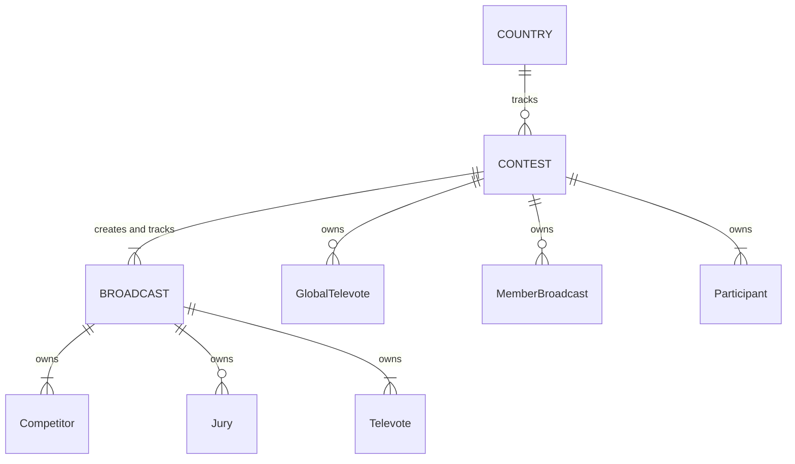

# 03: Domain model

This document outlines the entities, transactions and business rules in the *Eurocentric* project domain model.

- [03: Domain model](#03-domain-model)
  - [Entities and aggregates](#entities-and-aggregates)
  - [Transactions](#transactions)
    - [Admin creates a **COUNTRY**](#admin-creates-a-country)
    - [Admin deletes a **COUNTRY**](#admin-deletes-a-country)
    - [Admin creates a **CONTEST**](#admin-creates-a-contest)
    - [Admin deletes a **CONTEST**](#admin-deletes-a-contest)
    - [Admin creates a **BROADCAST** for a **CONTEST**](#admin-creates-a-broadcast-for-a-contest)
    - [Admin deletes a **BROADCAST**](#admin-deletes-a-broadcast)
    - [Admin disqualifies a **Competitor** from a **BROADCAST**](#admin-disqualifies-a-competitor-from-a-broadcast)
    - [Admin awards points for a **Jury** in a **BROADCAST**](#admin-awards-points-for-a-jury-in-a-broadcast)
    - [Admin awards points for a **Televote** in a **BROADCAST**](#admin-awards-points-for-a-televote-in-a-broadcast)
  - [Business rules](#business-rules)
    - [Enumeration rules](#enumeration-rules)
    - [Rules that apply during instantiation of a single value object](#rules-that-apply-during-instantiation-of-a-single-value-object)
    - [Rules that apply within a single **BROADCAST** aggregate](#rules-that-apply-within-a-single-broadcast-aggregate)
    - [Rules that apply within a single **CONTEST** aggregate](#rules-that-apply-within-a-single-contest-aggregate)
    - [Rules that apply within a single **COUNTRY** aggregate](#rules-that-apply-within-a-single-country-aggregate)
    - [Rules that apply across all **BROADCAST** aggregates](#rules-that-apply-across-all-broadcast-aggregates)
    - [Rules that apply across all **CONTEST** aggregates](#rules-that-apply-across-all-contest-aggregates)
    - [Rules that apply across all **COUNTRY** aggregates](#rules-that-apply-across-all-country-aggregates)
    - [Rules that apply across all aggregates](#rules-that-apply-across-all-aggregates)

## Entities and aggregates

The domain model has three aggregate root entity types: **BROADCAST**, **CONTEST** and **COUNTRY**.

| Entity type   | Represents               | System ID type |
|:--------------|:-------------------------|:--------------:|
| **COUNTRY**   | a country                |  *CountryId*   |
| **CONTEST**   | a contest                |  *ContestId*   |
| **BROADCAST** | a broadcast in a contest | *BroadcastId*  |

It has six non-aggregate entity types: **Competitor**, **Jury**, **Televote**, **MemberBroadcast**, **Participant**, **GlobalTelevote**.

| Entity type         | Represents                                  | Owning aggregate root type | Local ID type |
|:--------------------|:--------------------------------------------|:--------------------------:|:-------------:|
| **GlobalTelevote**  | the global pseudo-country in a contest      |        **CONTEST**         |  *CountryId*  |
| **MemberBroadcast** | a broadcast stage in a contest              |        **CONTEST**         | *BroadcastId* |
| **Participant**     | a real country participating in a contest   |        **CONTEST**         |  *CountryId*  |
| **Competitor**      | a country competing in a broadcast          |       **BROADCAST**        |  *CountryId*  |
| **Jury**            | a country voting by jury in a broadcast     |       **BROADCAST**        |  *CountryId*  |
| **Televote**        | a country voting by televote in a broadcast |       **BROADCAST**        |  *CountryId*  |

The relationships between the entity types are illustrated in the diagram below.

## Transactions

The following is a list of all Admin transactions that change the system state.

### Admin creates a **COUNTRY**

- **Trigger:** the Admin requests to create a new **COUNTRY** aggregate in the system, specifying:
  1. the country code, and
  2. the country name, and
  3. whether it is a real country or pseudo-country.
- **Results:**
  1. A new **COUNTRY** aggregate exists in the system.

### Admin deletes a **COUNTRY**

- **Trigger:** the Admin requests to delete a **COUNTRY** aggregate from the system, specifying:
  1. the *CountryId*.
- **Results:**
  1. The **COUNTRY** aggregate no longer exists in the system.

### Admin creates a **CONTEST**

- **Trigger:** the Admin requests to create a new **CONTEST** aggregate in the system, specifying:
  1. the contest year, and
  2. the host city name, and
  3. the voting rules, and
  4. the global televote *CountryId* (optional), and
  5. the **Participant**s, for each:
     1. the *CountryId*, and
     2. the act name, and
     3. the song title, and
     4. the qualification route, and
     5. the Semi-Final allocation.
- **Results:**
  1. A new **CONTEST** aggregate exists in the system.
  2. Every **COUNTRY** aggregate referenced by the **CONTEST** aggregate has been updated to add a reference to the **CONTEST**.

### Admin deletes a **CONTEST**

- **Trigger:** the Admin requests to delete a **CONTEST** aggregate from the system, specifying:
  1. the *ContestId*.
- **Results:**
  1. The **CONTEST** aggregate no longer exists in the system.
  2. Every **COUNTRY** aggregate referenced by the **CONTEST** aggregate has been updated to remove the reference to the **CONTEST**.

### Admin creates a **BROADCAST** for a **CONTEST**

- **Trigger:** the Admin requests to create a new **BROADCAST** aggregate for a **CONTEST** aggregate in the system, specifying:
  1. the *ContestId*.
  2. the broadcast date.
  3. the broadcast contest stage.
  4. the competing **Participant** *CountryId*s in running order.
- **Results:**
  1. A new **BROADCAST** aggregate exists in the system.
  2. The **CONTEST** aggregate has been updated with a new **MemberBroadcast** entity referencing the new **BROADCAST**.

### Admin deletes a **BROADCAST**

- **Trigger:** the Admin requests to delete a **BROADCAST** aggregate from the system, specifying:
  1. the *BroadcastId*.
- **Results:**
  1. The **BROADCAST** aggregate no longer exists in the system.
  2. The **CONTEST** aggregate referenced by the **BROADCAST** aggregate has been updated to:
     1.  remove the **MemberBroadcast** entity referencing the **BROADCAST**, and
     2.  set the contest status to incomplete.

### Admin disqualifies a **Competitor** from a **BROADCAST**

- **Trigger:** the Admin requests to disqualify a **Competitor** from a **BROADCAST** in the system, specifying:
  1. the *BroadcastId*, and
  2. the **Competitor**'s *CountryId*.
- **Results:**
  1. The **BROADCAST** aggregate has been updated to:
     1. remove the **Competitor**
     2. redistribute the finishing positions of the remaining **Competitor**s to close the gap.

### Admin awards points for a **Jury** in a **BROADCAST**

- **Trigger:** the Admin requests to award the points for a **Jury** in a **BROADCAST** in the system, specifying:
  1. the *BroadcastId*, and
  2. the **Jury**'s *CountryId*, and
  3. the ranked **Competitor** *CountryId*s.
- **Results:**
  1. The **BROADCAST** aggregate has been updated to:
     1. award a set of points from the **Jury** entity to the **Competitor** entities, and
     2. update the **Jury** to indicate it has awarded its points, and
     3. update the finishing positions of the **Competitor** entities, and
     4. set the broadcast status to incomplete or complete.
  2. If the **BROADCAST** aggregate's status is set to complete, the **CONTEST** aggregate referenced by the **BROADCAST** has been updated to:
     1. update the status of the **MemberBroadcast** entity referencing the **BROADCAST**, and
     2. set the contest status to incomplete or complete.

### Admin awards points for a **Televote** in a **BROADCAST**

- **Trigger:** the Admin requests to award the points for a **Televote** in a **BROADCAST** in the system, specifying:
  1. the *BroadcastId*, and
  2. the **Televote** *CountryId*, and
  3. the ranked **Competitor** *CountryId*s.
- **Results:**
  1. The **BROADCAST** aggregate has been updated to:
     1. award a set of points from the **Televote** entity to the **Competitor** entities, and
     2. update the **Televote** to indicate it has awarded its points, and
     3. update the finishing positions of the **Competitor** entities, and
     4. set the broadcast status to incomplete or complete.
  2. If the **BROADCAST** aggregate's status is set to complete, the **CONTEST** aggregate referenced by the **BROADCAST** has been updated to:
     1. update the status of the **MemberBroadcast** entity referencing the **BROADCAST**, and
     2. set the contest status to incomplete or complete.

## Business rules

This section outlines the business rules that cannot be violated during any transaction.

### Enumeration rules

1. A broadcast status value must be one of { `Incomplete`, `Complete` }.
2. A contest stage value must be one of { `FirstSemiFinal`, `SecondSemiFinal`, `GrandFinal` }.
3. A contest status value must be one of { `Incomplete`, `Complete` }.
4. A points status value must be one of { `NotAwarded`, `Awarded` }.
5. A qualification route value must be one of { `SemiFinalCompetitor`, `AutoQualifier` }.
6. A Semi-Final allocation value must be one of { `First`, `Second` }.
7. A voting method value must be one of { `Televote`, `Jury` }.
8. A voting rules value must be one of { `Stockholm`, `Liverpool` }.

### Rules that apply during instantiation of a single value object

1. An act name must be a non-empty, non-white-space string of no more than 200 letters.
2. A broadcast date must be a date in the range \[2016-01-01, 2050-12-31\].
3. A host city name must be a non-empty, non-white-space string of no more than 200 letters.
4. A contest year must be an integer in the range \[2016, 2050\].
5. A country code must be a string of 2 upper-case letters.
6. A country name must be a non-empty, non-white-space string of no more than 200 letters.
7. A finishing position must be an integer greater than or equal to 1.
8. A points award points value must be a non-negative integer.
9. A running order spot must be an integer greater than or equal to 1.
10. A song title must be a non-empty, non-white-space string of no more than 200 letters.

### Rules that apply within a single **BROADCAST** aggregate

1. A **BROADCAST** is complete when all of its **Jury** entities and **Televote** entities have awarded their points.
2. A **BROADCAST** aggregate must own at least 3 **Competitor** entities.
3. Each **Competitor** entity in a **BROADCAST** aggregate must have a different *CountryId*.
4. Each **Competitor** entity in a **BROADCAST** aggregate must have a different running order spot.
5. Each **Competitor** entity in a **BROADCAST** aggregate must have a different finishing position.
6. A **BROADCAST** aggregate can own zero or multiple **Jury** entities.
7. Each **Jury** entity in a **BROADCAST** aggregate must have a different *CountryId*.
8. A **BROADCAST** aggregate must own at least 3 **Televote** entities.
9. Each **Televote** entity in a **BROADCAST** aggregate must have a different *CountryId*.
10. A **BROADCAST** awards a set of jury points by specifying a **Jury**'s *CountryId* and a list of all the **Competitor**s' *CountryId*s, excluding the **Jury** *CountryId* (if present) ordered from first place to last place.
11. A **BROADCAST** awards a set of televote points by specifying a **Televote**'s *CountryId* and a list of all the **Competitor**s' *CountryId*s, excluding the **Televote** *CountryId* (if present) ordered from first place to last place.

### Rules that apply within a single **CONTEST** aggregate

1. A **CONTEST** aggregate cannot be deleted from the system if it owns any **MemberBroadcast** entities.
2. A **CONTEST** is complete when it owns 3 **MemberBroadcast** entities, all of which are complete.
3. A **CONTEST** aggregate cannot own multiple **MemberBroadcast** entities with the same *BroadcastId*.
4. A **CONTEST** aggregate cannot own multiple **MemberBroadcast** entities with the same contest stage.
5. A **CONTEST** aggregate must own at least 6 **Participant** entities in total.
6. Each **Participant** entity in a **CONTEST** aggregate must have a different *CountryId*.
7. A **CONTEST** aggregate must own at least 3 **Participant** entities that compete in the First Semi-Final.
8. A **CONTEST** aggregate must own at least 3 **Participant** entities that compete in the Second Semi-Final.

### Rules that apply within a single **COUNTRY** aggregate

1. A **COUNTRY** aggregate cannot be deleted from the system if it holds any references to **CONTEST** aggregates.
2. A **COUNTRY** aggregate cannot hold multiple references to the same **CONTEST** aggregate.

### Rules that apply across all **BROADCAST** aggregates

1. Every **BROADCAST** aggregate in the system must have a unique ID.
2. Every **BROADCAST** aggregate in the system must have a unique (*ContestId*, contest stage) tuple.

### Rules that apply across all **CONTEST** aggregates

1. Every **CONTEST** aggregate in the system must have a unique ID.
2. Every **CONTEST** aggregate in the system must have a unique contest year.

### Rules that apply across all **COUNTRY** aggregates

1. Every **COUNTRY** aggregate in the system must have a unique ID.
2. Every **COUNTRY** aggregate in the system must have a unique country code.

### Rules that apply across all aggregates

1. Every **Participant** entity in a **CONTEST** aggregate must have a *CountryId* that references an existing **COUNTRY** aggregate representing a real country.
2. If a **CONTEST** aggregate has a **GlobalTelevote** entity, the latter must have a *CountryId* that references an existing **COUNTRY** aggregate representing a pseudo-country.
3. If a **CONTEST** aggregate is created, its referenced **COUNTRY** aggregates must be updated as part of the same transaction.
4. If a **CONTEST** aggregate is deleted, its referenced **COUNTRY** aggregates must be updated as part of the same transaction.
5. If a **BROADCAST** aggregate is created, its referenced **CONTEST** aggregate must be updated as part of the same transaction.
6. If a **BROADCAST** aggregate deleted, its referenced **CONTEST** aggregate must be updated as part of the same transaction.
7. If a **BROADCAST** aggregate updates its status, its referenced **CONTEST** aggregate must be updated as part of the same transaction.
