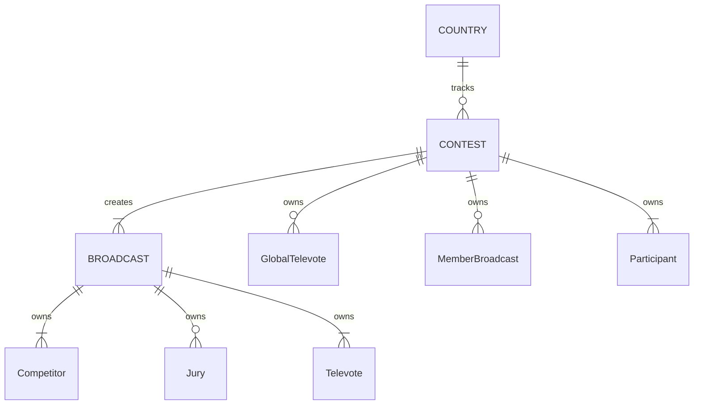

# Domain model

This document outlines the domain model for the *Eurocentric* project.

- [Domain model](#domain-model)
  - [Entity base types](#entity-base-types)
  - [Concrete entity and aggregate root types](#concrete-entity-and-aggregate-root-types)
    - [**COUNTRY** aggregate root type](#country-aggregate-root-type)
    - [**CONTEST** aggregate root type](#contest-aggregate-root-type)
    - [**Participant** entity type](#participant-entity-type)
    - [**GlobalTelevote** entity type](#globaltelevote-entity-type)
    - [**MemberBroadcast** entity type](#memberbroadcast-entity-type)
    - [**BROADCAST** aggregate root type](#broadcast-aggregate-root-type)
    - [**Competitor** entity type](#competitor-entity-type)
    - [**Jury** entity type](#jury-entity-type)
    - [**Televote** entity type](#televote-entity-type)
  - [Key business rules](#key-business-rules)
  - [Key transactions](#key-transactions)

## Entity base types

The domain has 3 base entity types, each with its own unique identifier type.

| Base entity type  | Represents                     | Identifier type |
|:------------------|:-------------------------------|:----------------|
| `CountryEntity`   | a country (or pseudo-country)  | `CountryId`     |
| `ContestEntity`   | a Contest                      | `ContestId`     |
| `BroadcastEntity` | a broadcast stage in a Contest | `BroadcastId`   |

For each of these base types, any two instances of concrete derivatives having the same ID value represent the same real-world entity.

## Concrete entity and aggregate root types

The domain has 9 concrete entity and aggregate root types, as follows:

| Entity type         | Base type         | Represents                                  | Owning aggregate root type |
|:--------------------|:------------------|:--------------------------------------------|:---------------------------|
| **COUNTRY**         | `CountryEntity`   | a country (or pseudo-country)               |                            |
| **CONTEST**         | `ContestEntity`   | a Contest                                   |                            |
| **GlobalTelevote**  | `CountryEntity`   | the global pseudo-country in a Contest      | **CONTEST**                |
| **MemberBroadcast** | `BroadcastEntity` | a broadcast stage in a Contest              | **CONTEST**                |
| **Participant**     | `CountryEntity`   | a country participating in a Contest        | **CONTEST**                |
| **BROADCAST**       | `BroadcastEntity` | a broadcast stage in a Contest              |                            |
| **Competitor**      | `CountryEntity`   | a country competing in a broadcast          | **BROADCAST**              |
| **Jury**            | `CountryEntity`   | a country voting by jury in a broadcast     | **BROADCAST**              |
| **Televote**        | `CountryEntity`   | a country voting by televote in a broadcast | **BROADCAST**              |

The key relationships between the entity types are shown in the diagram below.

### **COUNTRY** aggregate root type

- A **COUNTRY** aggregate represents a real-world country (or pseudo-country).
- It is identified by its *CountryId*.
- Its alternate key is its *CountryCode*.
- It is responsible for tracking the **CONTEST** aggregates in which it is involved. It does this by maintaining a list of *ContestId* values.

### **CONTEST** aggregate root type

- A **CONTEST** aggregate represents a single year's edition of the Eurovision Song Contest.
- It is identified by its *ContestId*.
- Its alternate key is its *ContestYear*.
- It has a *Completed* boolean value that is only `true` when all three of its **BROADCAST** aggregates are created, and they are all completed.
- It owns multiple **Participant** entities.
- It owns zero or one **GlobalTelevote** entity.
- It is responsible for creating **BROADCAST** aggregates and tracking their status. It does the latter by maintaining a collection of **MemberBroadcast** entities.

### **Participant** entity type

- A **Participant** entity represents a single country with an act and a song in a single contest.
- It is identified within its **CONTEST** aggregate by its *CountryId*.
- It is responsible for creating **Competitor**, **Jury** and **Televote** entities in **BROADCAST** aggregates created by its owning **CONTEST**.

### **GlobalTelevote** entity type

- A **GlobalTelevote** entity represents the "Rest of the World" televote when it is used in a single contest.
- It has a *CountryId*.
- It is responsible for creating **Televote** entities in **BROADCAST** aggregates created by its owning **CONTEST**.

### **MemberBroadcast** entity type

- A **MemberBroadcast** entity represents a single broadcast that is part of a single contest.
- It is identified within its **CONTEST** aggregate by its **BroadcastId**.
- It is responsible for tracking the status of its corresponding **BROADCAST** aggregate.

### **BROADCAST** aggregate root type

- A **BROADCAST** aggregate represents a single contest stage in a single contest.
- It is identified by its *BroadcastId*.
- Its natural key is its (*ContestId*, *ContestStage*) tuple.
- It owns multiple **Competitor** entities.
- It owns zero or multiple **Jury** entities.
- It owns multiple **Televote** entities.
- It is responsible for distributing points based on the **Competitor** rankings of its **Televote** and **Jury** entities, and updating its own status accordingly.

### **Competitor** entity type

- A **Competitor** entity represents a single country that competes in a single broadcast.
- It is identified within its **BROADCAST** aggregate by its *CountryId*.
- It is responsible for tracking the points it is awarded. It does this by maintaining a collection of *PointsAward* value objects.

### **Jury** entity type

- A **Jury** entity represents a single country that awards a set of jury points in a single broadcast.
- It is identified within its **BROADCAST** aggregate by its *CountryId*.
- It is responsible for tracking the points it is awarded.

### **Televote** entity type

- A **Televote** entity represents a single country that awards a set of televote points in a single broadcast.
- It is identified within its **BROADCAST** aggregate by its *CountryId*.
- It is responsible for tracking the points it is awarded.

## Key business rules

- A **COUNTRY** aggregate cannot be deleted from the system if it has any *ContestId* values.
- A **CONTEST** aggregate cannot be deleted from the system if it has any **MemberBroadcast** entities.
- A **CONTEST** aggregate must have at least 6 **Participant** entities, of which:
  - at least 3 compete and vote in the First Semi-Final, and
  - at least 3 compete and vote in the Second Semi-Final.
- A **BROADCAST** aggregate must have at least 3 **Competitor** entities.
- Every **Competitor** in a **BROADCAST** must also be a **Televote** in the **BROADCAST**.
- Every **Jury** in a **BROADCAST** must also be a **Televote** in the **BROADCAST**.
- A country code must be a string of 2 upper-case ASCII letters.
- A contest year must be an integer in the range \[2016, 2050\].
- A country name, host city name, act name and song title must be a non-empty, non-white-space string of no more than 200 characters.

## Key transactions

| Operation                                                 | Preconditions                                                                                                        | Consequences                               |
|:----------------------------------------------------------|:---------------------------------------------------------------------------------------------------------------------|:-------------------------------------------|
| Admin creates a **COUNTRY**                               | No **COUNTRY** with country code exists                                                                              | **COUNTRY** added                          |
| Admin creates a **CONTEST**                               | No **CONTEST** with contest year exists, **COUNTRY** exists for each **ParticipatingCountry** and **GlobalTelevote** | **CONTEST** added, **COUNTRIES** updated   |
| Admin creates a **BROADCAST** for a **CONTEST**           | **CONTEST** exists and has no **MemberBroadcast** with contest stage                                                 | **BROADCAST** added, **CONTEST** updated   |
| Admin awards points for a **Jury** in a **BROADCAST**     | **BROADCAST** exists and **Jury** can award points                                                                   | **BROADCAST** updated, **CONTEST** updated |
| Admin awards points for a **Televote** in a **BROADCAST** | **BROADCAST** exists and **Televote** can award points                                                               | **BROADCAST** updated, **CONTEST** updated |
| Admin deletes a **BROADCAST**                             | **BROADCAST** exists                                                                                                 | **BROADCAST** deleted, **CONTEST** updated |
| Admin deletes a **CONTEST**                               | **CONTEST** exists and has empty **MemberBroadcast** collection                                                      | **CONTEST** deleted, **COUNTRIES** updated |
| Admin deletes a **COUNTRY**                               | **COUNTRY** exists and has empty *ContestId* collection                                                              | **COUNTRY** deleted                        |
