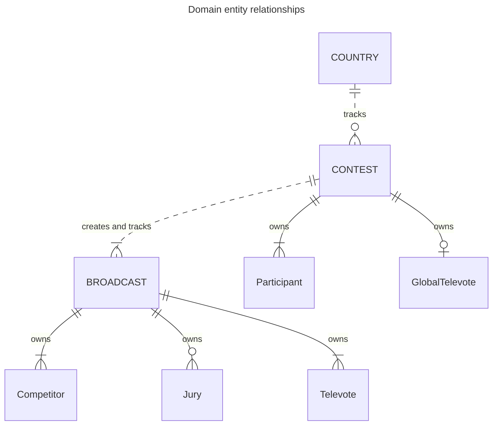

# Domain model

This document outlines the domain model for the *Eurocentric* project.

- [Domain model](#domain-model)
  - [Key transactions (in reverse chronological order)](#key-transactions-in-reverse-chronological-order)
  - [Entity base types and domain identifiers](#entity-base-types-and-domain-identifiers)
  - [Entity and aggregate root types](#entity-and-aggregate-root-types)
    - [**COUNTRY** aggregate root type](#country-aggregate-root-type)
    - [**CONTEST** aggregate root type](#contest-aggregate-root-type)
    - [**Participant** entity type](#participant-entity-type)
    - [**GlobalTelevote** entity type](#globaltelevote-entity-type)
    - [**BROADCAST** aggregate root type](#broadcast-aggregate-root-type)
    - [**Competitor** entity type](#competitor-entity-type)
    - [**Jury** entity type](#jury-entity-type)
    - [**Televote** entity type](#televote-entity-type)
  - [Key business rules](#key-business-rules)

## Key transactions (in reverse chronological order)

1. A contest, having initialized its three broadcasts and having been notified that all three have been completed, sets its status to completed, which means that all its associated data can be included in data analytics queries.
2. A broadcast, having detected that all its televote and jury points have been awarded, sets its status to completed and issues a completion notification.
3. A televote in a broadcast awards its points to the competitors in the broadcast.
4. A jury in a broadcast awards its points to the competitors in the broadcast.
5. A contest initializes one of its broadcasts.
6. A new contest is created.
7. A new country is created.

## Entity base types and domain identifiers

There are three entity base types: country, contest, and broadcast.

- A country is uniquely identified in the domain by its 2-letter country code, e.g. `"GB"`, `"FR"`, `"XX"`.
- A contest is uniquely identified in the domain by its contest year, e.g. `2023`, `2024`.
- A broadcast is uniquely identified in the domain by its (contest year, contest stage) tuple, e.g. `(2023, FirstSemiFinal)`, `(2023, SecondSemiFinal)`, `(2024, GrandFinal)`.

## Entity and aggregate root types

The domain has three aggregate root types: **COUNTRY**, **CONTEST** and **BROADCAST**. It has four entity types: **Participant**, **Competitor**, **GlobalTelevote**, **Televote** and **Jury**.

### **COUNTRY** aggregate root type

- A **COUNTRY** aggregate represents a single country (or pseudo-country) that exists in the world.
- It is identified by its country code.
- It is responsible for tracking the **CONTEST** aggregates in which it is involved.

### **CONTEST** aggregate root type

- A **CONTEST** aggregate represents a single year's edition of the Eurovision Song Contest.
- It is identified by its contest year.
- It owns multiple **Participant** entities.
- It owns zero or one **GlobalTelevote** entity.
- It is responsible for initializing **BROADCAST** aggregates and tracking their completion status.

### **Participant** entity type

- A **Participant** entity represents a single country with an act and a song in a single contest.
- It is identified within its **CONTEST** aggregate by its country code.
- It is responsible for creating **Competitor**, **Jury** and **Televote** entities.

### **GlobalTelevote** entity type

- A **GlobalTelevote** entity represents the "Rest of the World" televote when it is used in a single contest.
- It is responsible for creating **Televote** entities.

### **BROADCAST** aggregate root type

- A **BROADCAST** aggregate represents a single contest stage in a single contest.
- It is identified by its (contest year, contest stage) tuple.
- It owns multiple **Competitor** entities.
- It owns zero or multiple **Jury** entities.
- It owns multiple **Televote** entities.
- It is responsible for distributing points based on the **Competitor** rankings of its **Televote** and **Jury** entities, and tracking its completion status.

### **Competitor** entity type

- A **Competitor** entity represents a single country that competes in a single broadcast.
- It is identified within its **BROADCAST** aggregate by its country code.
- It is responsible for tracking the points it is awarded.

### **Jury** entity type

- A **Jury** entity represents a single country that awards a set of jury points in a single broadcast.
- It is identified within its **BROADCAST** aggregate by its country code.
- It is responsible for awarding jury points.

### **Televote** entity type

- A **Televote** entity represents a single country that awards a set of televote points in a single broadcast.
- It is identified within its **BROADCAST** aggregate by its country code.
- It is responsible for awarding televote points.

## Key business rules

- A **COUNTRY** aggregate cannot be deleted from the system if it is a **Participant** in one or more **CONTEST** aggregates.
- A **CONTEST** aggregate cannot be deleted from the system if any of its **BROADCAST** aggregates exist in the system.
- A **CONTEST** aggregate must have at least 6 **Participant** entities, of which:
  - at least 3 compete and vote in the First Semi-Final, and
  - at least 3 compete and vote in the Second Semi-Final.
- A **BROADCAST** aggregate must have at least 3 **Competitor** entities.
- Every **Competitor** in a **BROADCAST** must also be a **Televote**.
- Every **Jury** in a **BROADCAST** must also be a **Televote**.
- A country code must be a string of 2 upper-case ASCII letters.
- A contest year must be an integer in the range \[2016, 2050\].
- A country name, host city name, act name and song title must be a non-empty, non-white-space string of no more than 200 characters.
