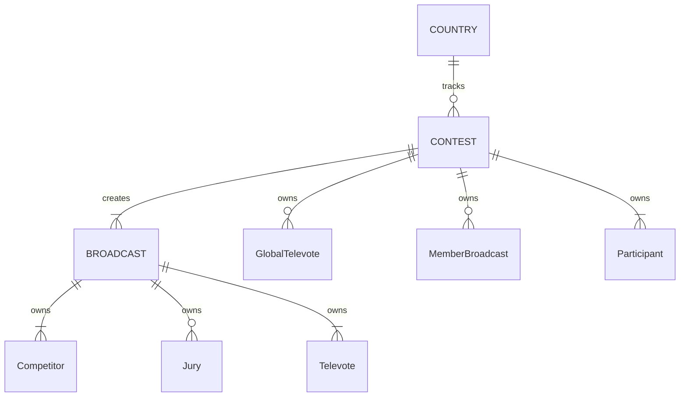

# Domain model

This document outlines the domain model for the *Eurocentric* project.

- [Domain model](#domain-model)
  - [Entity base types](#entity-base-types)
  - [Concrete entity and aggregate root types](#concrete-entity-and-aggregate-root-types)
    - [**COUNTRY** aggregate root type](#country-aggregate-root-type)
    - [**CONTEST** aggregate root type](#contest-aggregate-root-type)
    - [**Participant** entity type](#participant-entity-type)
    - [**GlobalTelevote** entity type](#globaltelevote-entity-type)
    - [**MemberBroadcast** entity type](#memberbroadcast-entity-type)
    - [**BROADCAST** aggregate root type](#broadcast-aggregate-root-type)
    - [**Competitor** entity type](#competitor-entity-type)
    - [**Jury** entity type](#jury-entity-type)
    - [**Televote** entity type](#televote-entity-type)
  - [Key transactions](#key-transactions)
  - [Business rules](#business-rules)
    - [Rules to be enforced within a single value object](#rules-to-be-enforced-within-a-single-value-object)
    - [Rules to be enforced within a single **COUNTRY** aggregate](#rules-to-be-enforced-within-a-single-country-aggregate)
    - [Rules to be enforced within a single **CONTEST** aggregate](#rules-to-be-enforced-within-a-single-contest-aggregate)
    - [Rules to be enforced within a single **BROADCAST** aggregate](#rules-to-be-enforced-within-a-single-broadcast-aggregate)
    - [Rules to be enforced across all **COUNTRY** aggregates](#rules-to-be-enforced-across-all-country-aggregates)
    - [Rules to be enforced across all **CONTEST** aggregates](#rules-to-be-enforced-across-all-contest-aggregates)
    - [Rules to be enforced across all **BROADCAST** aggregates](#rules-to-be-enforced-across-all-broadcast-aggregates)
    - [Rules to be enforced across different aggregate types](#rules-to-be-enforced-across-different-aggregate-types)

## Entity base types

The domain has 3 base entity types, each with its own unique identifier type.

| Base entity type  | Represents                     | Identifier type |
|:------------------|:-------------------------------|:----------------|
| `CountryEntity`   | a country (or pseudo-country)  | `CountryId`     |
| `ContestEntity`   | a contest                      | `ContestId`     |
| `BroadcastEntity` | a broadcast stage in a contest | `BroadcastId`   |

For each of these base types, any two instances of concrete derivatives having the same ID value represent the same real-world entity.

## Concrete entity and aggregate root types

The domain has 9 concrete entity and aggregate root types, as follows:

| Entity type         | Base type         | Represents                                  | Owning aggregate root type |
|:--------------------|:------------------|:--------------------------------------------|:---------------------------|
| **COUNTRY**         | `CountryEntity`   | a country (or pseudo-country)               |                            |
| **CONTEST**         | `ContestEntity`   | a contest                                   |                            |
| **GlobalTelevote**  | `CountryEntity`   | the global pseudo-country in a contest      | **CONTEST**                |
| **MemberBroadcast** | `BroadcastEntity` | a broadcast stage in a contest              | **CONTEST**                |
| **Participant**     | `CountryEntity`   | a country participating in a contest        | **CONTEST**                |
| **BROADCAST**       | `BroadcastEntity` | a broadcast stage in a contest              |                            |
| **Competitor**      | `CountryEntity`   | a country competing in a broadcast          | **BROADCAST**              |
| **Jury**            | `CountryEntity`   | a country voting by jury in a broadcast     | **BROADCAST**              |
| **Televote**        | `CountryEntity`   | a country voting by televote in a broadcast | **BROADCAST**              |

The key relationships between the entity types are shown in the diagram below.

### **COUNTRY** aggregate root type

- A **COUNTRY** aggregate represents a real-world country (or pseudo-country).
- It is identified by its *CountryId*.
- Its alternate key is its *CountryCode*.
- It has a boolean *PseudoCountry* value.
- It is responsible for tracking the **CONTEST** aggregates in which it is involved. It does this by maintaining a list of *ContestId* values.

### **CONTEST** aggregate root type

- A **CONTEST** aggregate represents a single year's edition of the Eurovision Song Contest.
- It is identified by its *ContestId*.
- Its alternate key is its *ContestYear*.
- It has a *Completed* boolean value that is only `true` when all three of its **BROADCAST** aggregates are created, and they are all completed.
- It owns multiple **Participant** entities.
- It owns zero or one **GlobalTelevote** entity.
- It is responsible for creating **BROADCAST** aggregates and tracking their status. It does the latter by maintaining a collection of **MemberBroadcast** entities.

### **Participant** entity type

- A **Participant** entity represents a single country with an act and a song in a single contest.
- It is identified within its **CONTEST** aggregate by its *CountryId*.
- It has a *ParticipantGroup* enum value with the values { `First`, `Second` }, which denotes the Semi-Final to which the participant has been allocated for voting and/or competing.
- It has an *AutoQualifier* boolean value.
- It is responsible for creating **Competitor**, **Jury** and **Televote** entities in **BROADCAST** aggregates created by its owning **CONTEST**.

### **GlobalTelevote** entity type

- A **GlobalTelevote** entity represents the "Rest of the World" televote when it is used in a single contest.
- It has a *CountryId*.
- It is responsible for creating **Televote** entities in **BROADCAST** aggregates created by its owning **CONTEST**.

### **MemberBroadcast** entity type

- A **MemberBroadcast** entity represents a single broadcast that is part of a single contest.
- It is identified within its **CONTEST** aggregate by its **BroadcastId**.
- It is responsible for tracking the *BroadcastStatus* of its corresponding **BROADCAST** aggregate.

### **BROADCAST** aggregate root type

- A **BROADCAST** aggregate represents a single contest stage in a single contest.
- It is identified by its *BroadcastId*.
- Its natural key is its (*ContestId*, *ContestStage*) tuple.
- It has a *BroadcastStatus* enum property with the values { `Initialized`, `Voting`, `Completed` }.
- It owns multiple **Competitor** entities.
- It owns zero or multiple **Jury** entities.
- It owns multiple **Televote** entities.
- It is responsible for distributing points based on the **Competitor** rankings of its **Televote** and **Jury** entities, and updating its own *BroadcastStatus* accordingly.

### **Competitor** entity type

- A **Competitor** entity represents a single country that competes in a single broadcast.
- It is identified within its **BROADCAST** aggregate by its *CountryId*.
- It is responsible for tracking the points it is awarded. It does this by maintaining a collection of *PointsAward* value objects.

### **Jury** entity type

- A **Jury** entity represents a single country that awards a set of jury points in a single broadcast.
- It is identified within its **BROADCAST** aggregate by its *CountryId*.
- It is responsible for tracking the points it is awarded.

### **Televote** entity type

- A **Televote** entity represents a single country that awards a set of televote points in a single broadcast.
- It is identified within its **BROADCAST** aggregate by its *CountryId*.
- It is responsible for tracking the points it is awarded.

## Key transactions

| Operation                                                 | Preconditions                                                                                                        | Consequences                               |
|:----------------------------------------------------------|:---------------------------------------------------------------------------------------------------------------------|:-------------------------------------------|
| Admin creates a **COUNTRY**                               | No **COUNTRY** with country code exists                                                                              | **COUNTRY** added                          |
| Admin creates a **CONTEST**                               | No **CONTEST** with contest year exists, **COUNTRY** exists for each **ParticipatingCountry** and **GlobalTelevote** | **CONTEST** added, **COUNTRIES** updated   |
| Admin creates a **BROADCAST** for a **CONTEST**           | **CONTEST** exists and has no **MemberBroadcast** with contest stage                                                 | **BROADCAST** added, **CONTEST** updated   |
| Admin disqualifies a **Competitor** from a **BROADCAST**  | **BROADCAST** exists and has `Initialized` *BroadcastStatus* value                                                   | **BROADCAST** updated                      |
| Admin awards points for a **Jury** in a **BROADCAST**     | **BROADCAST** exists and **Jury** can award points                                                                   | **BROADCAST** updated, **CONTEST** updated |
| Admin awards points for a **Televote** in a **BROADCAST** | **BROADCAST** exists and **Televote** can award points                                                               | **BROADCAST** updated, **CONTEST** updated |
| Admin deletes a **BROADCAST**                             | **BROADCAST** exists                                                                                                 | **BROADCAST** deleted, **CONTEST** updated |
| Admin deletes a **CONTEST**                               | **CONTEST** exists and has empty **MemberBroadcast** collection                                                      | **CONTEST** deleted, **COUNTRIES** updated |
| Admin deletes a **COUNTRY**                               | **COUNTRY** exists and has empty *ContestId* collection                                                              | **COUNTRY** deleted                        |

## Business rules

### Rules to be enforced within a single value object

- A *CountryCode* value must be a string of 2 upper-case letters.
- A *CountryName* value must be a non-empty, non-white-space string of no more than 200 characters.
- A *ContestYear* value must be an integer in the range \[2016, 2050\].
- A *HostCityName* value must be a non-empty, non-white-space string of no more than 200 characters.
- An *ActName* value must be a non-empty, non-white-space string of no more than 200 characters.
- A *SongTitle* value must be a non-empty, non-white-space string of no more than 200 characters.
- A *TransmissionDate* value must be a date in the range \[01/01/2016, 31/12/2050].
- A *RunningOrderSpot* value must be an integer greater than or equal to 1.
- A *FinishingPosition* value must be an integer greater than or equal to 1.
- A *PointsAward* value must have a points value greater than or equal to 0.

### Rules to be enforced within a single **COUNTRY** aggregate

- A **COUNTRY** aggregate cannot be deleted from the system if its *ContestId* value collection is not empty.
- A **COUNTRY** aggregate cannot add a *ContestId* to its *ContestId* value collection if it is already present.

### Rules to be enforced within a single **CONTEST** aggregate

- A **CONTEST** aggregate must be initialized with at least 6 **Participant** entities.
- Each of a **CONTEST** aggregate's **Participant** entities must have a different *CountryId*.
- At least 3 of a **CONTEST** aggregate's **Participant** entities must have a (`First`, `false`) (*ParticipantGroup*, *AutoQualifier*) value tuple.
- At least 3 of a **CONTEST** aggregate's **Participant** entities must have a (`Second`, `false`) (*ParticipantGroup*, *AutoQualifier*) value tuple.
- A **CONTEST** aggregate cannot be deleted from the system if its **MemberBroadcast** entity collection is not empty.
- A **CONTEST** aggregate cannot add a **MemberBroadcast** to its **MemberBroadcast** entity collection if it already has a member with the same *BroadcastId* value.
- A **CONTEST** aggregate cannot add a **MemberBroadcast** to its **MemberBroadcast** entity collection if it already has a member with the same *ContestStage* value.
- - When a **CONTEST** aggregate creates a **BROADCAST** aggregate, it must ensure that the competing *CountryId* values specified by the client match with **Participant** entities that are eligible to compete in the specified contest stage.
- When a **CONTEST** aggregate creates a **BROADCAST** aggregate, it must ensure that it does not already have a **MemberBroadcast** entity with the *ContestStage* value specified by the client.
- Every time a **CONTEST** aggregate updates its **MemberBroadcast** entity collection, it must also update its *Completed* boolean value.

### Rules to be enforced within a single **BROADCAST** aggregate

- A **BROADCAST** aggregate must be initialized with at least 3 **Competitor** entities.
- A **BROADCAST** aggregate must be initialized with at least as many **Televote** entities as it has **Competitor** entities.
- A **BROADCAST** aggregate can have 0 or multiple **Jury** entities, but never greater than the number of **Televote** entities.
- Each of a **BROADCAST** aggregate's **Competitor** entities must have a different *CountryId*.
- Each of a **BROADCAST** aggregate's **Televote** entities must have a different *CountryId*.
- Each of a **BROADCAST** aggregate's **Jury** entities must have a different *CountryId*.
- Each of a **BROADCAST** aggregate's **Competitor** entities must have the same *CountryId* as one of its **Televote** entities.
- Each of a **BROADCAST** aggregate's **Jury** entities must have the same *CountryId* as one of its **Televote** entities.
- Each of a **BROADCAST** aggregate's **Televote** entities must give a single *PointsAward* to each of its **Competitor** entities that has a different *CountryId* to the **Televote**.
- Each of a **BROADCAST** aggregate's **Jury** entities must give a single *PointsAward* to each of its **Competitor** entities that has a different *CountryId* to the **Jury**.
- Every time a **BROADCAST** aggregate awards a set of televote points, it must re-allocate the *FinishingPosition* values of its **Competitor** entities.
- Every time a **BROADCAST** aggregate awards a set of televote points, it must update its *BroadcastStatus* value.
- Every time a **BROADCAST** aggregate awards a set of jury points, it must re-allocate the *FinishingPosition* values of its **Competitor** entities.
- Every time a **BROADCAST** aggregate awards a set of jury points, it must update its *BroadcastStatus* value.
- A **BROADCAST** aggregate cannot disqualify a **Competitor** entity if its *BroadcastStatus* is not `Initialized`.
- When a **BROADCAST** aggregate disqualifies a **Competitor** entity, it must delete the entity and re-allocate the *FinishingPosition* values of the remaining **Competitor** entities so that there are no gaps.

### Rules to be enforced across all **COUNTRY** aggregates

- Every **COUNTRY** aggregate in the system must have a unique *CountryId* value.
- Every **COUNTRY** aggregate in the system must have a unique *CountryCode* value.

### Rules to be enforced across all **CONTEST** aggregates

- Every **CONTEST** aggregate in the system must have a unique *ContestId* value.
- Every **CONTEST** aggregate in the system must have a unique *ContestYear* value.

### Rules to be enforced across all **BROADCAST** aggregates

- Every **BROADCAST** aggregate in the system must have a unique *BroadcastId* value.
- Every **BROADCAST** aggregate in the system must have a unique (*ContestId*, *ContestStage*) value tuple.

### Rules to be enforced across different aggregate types

- Each of a **CONTEST** aggregate's **Participant** entities must have a *ContestId* that references an existing **COUNTRY** aggregate with a `false` *PseudoCountry* value.
- When a **CONTEST** aggregate has a **GlobalTelevote** entity, it must have a *ContestId* that references an existing **COUNTRY** aggregate with a `true` *PseudoCountry* value.
- When a **CONTEST** is added to the system, each referenced **COUNTRY** aggregate must add its *ContestId* to itself as part of the same transaction.
- When a **CONTEST** is deleted from the system, each referenced **COUNTRY** aggregate must remove its *ContestId* from itself as part of the same transaction.
- When a **CONTEST** aggregate creates a **BROADCAST** aggregate, it must add a **MemberBroadcast** entity to itself as part of the same transaction.
- When a **BROADCAST** aggregate sets its *BroadcastStatus* value to `Completed`, its referenced **CONTEST** aggregate must update its corresponding **MemberBroadcast** entity as part of the same transaction.
- When a **BROADCAST** aggregate is deleted from the system, its referenced **CONTEST** aggregate must remove its corresponding **MemberBroadcast** entity as part of the same transaction.
