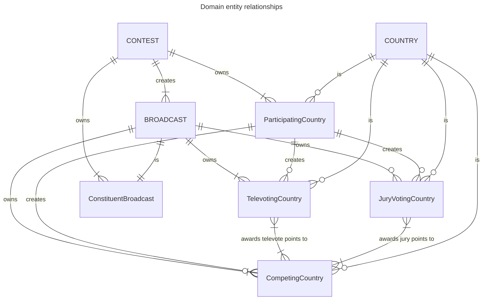
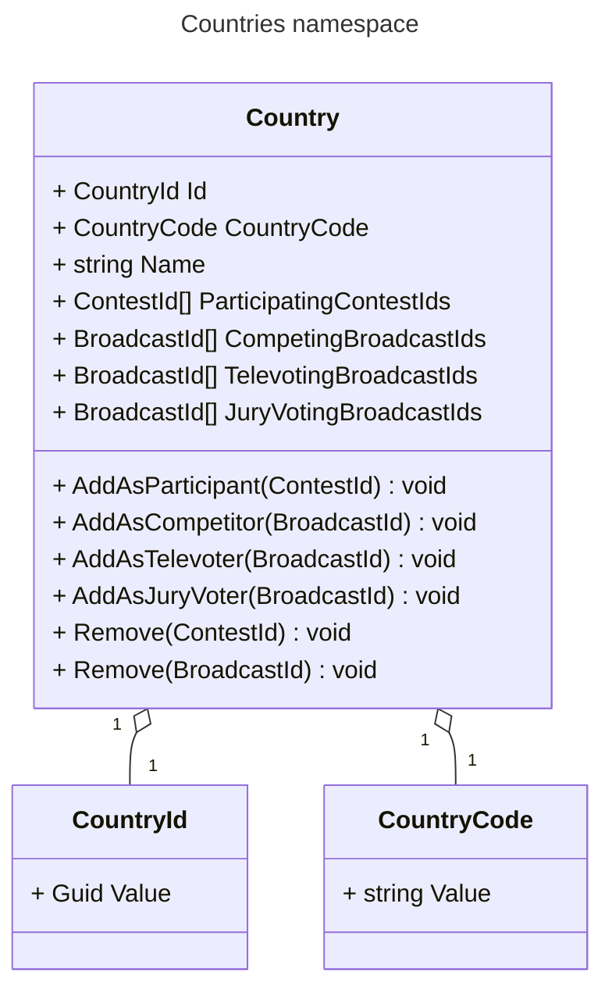
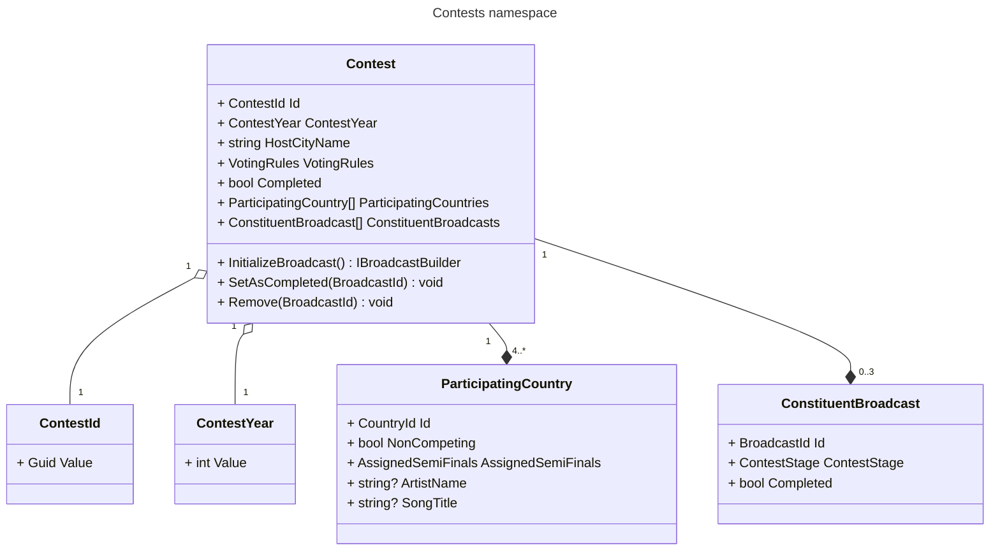
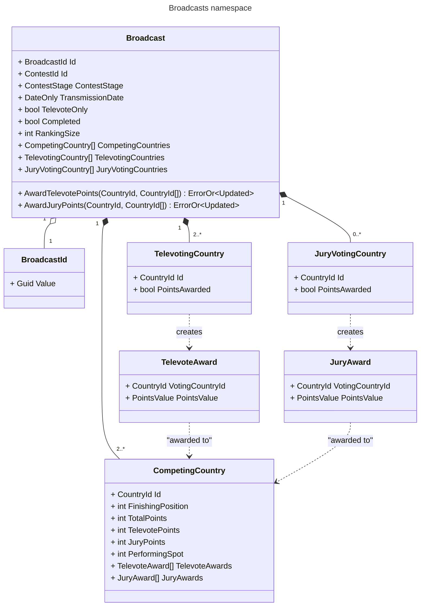

# Domain model

This document outlines the *Eurocentric* project's domain model: the Eurovision Song Contest, 2016-present.

- [Domain model](#domain-model)
  - [Key transactions (in reverse chronological order)](#key-transactions-in-reverse-chronological-order)
  - [Entity types overview](#entity-types-overview)
  - [Countries subdomain](#countries-subdomain)
    - [Countries subdomain types](#countries-subdomain-types)
    - [Countries aggregate root operations](#countries-aggregate-root-operations)
    - [Countries subdomain invariants](#countries-subdomain-invariants)
  - [Contests subdomain](#contests-subdomain)
    - [Contests subdomain types](#contests-subdomain-types)
    - [Contests aggregate root operations](#contests-aggregate-root-operations)
    - [Contests subdomain invariants](#contests-subdomain-invariants)
  - [Broadcasts subdomain](#broadcasts-subdomain)
    - [Broadcasts subdomain types](#broadcasts-subdomain-types)
    - [Broadcasts aggregate root operations](#broadcasts-aggregate-root-operations)
    - [Broadcast subdomain invariants](#broadcast-subdomain-invariants)
  - [Domain events](#domain-events)

## Key transactions (in reverse chronological order)

1. A contest, having initialized three broadcasts and having been notified that all three have been completed, sets its status to completed, which means that all its associated data can be included in data analytics queries.
2. A broadcast, having detected that all its televote and jury points have been awarded, sets its status to completed and issues a completion notification.
3. A televoting country in a broadcast awards points to the competing countries in the broadcast.
4. A jury voting country in a broadcast awards points to the competing countries in the broadcast.
5. A new broadcast is initialized for a contest.
6. A new contest is created with its participating countries and voting rules.
7. A new country is created.

## Entity types overview

The domain contains seven **entity** types, of which three are **AGGREGATE ROOT** types.

- A **COUNTRY** aggregate represents a real-world country in the system.
- A **CONTEST** aggregate represents a specific year's Eurovision Song Contest in the system.
- A **BROADCAST** aggregate represents a specific contest stage broadcast in the system.
- A **ParticipatingCountry** entity represents a country that is participating in a contest.
- A **CompetingCountry** entity represents a country that is competing in a broadcast.
- A **TelevotingCountry** entity represents a country that awards televote points in a broadcast.
- A **JuryVotingCountry** entity represents a country that awards jury points in a broadcast.
- A **ConstituentBroadcast** entity represents a broadcast that is a constituent of a contest.

ID entity equality is used across the domain. That is:

- A **ConstituentBroadcast** entity and a **BROADCAST** aggregate with the same ID represent the same real-world broadcast.
- A **ParticipatingCountry** entity and a **COUNTRY** aggregate with the same ID represent the same real-world country.

The full set of entity relationships are:

- A **BROADCAST** aggregate *is* 1 **ConstituentBroadcast** entity, which is owned by the **CONTEST** aggregate that initialized the **BROADCAST**.
- A **BROADCAST** aggregate *owns* 2 or more **CompetingCountry** entities.
- A **BROADCAST** aggregate *owns* 0 or more **JuryVotingCountry** entities.
- A **BROADCAST** aggregate *owns* 2 or more **TelevotingCountry** entities.
- A **CONTEST** aggregate *creates* multiple **BROADCAST** aggregates.
- A **CONTEST** aggregate *owns* between 0 and 3 **ConstituentBroadcast** entities.
- A **CONTEST** aggregate *owns* 4 or more **ParticipatingCountry** entities.
- A **COUNTRY** aggregate *is* 0 or 1 **ParticipatingCountry** entity in any **CONTEST** aggregate.
- A **COUNTRY** aggregate *is* 0 or 1 **CompetingCountry** entity in any **BROADCAST** aggregate.
- A **COUNTRY** aggregate *is* 0 or 1 **JuryVotingCountry** entity in any **BROADCAST** aggregate.
- A **COUNTRY** aggregate *is* 0 or 1 **TelevotingCountry** entity in any **BROADCAST** aggregate.
- A **ParticipatingCountry** entity *creates* 0 or 1 **CompetingCountry** in any **BROADCAST** aggregate created by its **CONTEST** aggregate owner.
- A **ParticipatingCountry** entity *creates* 0 or 1 **JuryVotingCountry** in any **BROADCAST** aggregate created by its **CONTEST** aggregate owner.
- A **ParticipatingCountry** entity *creates* 0 or 1 **TelevotingCountry** in any **BROADCAST** aggregate created by its **CONTEST** aggregate owner.
- A **JuryVotingCountry** entity *awards jury points* to the **CompetingCountry** entities in its **BROADCAST** aggregate owner.
- A **TelevotingCountry** entity *awards televote points* to the **CompetingCountry** entities in its **BROADCAST** aggregate owner.

The domain is split into three subdomains, one per aggregate type.

## Countries subdomain

This subdomain models the **COUNTRY** aggregate in code.

A **COUNTRY** represents a real-world country in the system. It is responsible for tracking that country's involvement in **CONTEST** and **BROADCAST** aggregates in the system.

### Countries subdomain types

- A `Country` is a **COUNTRY** aggregate.
- A `CountryId` is a country's unique identifier.
- A `CountryCode` is a country's unique ISO 3166-1 alpha-2 code.

### Countries aggregate root operations

A `Country` can:

1. Add to itself the ID of a `Contest` in which the `Country` is a `ParticipatingCountry`.
2. Add to itself the ID of a `Broadcast` in which it is a `CompetingCountry`.
3. Add to itself the ID of a `Broadcast` in which it is a `TelevotingCountry`.
4. Add to itself the ID of a `Broadcast` in which it is a `JuryVotingCountry`.
5. Remove from itself the ID of a `Contest` (i.e. that has been deleted from the system).
6. Remove from itself the ID of a `Broadcast` (i.e. that has been deleted from the system).

### Countries subdomain invariants

1. A `Country`'s `Id` value is its globally unique identifier.
2. Every `Country` in the system must have a unique `CountryCode` value.
3. A `Country`'s `ParticipatingContestIds` collection is initially empty.
4. A `Country`'s `ParticipatingContestIds` collection can never contain duplicate values.
5. A `Country`'s `CompetingBroadcastIds` collection is initially empty.
6. A `Country`'s `CompetingBroadcastIds` collection can never contain duplicate values.
7. A `Country`'s `TelevotingBroadcastIds` collection is initially empty.
8. A `Country`'s `TelevotingBroadcastIds` collection can never contain duplicate values.
9.  A `Country`'s `JuryVotingBroadcastIds` collection is initially empty.
10. A `Country`'s `JuryVotingBroadcastIds` collection can never contain duplicate values.
11. A `Country` cannot be deleted from the system if its *ParticipatingContestIds* collection is not empty.
12. A `Country` cannot be deleted from the system if its *CompetingBroadcastIds* collection is not empty.
13. A `Country` cannot be deleted from the system if its *TelevotingBroadcastIds* collection is not empty.
14. A `Country` cannot be deleted from the system if its *JuryVotingBroadcastIds* collection is not empty.
15. A `CountryCode`'s `Value` must be a string of 2 upper-case letters.

## Contests subdomain

This subdomain models the **CONTEST** aggregate in code.

A **CONTEST** represents a real-world Eurovision Song Contest in the system. It is responsible for initializing the constituent **BROADCAST** aggregates and tracking their completeness.

### Contests subdomain types

- A `Contest` is a **CONTEST** aggregate.
- A `ContestId` is a contest's unique identifier.
- A `ContestYear` is the year in which a contest was held.
- A `ParticipatingCountry` is a **ParticipatingCountry** entity.
- A `ConstituentBroadcast` is a **ConstituentBroadcast** entity.
- The `VotingRules` enum specifies a contest's voting rules. It has the values `{ Undefined, Stockholm, Liverpool }`.
- The `AssignedSemiFinals` flags enum specifies the semi-final(s) to which a participating country has been assigned. It has the values `{ None, First, Second, Both }`.

### Contests aggregate root operations

A `Contest` can:

1. Initialize a new `Broadcast`, which also updates its `ConstituentBroadcasts` collection.
2. Set one of its `ConstituentBroadcasts` to `Completed = true` given its ID, which may also update its `Completed` value.
3. Remove from itself a `ConstituentBroadcast` given its ID (i.e. of a `Broadcast` that has been deleted from the system), which may also update its `CompletedValue`.

### Contests subdomain invariants

1. A `Contests`'s `Id` value is its globally unique identifier.
2. Every `Contest` in the system must have a unique `ContestYear` value.
3. A `Contest`'s `HostCityName` value cannot be an empty string or all white space.
4. A `Contest`'s `VotingRules` value cannot be `Undefined`.
5. A `Contest`'s `Completed` value is initially `false`.
6. A `Contest`'s `ParticipatingCountries` collection must:
   1. Contain at least 2 entities with `NonCompeting = true` and `AssignedSemiFinals = First`.
   2. Contain at least 2 entities with `NonCompeting = true` and `AssignedSemiFinals = Second`.
   3. Contain no entities with duplicate `Id` values.
7. A `Contest`'s `ConstituentBroadcasts` collection is initially empty.
8. A `Contest` cannot initialize a `Broadcast` if its `ConstituentBroadcasts` collection already contains an entity with the specified `ContestStage` value.
9. A `Contest` must set its `Completed` value to `true` when its `ConstituentBroadcasts` collection contains 3 entities, all of which have `Completed = true`.
10. A `Contest` cannot be deleted from the system if its `ConstituentBroadcasts` collection is not empty.
11. A `ContestYear`'s `Value` must be an integer in the range \[2016, 2050\].
12. A `ParticipatingCountry`'s `Id` value references a `Country` that exists in the system.
13. A `ParticipatingCountry` can be initialized in one of two possible states:
    1.  `NonCompeting = true`, `AssignedSemiFinals = Both`, `ArtistName = null`, `SongTitle = null`, or
    2.  `NonCompeting = false`, `AssignedSemiFinals` is either `First` or `Second`, `ArtistName` and `SongTitle` are not `null`.
14. A `ConstituentBroadcast`'s `Id` value references a `Broadcast` that exists in the system.
15. A `ConstituentBroadcast`'s `Completed` value is initially empty.

## Broadcasts subdomain

This subdomain models the **BROADCAST** aggregate in code.

A **BROADCAST** represents a real-world Eurovision Song Contest broadcast in the system. It is responsible for accumulating the points awarded in the broadcast.

### Broadcasts subdomain types

- A `Broadcast` is a **BROADCAST** aggregate.
- A `BroadcastId` is a country's unique identifier.
- A `CompetingCountry` is a **CompetingCountry** entity.
- A `TelevotingCountry` is a **TelevotingCountry** entity.
- A `JuryVotingCountry` is a **JuryVotingCountry** entity.
- A `TelevoteAward` is a single points award from a **TelevotingCountry** to a **CompetingCountry**.
- A `JuryAward` is a single points award from a **JuryVotingCountry** to a **CompetingCountry**.
- The `ContestStage` enum specifies a broadcast's stage in its contest. Its values are `{ Undefined, SemiFinal1, SemiFinal2, GrandFinal }`.
- The `PointsValue` enum specifies the value of a points award. Its values are `{ Zero, One, Two, Three, Four, Five, Six, Seven, Eight, Ten, Twelve }`.

### Broadcasts aggregate root operations

A `Broadcast` can:

1. Award a set of points for one of its `TelevotingCountries`, which updates the `TelevotingCountry` and the `CompetingCountry` entities, and may update its `Completed` value.
2. Award a set of points for one of its `JuryVotingCountries`, which updates the `JuryVotingCountry` and the `CompetingCountry` entities, and may update its `Completed` value.

### Broadcast subdomain invariants

1. A `Broadcasts`'s `Id` value is its globally unique identifier.
2. Every `Broadcast` in the system must have a unique (`ContestId`, `ContestStage`) value tuple.
3. A `Broadcast`'s `ContestId` value references a `Contest` that exists in the system.
4. A `Broadcast`'s `ContestStage` value cannot be `Undefined`.
5. A `Broadcast`'s `Completed` value is initially empty.
6. A `Broadcast`'s `CompetingCountries` collection must:
   1. Contain at least 2 entities.
   2. Contain no entities with duplicate `Id` values.
   3. Contain no entities with duplicate `PerformingSpot` values.
7. A `Broadcast`'s `TelevotingCountries` collection must:
   1. Contain at least 2 entities.
   2. Contain no entities with duplicate `Id` values.
8. A `Broadcast`'s `JuryVotingCountries` collection must:
   1. Contain no entities with duplicate `Id` values.
9. A `TelevotingCountry` must give one `TelevoteAward` to each `CompetingCountry` except one with the same `Id` as itself (if present).
10. A `JuryVotingCountry` must give one `JuryAward` to each `CompetingCountry` except one with the same `Id` as itself (if present).

## Domain events

The following domain events are defined, with their side effects in other subdomains:

| Domain event              | Origin       | Side effects                                                                                                                                                                                                                                                                            |
|:--------------------------|:-------------|:----------------------------------------------------------------------------------------------------------------------------------------------------------------------------------------------------------------------------------------------------------------------------------------|
| `ContestCreatedEvent`     | `Contests`   | For every `ParticipatingCountry`, the corresponding `Country` should add the `ContestId` as a participant.                                                                                                                                                                              |
| `ContestDeletedEvent`     | `Contests`   | For every `ParticipatingCountry`, the corresponding `Country` should remove the `ContestId`.                                                                                                                                                                                            |
| `BroadcastCreatedEvent`   | `Broadcasts` | For every `CompetingCountry`, the corresponding `Country` should add the `ContestId` as a competitor. For every `TelevotingCountry`, the `Country` should add the `ContestId` as a televoter. For every `JuryVotingCountry`, the `Country` should add  the `ContestId` as a jury voter. |
| `BroadcastCompletedEvent` | `Broadcasts` | The corresponding `Contest` should set the `BroadcastId` as completed.                                                                                                                                                                                                                  |
| `BroadcastDeletedEvent`   | `Broadcasts` | The corresponding `Contest` should remove the `BroadcastId`. For every `CompetingCountry`, `TelevotingCountry` and `JuryVotingCountry`, the corresponding `Country` should remove the `BroadcastId`.                                                                                    |
