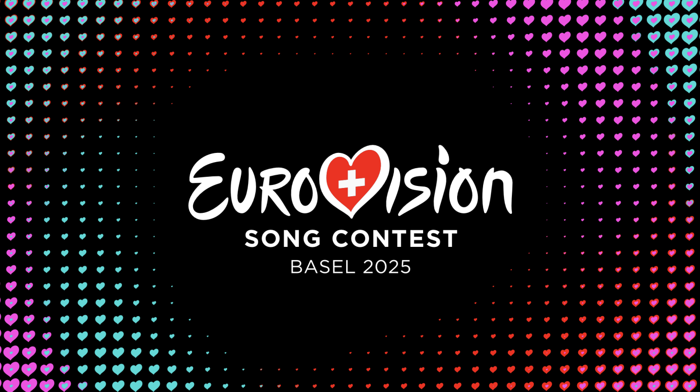
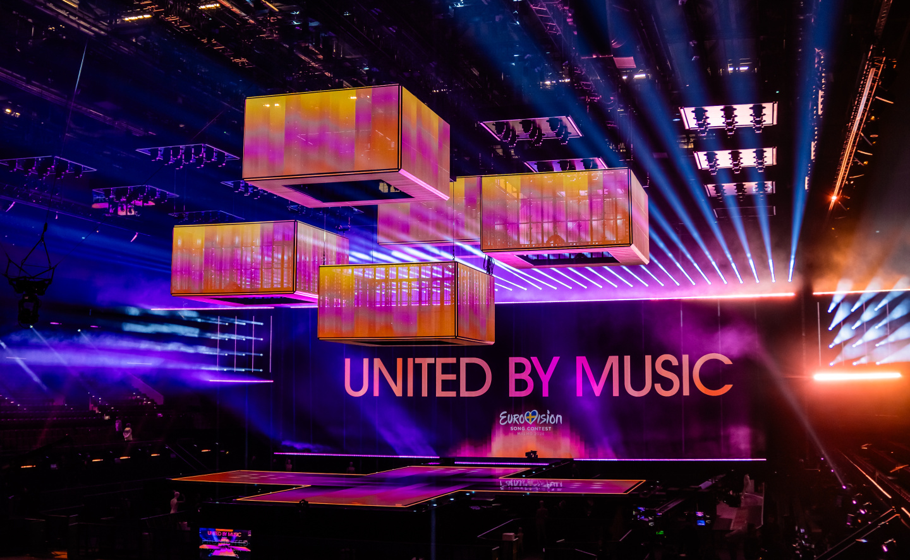
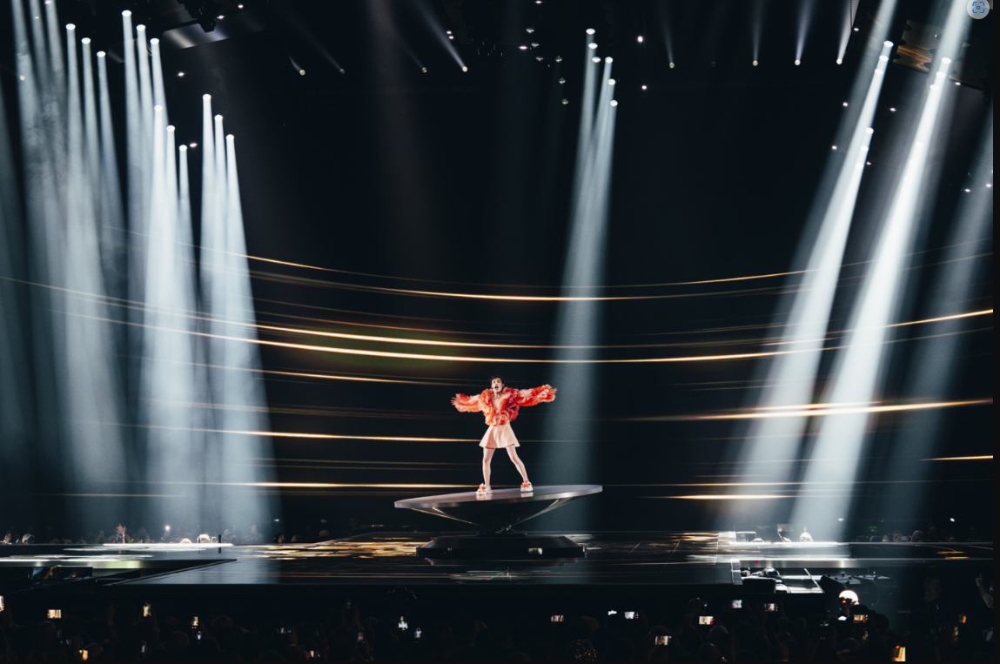
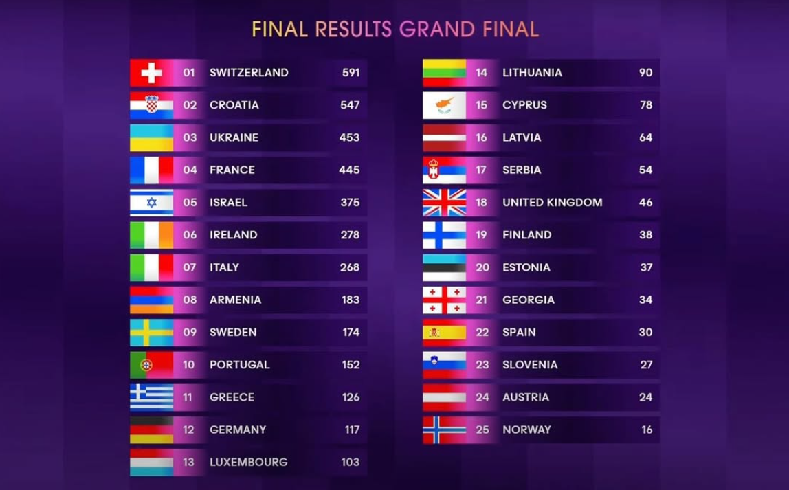
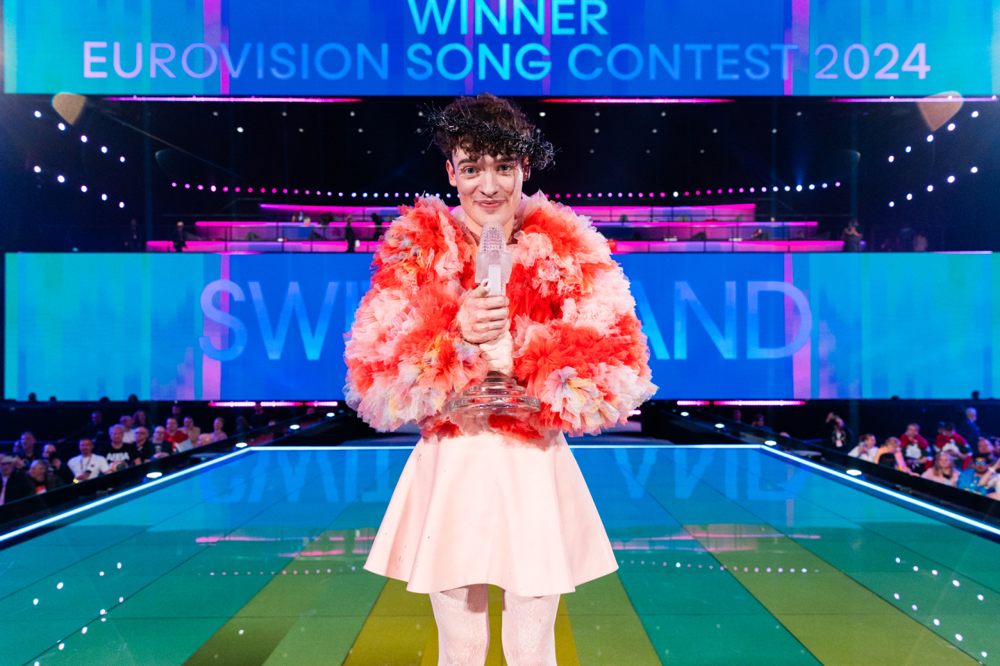

# Eurovision context

This document describes the real-world context for the *Eurocentric* project: the Eurovision Song Contest, 2016-present.

- [Eurovision context](#eurovision-context)
  - [What is the Eurovision Song Contest?](#what-is-the-eurovision-song-contest)
  - [What countries are involved?](#what-countries-are-involved)
  - [How is a contest organized?](#how-is-a-contest-organized)
    - [Contest stages](#contest-stages)
    - [Qualification](#qualification)
    - [Competing and voting allocations](#competing-and-voting-allocations)
    - [Voting methods](#voting-methods)
      - ["Stockholm" voting rules, 2016-2022](#stockholm-voting-rules-2016-2022)
      - ["Liverpool" voting rules, 2023-present](#liverpool-voting-rules-2023-present)
    - [Disqualification](#disqualification)
      - [Disqualification during a contest](#disqualification-during-a-contest)
      - [Withdrawal before a contest starts](#withdrawal-before-a-contest-starts)
  - [How does a broadcast work?](#how-does-a-broadcast-work)
    - [Awarding points](#awarding-points)
    - [Determining the finishing order](#determining-the-finishing-order)
    - [Substitute televotes](#substitute-televotes)
  - [The future](#the-future)
  - [Data source](#data-source)
  - [Images](#images)

## What is the Eurovision Song Contest?

|  |
|:------------------------------------------------------------------------------------------------:|
|            The logo for the 2025 Eurovision Song Contest in Basel, Switzerland (EBU).            |

The Eurovision Song Contest is an annual televised song contest organized by the European Broadcasting Union (EBU). The Contest is between national broadcasters, each from a different country. Each broadcaster is represented by an act with a song. The winner of the Contest customarily hosts the following year's Contest.

For example:

The 2024 Eurovision Song Contest was held in Malmö, Sweden. There were 37 participating countries. The winner was Nemo with the song "The Code", representing the Swiss national broadcaster SRG SSR. The 2025 Eurovision Song Contest is therefore hosted by Switzerland.

## What countries are involved?

A given year's Contest has somewhere between 35 and 45 participating countries.

Participating countries are mostly located in Europe. Exceptions include Australia, Israel, Georgia, Azerbaijan and Armenia.

It's customary when talking about Eurovision to refer to acts, songs, performances, televotes and juries by the countries that they represented. For example:

- "Sweden and Ireland have won Eurovision the most times."
- "Luxembourg participated in Eurovision 2024, for the first time since 1993."
- "In the 2023 Grand Final, Austria performed first in the running order and finished 15th with 120 points."
- "The UK received zero televote points in the 2024 Grand Final."
- "Getting votes from your neighbours is a sure way / To get your song disgraced. / But when Sweden gets 12 points from Norway / It's clearly just good taste." \[[YouTube link](https://youtu.be/YuszTGJlRoo?si=IfmnLxw1XJGlxdxg&t=92)\]

## How is a contest organized?

### Contest stages

A given year's Contest is divided into three stages:

| Stage             | Competitors |
|:------------------|:-----------:|
| First Semi-Final  |    15-20    |
| Second Semi-Final |    15-20    |
| Grand Final       |    25-26    |

Each stage is a separate TV broadcast.

### Qualification

Five or six of a Contest's participating countries automatically qualify for the Grand Final and do not have to compete in the Semi-Finals. The automatic qualifiers are the host country and the "Big Five":

- France
- Germany
- Italy
- Spain
- United Kingdom

All other participating countries must compete in one of the two Semi-Finals. The top 10 competing countries from each Semi-Final qualify for the Grand Final.

### Competing and voting allocations

The participating countries in a Contest are split approximately 50/50 between each of the two Semi-Finals using a semi-random draw.

Each participating country that is not an automatic qualifier is allocated to one of the two Semi-Finals, in which it competes and votes.

Each automatic qualifier is allocated to one of the Semi-Finals, in which it votes but *does not* compete.

The qualifying participating countries compete in the Grand Final.

Every participating country in a Contest votes in the Grand Final, irrespective of whether it competes in the Grand Final.

### Voting methods

Two voting methods are used: national televotes and national juries.

#### "Stockholm" voting rules, 2016-2022

The following voting rules were introduced for the 2016 Contest in Stockholm:

- In all three stages, every voting country has a national televote.
- In all three stages, every voting country has a national jury.

#### "Liverpool" voting rules, 2023-present

The following voting rules were introduced for the 2023 contest in Liverpool.

- In all three stages, every voting country has a national televote.
- In the First Semi-Final and Second Semi-Final, there are no national juries awarding points.
- In the Grand Final, every voting country has a national jury.
- The Contest recognizes a "Rest of the World" pseudo-country, which awards a single set of televote points in each broadcast voted for by viewers outside the participating countries.

### Disqualification

#### Disqualification during a contest

During the 2024 Eurovision Song Contest, the Netherlands qualified from the Second Semi-Final and assigned running order spot 5 in the Grand Final. The Dutch act was subsequently disqualified from the Grand Final before it took place.

The Netherlands did not compete in the Grand Final, but they did vote as usual. Running order spot 5 was left vacant.

This is the only time this has happened.

#### Withdrawal before a contest starts

On several occasions, a participating country has had to withdraw before the start of the Contest. For example, Romania chose an act and a song for the 2016 Eurovision Song Contest but was later disqualified by the EBU. In these instances, the country is not listed as a participant in that Contest.

## How does a broadcast work?

A broadcast is a single stage of a single Contest. The competing countries perform in a pre-determined running order. The voting countries (the national televotes and/or national juries) award points to the competitors, which determine their finishing positions.

### Awarding points

A single national televote or jury representing a voting country in a broadcast gives a single points award to each competing country in the broadcast, excluding itself if is also a competitor. It ranks the competitors from first to last. It awards the top ten ranked competitors points with the values \[12, 10, 8, 7, 6, 5, 4, 3, 2, 1\]. It awards all the other competitors 0 points.

### Determining the finishing order

The competing countries in a broadcast are assigned a distinct finishing position based on descending total points.

Ties are not permitted. The following tie-break rules are used in order:

1. If two competitors are tied on total points, the competitor with more televote points wins the tie.
2. If they are still tied, the competitor with more non-zero televote points awards wins the tie.
3. If they are still tied, a "count-back" is used: the competitor that received more 12-points televote awards wins the tie, then 10-points televote awards, and so on down to 1-point televote awards.
4. If they are still tied, the competitor with the earlier running order position wins the tie.

### Substitute televotes

On multiple occasions in recent years, a voting country has not been able to award its televote points during a broadcast. Two methods have been used in recent years to create a set of televote points awards for a country that finds itself in this position:

1. An artificial televote ranking of competing countries has been generated from the televote rankings of selected countries that are similar to the affected country.
2. The country has a back-up jury whose competitor ranking is used as a substitute for a televote rankings.

For the purposes of this project, all televote points are taken at face value, disregarding any substitution methods that were used.

## The future

This document describes the Eurovision Song Contest from 2016 to 2024. At the time of writing, no announcements have been made regarding any format changes for the 2025 Contest.

## Data source

The [official Eurovision website](https://eurovision.tv) is the single source for all data used in this project.

## Images

|  |
|:----------------------------------------------------------------------------------------------------------:|
|       The stage for the 68th Eurovision Song Contest in Malmö, Sweden, 2024 (Peppe Andersson, SVT).        |

|  |
|:--------------------------------------------------------------------------------------------------------:|
|     Nemo performing "The Code" for Switzerland at the 2024 Grand Final (Sarah Louise Bennett, EBU).      |

|  |
|:------------------------------------------------------------------------------------:|
|                   The final results of the 2024 Grand Final (EBU).                   |

|  |
|:-------------------------------------------------------------------------------------------------------------------:|
|     Switzerland wins the 68th Eurovision Song Contest with the song "The Code" by Nemo (Corinne Cumming, EBU).      |

|  |
|:-----------------------------------------------------------------------------------------------------------------------------:|
|              Rendering of the stage design for the 2025 Eurovision Song Contest in Basel, Switzerland (SRG SSR).              |
