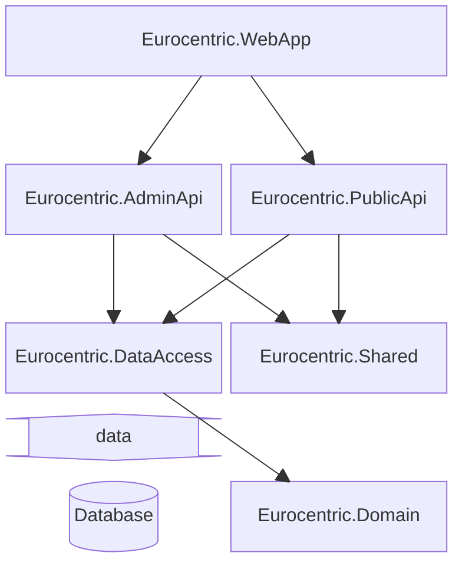

# System design

This document outlines the technical design decisions made during the initial development of the *Eurocentric* project.

- [System design](#system-design)
  - [Technical requirements](#technical-requirements)
  - [REPR pattern](#repr-pattern)
  - [Railway-oriented programming](#railway-oriented-programming)
  - [Vertical slice architecture](#vertical-slice-architecture)
  - [Assembly architecture](#assembly-architecture)
  - [ATDD](#atdd)
  - [Test databases](#test-databases)
  - [Version control](#version-control)
  - [CI/CD](#cicd)

## Technical requirements

- The system is written using .NET version 9.
- The APIs are implemented using the ASP.NET *minimal API* technique.
- The system aims for level 2 REST maturity.
- The server is hosted in the cloud as an Azure Web App.
- The system uses an Azure SQL database (in the cloud).
- The language used by the system is UK English.

## REPR pattern

The two APIs implement the REPR (Request, Endpoint, Response) pattern. That is, for every feature, there is:

- a class that defines the HTTP endpoint,
- a class that defines the request parameters (if any),
- a class that defines the response object (if any).

## Railway-oriented programming

Features in the two APIs are implemented using the Railway-oriented programming pattern. That is, whenever a request is handled on the server:

- *either* the request is handled successfully and a response object is returned, which the API sends to the client as a successful HTTP response.
- *or* the request is unsuccessful and an error is returned, which the API converts to a problem details object and sends to the client as an unsuccessful HTTP response.

## Vertical slice architecture

The two APIs are implemented using vertical slice architecture. Within each API assembly, each feature has its own folder, having the name of the feature. Within the feature folder, every non-static class has a name beginning with the feature name.

For example:

```
Eurocentric.AdminApi
└── Countries
    ├── Common
    |   └── Country.cs
    └── CreateCountry
        ├── CreateCountryCommand.cs
        ├── CreateCountryEndpoint.cs
        ├── CreateCountryHandler.cs
        ├── CreateCountryRequest.cs
        └── CreateCountryResponse.cs
```

## Assembly architecture

The system is composed of six .NET assemblies:

| Name                     | .NET project type | Role                                            |
|:-------------------------|:-----------------:|:------------------------------------------------|
| `Eurocentric.WebApp`     |      Web API      | Web application composition root and executable |
| `Eurocentric.AdminApi`   |   Class library   | *Admin API* features                            |
| `Eurocentric.PublicApi`  |   Class library   | *Public API* features                           |
| `Eurocentric.DataAccess` |   Class library   | Database access to domain types                 |
| `Eurocentric.Shared`     |   Class library   | *Shared* features                               |
| `Eurocentric.Domain`     |   Class library   | Domain types                                    |

The assemblies are illustrated in the below diagram, in which arrows indicate the directions of dependencies.



## ATDD

The system is developed using Acceptance Test Driven Development. The following basic workflow is used:

1. A feature is selected from the backlog and its issue is opened on GitHub.
2. A set of failing acceptance tests are written for the feature, from the perspective of a client making an HTTP request and analysing the response.
3. The feature is implemented using unit tests and integration tests.
4. The feature is completed once all the acceptance tests pass.
5. The source code changes are committed and the GitHub issue is closed.

## Test databases

Integration and acceptance tests use their own test databases running inside Docker containers that are disposed of at the end of each test run.

## Version control

Git is used for version control of source code.

Commit messages are written using the [Conventional Commits](https://www.conventionalcommits.org/en/v1.0.0/) standard.

## CI/CD

At an early stage in development, an action is added to the GitHub source code repository that automatically publishes and deploys the application to the Azure App Service. This action is triggered every time source code is pushed to the main branch in the remote repository.
