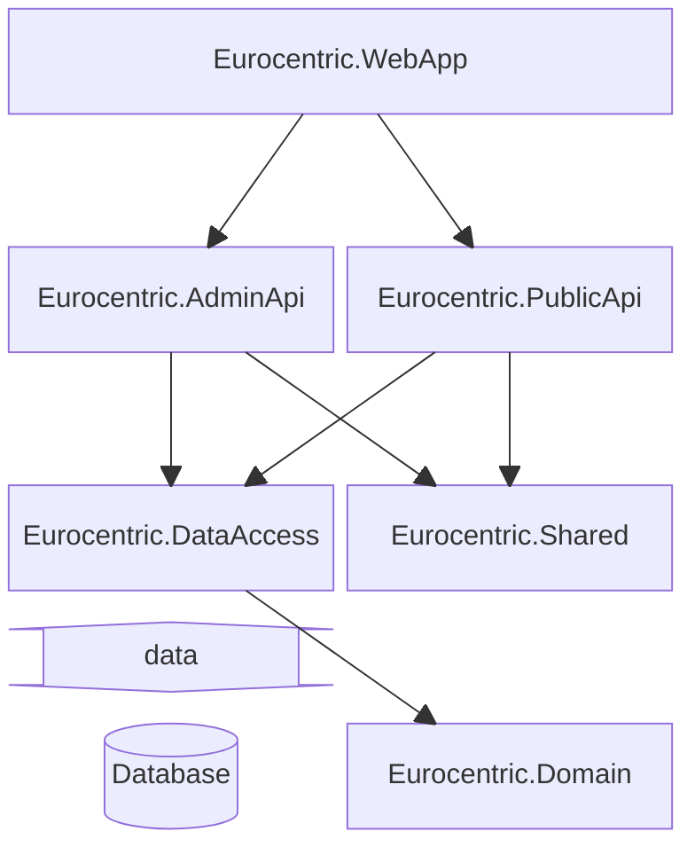

# System design

This document outlines system design decisions taken during development of the *Eurocentric* project.

- [System design](#system-design)
  - [Technical specification](#technical-specification)
  - [Assembly architecture](#assembly-architecture)
  - [API architecture](#api-architecture)
  - [Version control](#version-control)
  - [CI/CD](#cicd)

## Technical specification

- The system is written using .NET version 9.
- The APIs are implemented using the ASP.NET *minimal API* technique.
- The system aims for level 2 REST maturity.
- The system is hosted in the cloud as an Azure Web App.
- The system uses an Azure SQL Database, hosted in the cloud.
- The language used by the system is UK English.

## Assembly architecture

The system is composed of six .NET assemblies:

| Name                     | .NET project type | Role                                            |
|:-------------------------|:-----------------:|:------------------------------------------------|
| `Eurocentric.WebApp`     |      Web API      | Web application composition root and executable |
| `Eurocentric.AdminApi`   |   Class library   | *admin-api* features                            |
| `Eurocentric.PublicApi`  |   Class library   | *public-api* features                           |
| `Eurocentric.DataAccess` |   Class library   | Database access to domain types                 |
| `Eurocentric.Shared`     |   Class library   | *shared* features                               |
| `Eurocentric.Domain`     |   Class library   | Domain types                                    |

The assemblies are illustrated in the below diagram, in which arrows indicate the directions of dependencies.

## API architecture

Each of the two APIs is structured using the following patterns:

- vertical slices
- request-endpoint-response
- railway-oriented programming

## Version control

Git is used for version control of source code.

Commit messages are written using the [Conventional Commits](https://www.conventionalcommits.org/en/v1.0.0/) standard.

## CI/CD

At an early stage in development, an action is added to the GitHub source code repository that automatically publishes and deploys the application to the Azure App Service. This action is triggered every time source code is pushed to the main branch in the remote repository.
