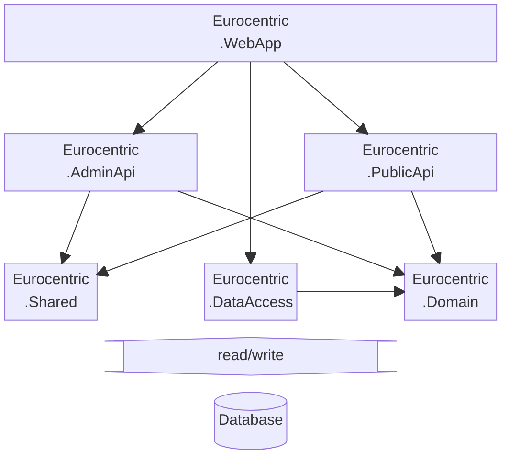

# System design

This document outlines the system design decisions taken during development of the *Eurocentric* project.

- [System design](#system-design)
  - [Vertical slice architecture](#vertical-slice-architecture)
  - [Modular assembly architecture](#modular-assembly-architecture)
  - [Version control](#version-control)

## Vertical slice architecture

The system is built using the **vertical slice** architecture. As far as possible, all the code for a single feature is grouped into the same source code folder, which has the name of the feature.

## Modular assembly architecture

The system is built using a **modular assembly architecture**, as illustrated in the diagram below. Arrows indicate assembly references.

| Assembly name            | .NET project type | Contains                                                       |
|:-------------------------|:-----------------:|:---------------------------------------------------------------|
| `Eurocentric.AdminApi`   |   Class library   | *Admin API* features, API releases                             |
| `Eurocentric.DataAccess` |   Class library   | Database context and configuration, repository implementations |
| `Eurocentric.Domain`     |   Class library   | Core domain entities, views, queries, repository interfaces    |
| `Eurocentric.PublicApi`  |   Class library   | *Public API* features, API releases                            |
| `Eurocentric.Shared`     |   Class library   | *Shared* features for APIs, custom middleware                  |
| `Eurocentric.WebApp`     |      Web API      | Application executable, composition root                       |

## Version control

Git commit messages adhere to the [Conventional Commits](https://www.conventionalcommits.org/en/v1.0.0/) standard.
