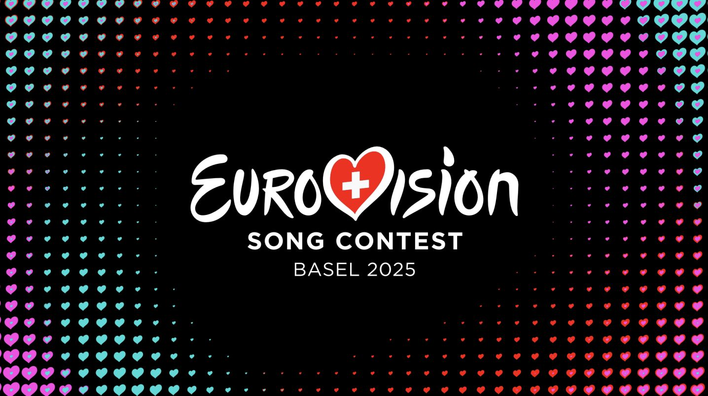
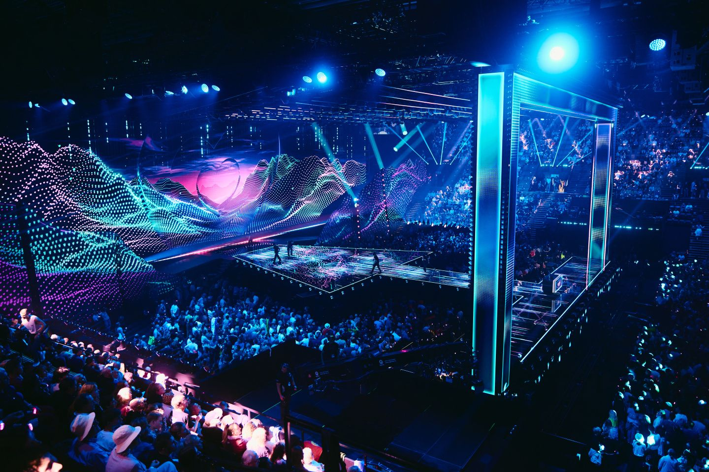
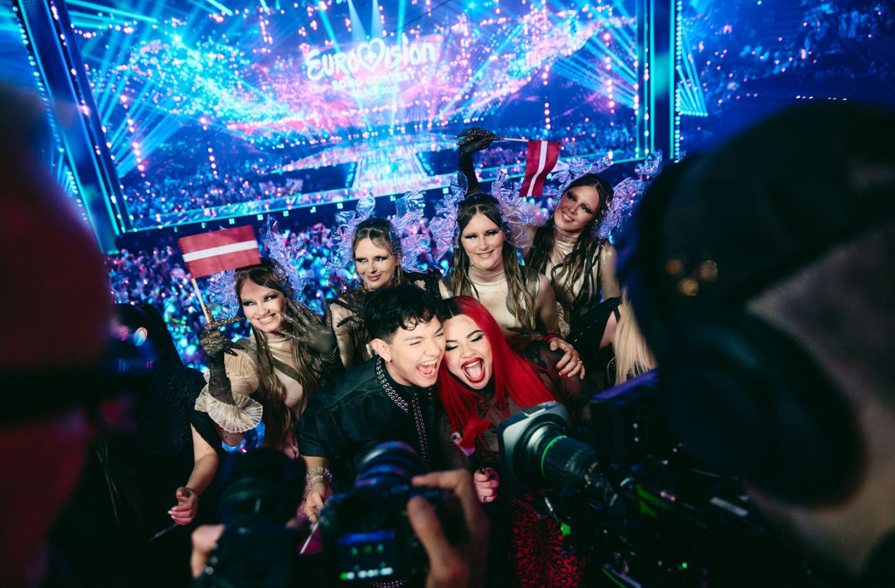
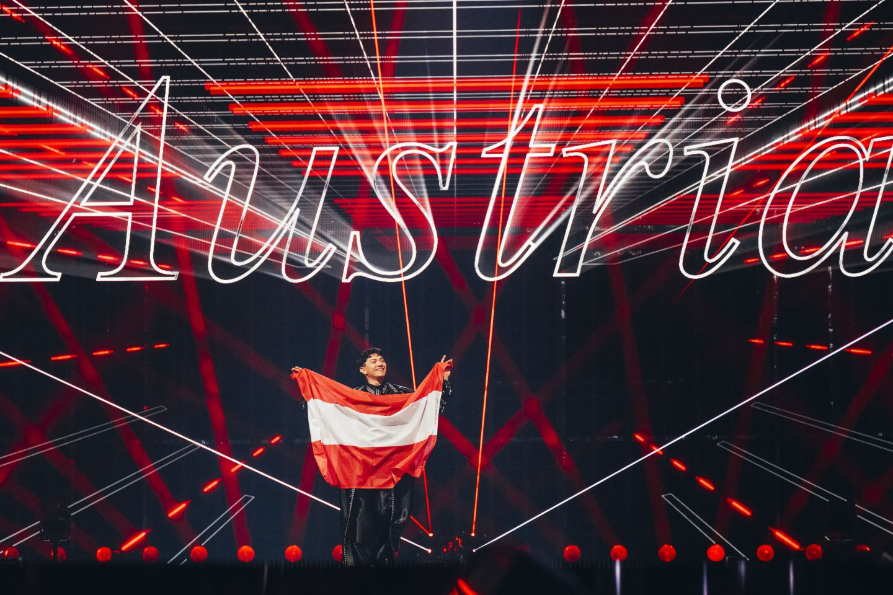

# 2. Eurovision context

This document explains the context to the *Eurocentric* project: the Eurovision Song Contest, 2016-2025.

- [2. Eurovision context](#2-eurovision-context)
  - [What is the Eurovision Song Contest?](#what-is-the-eurovision-song-contest)
  - [What countries are involved?](#what-countries-are-involved)
  - [How is a contest organized?](#how-is-a-contest-organized)
    - [Contest stages](#contest-stages)
    - [Qualification](#qualification)
    - [Competing and voting](#competing-and-voting)
    - [Disqualification and withdrawal](#disqualification-and-withdrawal)
      - [Disqualification during a contest](#disqualification-during-a-contest)
      - [Withdrawal before a contest starts](#withdrawal-before-a-contest-starts)
    - [Contest format](#contest-format)
      - ["Stockholm" format (2016-2022)](#stockholm-format-2016-2022)
      - ["Liverpool" format (2023-present)](#liverpool-format-2023-present)
  - [How does a broadcast work?](#how-does-a-broadcast-work)
    - [Awarding points](#awarding-points)
    - [Determining the finishing order](#determining-the-finishing-order)
    - [Substitute voting methods](#substitute-voting-methods)
  - [The future](#the-future)
  - [Data source](#data-source)
  - [Images from Eurovision official website](#images-from-eurovision-official-website)

## What is the Eurovision Song Contest?

|  |
|:-----------------------------------------------------------------------------------------------------------------------------------------------------------------------------------------------------------------------------:|
|                                                                         The logo for the 2025 Eurovision Song Contest in Basel, Switzerland (© EBU).                                                                          |

The Eurovision Song Contest is an annual televised song contest organized by the European Broadcasting Union (EBU). The contest is between national broadcasters, each from a different country, represented by an act with a song. The broadcaster that wins the contest customarily hosts the following year's contest.

For example:

The 2025 Eurovision Song Contest was held in Basel, Switzerland. There were 37 participating countries, plus an additional "Rest of the World" televote. The winner was JJ with the song "Wasted Love", representing the Austrian national broadcaster ORF. The 2026 Eurovision Song Contest is going to be held in Vienna, Austria.

## What countries are involved?

A given year's contest has somewhere between 35 and 45 participating countries.

Participating countries are mostly located in Europe. Participating countries from outside Europe include Australia, Israel, Georgia, Azerbaijan and Armenia.

It's customary when talking about Eurovision to refer to acts, songs, performances, televotes and juries by the countries that they represented. For example:

- "Sweden and Ireland have won Eurovision the most times."
- "Luxembourg participated in Eurovision 2024, for the first time since 1993."
- "In the 2023 Grand Final, Austria performed first in the running order and finished 15th with 120 points."
- "The UK received zero televote points in the 2024 Grand Final."
- "Getting votes from your neighbours is a sure way / To get your song disgraced. / But when Sweden gets 12 points from Norway / It's clearly just good taste." \[[YouTube link](https://youtu.be/YuszTGJlRoo?si=IfmnLxw1XJGlxdxg&t=92)\]

## How is a contest organized?

### Contest stages

A given year's contest is divided into three stages:

| Stage             | Competitors |
|:------------------|:-----------:|
| First Semi-Final  |    15-20    |
| Second Semi-Final |    15-20    |
| Grand Final       |    25-26    |

Each stage is a separate TV broadcast.

### Qualification

The following participating countries automatically qualify for the Grand Final:

- The "Big Five": France, Germany, Italy, Spain and the United Kingdom.
- The host country.

All other participating countries must compete in one of the two Semi-Finals. The top 10 competitors in each Semi-Final qualify for the Grand Final.

### Competing and voting

Participating countries in a contest are split evenly between the two Semi-Finals for voting and competing, as follows:

- Half of the automatic qualifiers vote in the First Semi-Final, the other half in the Second Semi-Final.
- Half of the non-automatic qualifiers compete and vote in the First Semi-Final, the other half in the Second Semi-Final.
- All participants vote in the Grand Final.

Participants are assigned to a Semi-Final using a random draw before the contest starts.

### Disqualification and withdrawal

#### Disqualification during a contest

During the 2024 Eurovision Song Contest, the Netherlands qualified from the Second Semi-Final and assigned running order spot 5 in the Grand Final. The Dutch act was subsequently disqualified from the Grand Final before it took place.

The Netherlands did not compete in the Grand Final, but they did vote as usual. Running order spot 5 was left vacant.

This is the only time this has happened.

**In *Eurocentric*, a competitor disqualified from a broadcast is removed from the broadcast before any points are awarded.**

#### Withdrawal before a contest starts

On several occasions, a participating country has had to withdraw before the start of the contest. For example, Moldova withdrew from the Basel 2025 contest before their act was selected. In these instances, the country is not listed as a participant in that contest.

**In *Eurocentric*, a withdrawn participant is disregarded.**

### Contest format

**In *Eurocentric*, two simplified contest formats are defined.**

#### "Stockholm" format (2016-2022)

The "Stockholm" format summarizes the rules introduced at the Stockholm 2016 contest and last used at the Turin 2022 contest. They are:

- In each Semi-Final, every voting country has a jury and a televote, each of which awards a set of points.
- In the Grand Final, every voting country has a jury and a televote, each of which awards a set of points.

#### "Liverpool" format (2023-present)

The "Liverpool" format summarizes the rules introduced at the Liverpool 2023 contest and still currently in use. They are:

- In each Semi-Final, every voting country has a televote, each of which awards a set of points.
- In the Grand Final, every voting country has a jury and a televote, each of which awards a set of points.
- In all three broadcasts, there is an additional "Rest of the World" televote that awards a single set of points.

## How does a broadcast work?

A broadcast is a single stage of a single contest. The competing countries perform in a pre-determined running order. The voting countries (the national televotes and/or national juries) award points to the competitors, which determine their finishing positions.

### Awarding points

A single national televote or jury representing a voting country in a broadcast gives a single points award to each competing country in the broadcast, excluding itself if is also a competitor. It ranks the competitors from first to last. It awards the top ten ranked competitors points with the values \[12, 10, 8, 7, 6, 5, 4, 3, 2, 1\]. It awards all the other competitors 0 points.

### Determining the finishing order

The competing countries in a broadcast are assigned a distinct finishing position based on descending total points.

Ties are not permitted. The following tie-break rules are used in order:

1. If two competitors are tied on total points, the competitor with more televote points wins the tie.
2. If they are still tied, the competitor with more non-zero televote points awards wins the tie.
3. If they are still tied, a "count-back" is used: the competitor that received more 12-points televote awards wins the tie, then 10-points televote awards, and so on down to 1-point televote awards.
4. If they are still tied, the competitor with the earlier running order position wins the tie.

### Substitute voting methods

On multiple occasions in recent years, the jury or televote points awarded by a country have determined by a substitute method such as a back-up jury or a statistical average of neighbouring countries' votes. This has happened for a number of reasons, such as a country's jury being disqualified after evidence of vote-rigging was discovered, or a country's televote failing due to technical problems.

**In *Eurocentric*, all televote points and all jury points are taken at face value, disregarding any substitute methods that were used in reality.**

## The future

This document describes the Eurovision Song Contest from 2016 to 2025. At the time of writing, no announcements have been made regarding any format changes for the 2026 Contest.

## Data source

The [official Eurovision website](https://eurovision.tv) is the single source for all data used in this project.

## Images from Eurovision official website

|  |
|:-----------------------------------------------------------------------------------------------------------------:|
|                   *The Eurovision 2025 stage in St. Jakobshalle, Basel (© EBU/Alma Bengtsson).*                   |

|  |
|:--------------------------------------------------------------------------------------------------------------------------------------:|
|  *The qualifying acts representing Austria, Latvia and Malta at the Eurovision 2025 Second Semi-Final (© EBU/Sarah Louise Bennett).*   |

|  |
|:----------------------------------------------------------------------------------------------------------------------------------------------------------------------:|
|                       *JJ from Austria participating in the flag parade at the start of the Eurovision 2025 Grand Final (© EBU/Alma Bengtsson).*                       |

|  |
|:-----------------------------------------------------------------------------------------------------------------------------------------:|
|                   *JJ from Austria performing "Wasted Love" in the Eurovision 2025 Grand Final (© EBU/Alma Bengtsson).*                   |

|  |
|:----------------------------------------------------------------------------------------------------------:|
|                         *Scoreboard from the Eurovision 2025 Grand Final (© EBU).*                         |

|  |
|:------------------------------------------------------------------------------------------------------------------------------------:|
|         *JJ from Austria holding the winner's trophy at the end of the Eurovision 2025 Grand Final (© EBU/Corinne Cumming).*         |
