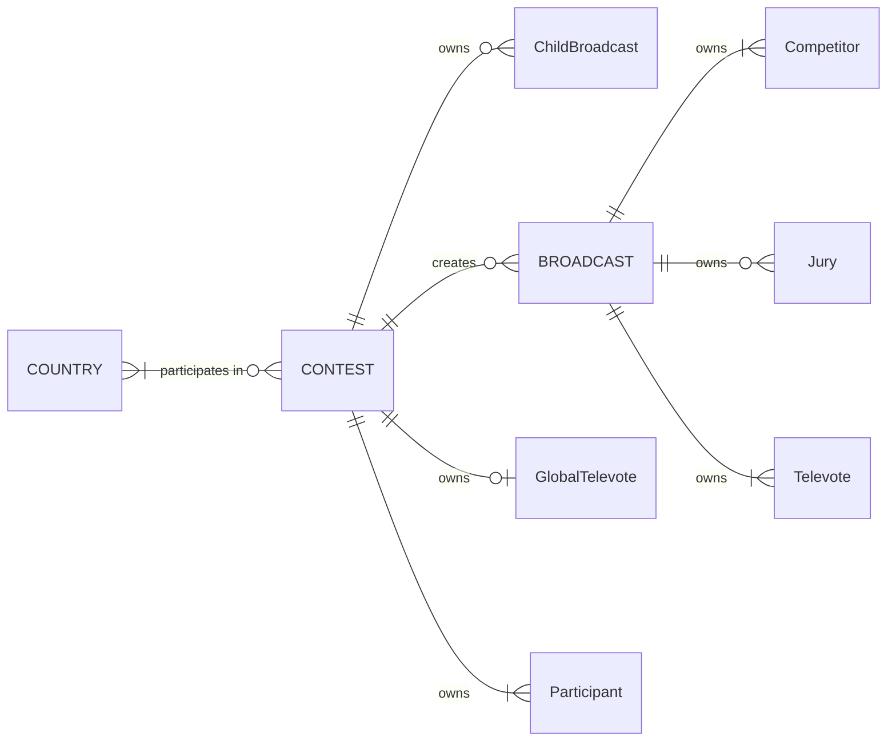

# 3. Domain model

This document outlines the domain model for *Eurocentric*.

- [3. Domain model](#3-domain-model)
  - [Aggregates and entities](#aggregates-and-entities)
    - [Country aggregate](#country-aggregate)
    - [Contest aggregate](#contest-aggregate)
    - [Broadcast aggregate](#broadcast-aggregate)
  - [Key transactions](#key-transactions)
    - [1. Create a country](#1-create-a-country)
    - [2. Create a contest](#2-create-a-contest)
    - [3. Create a child broadcast for a contest](#3-create-a-child-broadcast-for-a-contest)
    - [4. Disqualify a competitor in a broadcast](#4-disqualify-a-competitor-in-a-broadcast)
    - [5. Award jury points in a broadcast](#5-award-jury-points-in-a-broadcast)
    - [6. Award televote points in a broadcast](#6-award-televote-points-in-a-broadcast)
  - [Value object invariants](#value-object-invariants)

## Aggregates and entities

The domain model has 9 entities, grouped into 3 aggregates as shown in the diagram below.

### Country aggregate

A **country** aggregate represents a single country or pseudo-country in the system. It is responsible for tracking the contest aggregates in which the country participates.

### Contest aggregate

A **contest** aggregate represents a single year's edition of the Eurovision Song Contest in the system. It is responsible for creating its child broadcasts and tracking their completeness.

A contest aggregate owns at least 6 **participant** entities. A participant represents an act with a song from a participating country in the contest.

A contest aggregate owns between 0 and 3 **child broadcast** entities. A child broadcast represents a broadcast aggregate from the point of view of its parent contest.

A contest aggregate owns 0 or 1 **global televote** entity. A global televote represents a televote from a participating pseudo-country in the contest.

### Broadcast aggregate

A **broadcast** aggregate represents a single stage in a contest. It is responsible for awarding points from the juries to the competitors and updating the finishing positions.

A broadcast aggregate owns at least 2 **competitor** entities. A competitor represents a participant competing in the broadcast.

A broadcast aggregate owns 0 or multiple **jury** entities. A jury represents a participant awarding a set of jury points to the competitors in the broadcast.

A broadcast aggregate owns multiple **televote** entities. A televote represents a participant awarding a set of televote points to the competitors in the broadcast.

## Key transactions

### 1. Create a country

The Admin creates a new country in the system, providing:

- The country code.
- The country name.

**Invariants:**

- A country cannot be created in the system when an existing country has the same country code.

### 2. Create a contest

The Admin creates a new contest in the system, providing:

- The contest year.
- The city name.
- The contest format.
- The participants, for each:
  - The participating country ID.
  - The Semi-Final draw.
  - The act name.
  - The song title.

**Invariants:**

- A contest cannot be created in the system when an existing contest has the same contest year.
- If the contest format is "Liverpool", a "Rest of the World" country must exist in the system for the global televote.
- A contest must have at least 3 participants having drawn the First Semi-Final and at least 3 participants having drawn the Second Semi-Final.
- All participating country IDs in the contest must be different.
- All participating country IDs in the contest must reference an existing country.

### 3. Create a child broadcast for a contest

The Admin creates a child broadcast for an existing contest in the system, providing:

- The contest ID.
- The contest stage.
- The broadcast date.
- The competing country IDs in running order.

**Invariants:**

- The contest cannot create a child broadcast when it has an existing child broadcast with the same contest stage.
- A broadcast cannot be created in the system when an existing broadcast has the same broadcast date.
- A broadcast's date must have the same year as its parent contest.
- A broadcast must have at least 2 competitors.
- Each competing country IDs in the broadcast must be different.
- Each competing country ID in the broadcast must match a participant in the parent contest eligible to compete in the contest stage.

### 4. Disqualify a competitor in a broadcast

The Admin disqualifies a competitor in an existing broadcast in the system, providing:

- The broadcast ID.
- The competing country ID.

**Invariants:**

- A competitor cannot be disqualified from a broadcast when any of its juries or televotes has awarded its points.
- The competing country ID must match a competitor in the broadcast.

### 5. Award jury points in a broadcast

The Admin awards a set of points from a jury to the competitors in an existing broadcast in the system, proving:

- The broadcast ID.
- The voting country ID.
- The ranked competing country IDs.

**Invariants:**

- The voting country ID must match a jury in the broadcast.
- The jury must not have awarded its points.
- The ranked competing country IDs must consist of all the competing country IDs in the broadcast, excluding the voting country ID, exactly once.

### 6. Award televote points in a broadcast

The Admin awards a set of points from a televote to the competitors in an existing broadcast in the system, proving:

- The broadcast ID.
- The voting country ID.
- The ranked competing country IDs.

**Invariants:**

- The voting country ID must match a televote in the broadcast.
- The televote must not have awarded its points.
- The ranked competing country IDs must consist of all the competing country IDs in the broadcast, excluding the voting country ID, exactly once.

## Value object invariants

The following invariants are encapsulated in value object types:

- An act name must be a non-empty, non-whitespace string of no more than 200 characters.
- A broadcast date must be between 2016-01-01 and 2050-12-31.
- A city name must be a non-empty, non-whitespace string of no more than 200 characters.
- A contest year must be an integer between 2016 and 2050.
- A country code must be a string of 2 upper-case letters.
- A country name must be a non-empty, non-whitespace string of no more than 200 characters.
- A points award must have a numerical points value that is one of {12, 10, 8, 7, 6, 5, 4, 3, 2, 1, 0}.
- A song title must be a non-empty, non-whitespace string of no more than 200 characters.
