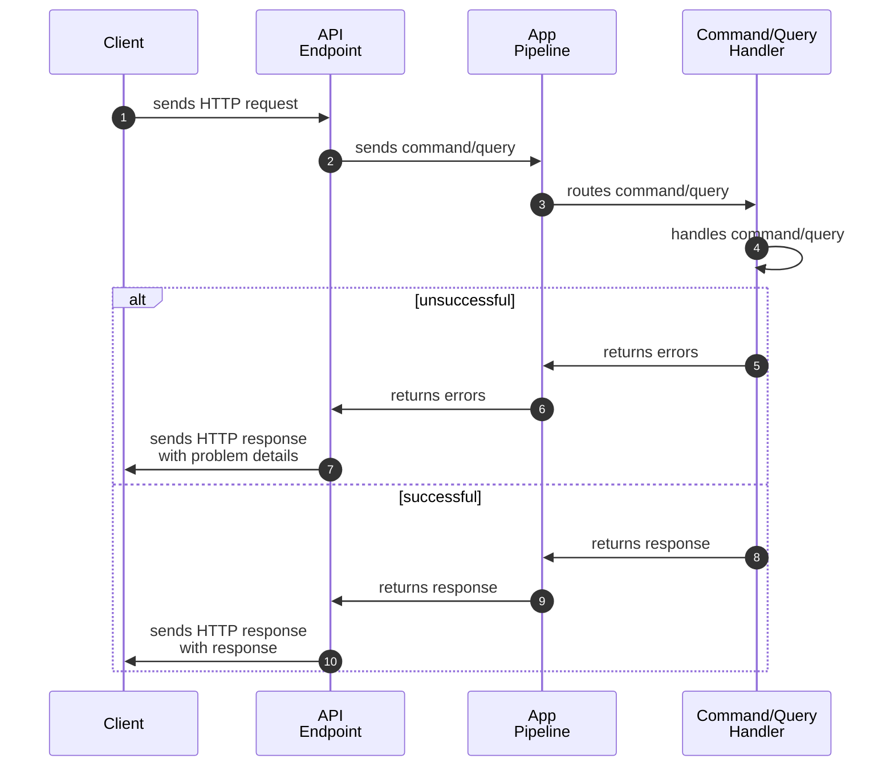
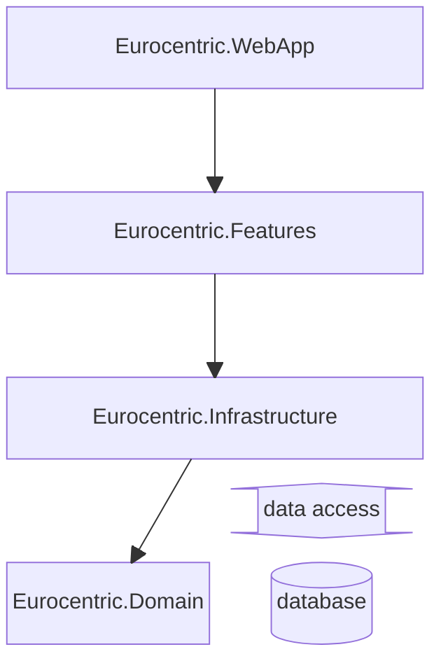

# 7. System design

This document outlines the system design decisions taken during the development of *Eurocentric*.

- [7. System design](#7-system-design)
  - [Technical specification](#technical-specification)
  - [API architecture](#api-architecture)
    - [Vertical slices](#vertical-slices)
    - [Request-endpoint-response](#request-endpoint-response)
    - [Request handling workflow](#request-handling-workflow)
    - [API versioning](#api-versioning)
    - [HTTP responses](#http-responses)
      - [Successful responses](#successful-responses)
      - [Unsuccessful responses](#unsuccessful-responses)
  - [System architecture](#system-architecture)
  - [Domain model rules](#domain-model-rules)
    - [Identity](#identity)
    - [Instantiation](#instantiation)
    - [Mutability](#mutability)
    - [Enforcement of invariants](#enforcement-of-invariants)
  - [Acceptance test driven development (ATDD)](#acceptance-test-driven-development-atdd)
    - [Acceptance tests](#acceptance-tests)
    - [Architecture tests](#architecture-tests)
    - [Unit tests](#unit-tests)
  - [Version control](#version-control)
  - [Continuous integration and continuous delivery (CI/CD)](#continuous-integration-and-continuous-delivery-cicd)
  - [Data access](#data-access)
  - [Database concurrency](#database-concurrency)

## Technical specification

- The system is written using .NET version 9.
- The APIs are implemented using the ASP.NET *minimal API* technique.
- The system aims for level 2 REST maturity.
- As far as possible, the native ASP.NET libraries are used to implement the APIs.
- The system is hosted in the cloud as an Azure Web App.
- The system uses an Azure SQL Database, hosted in the cloud.
- The language used by the system is UK English.

## API architecture

### Vertical slices

API features are organized using the **vertical slice** architecture. For each *admin-api* and *public-api* feature, all its code is grouped together in a single folder named after the feature.

### Request-endpoint-response

Every API endpoint defines its own request type and/or response types, e.g. `CreateCountryRequest` and `CreateCountryResponse`.

Every API endpoint has the same contract: the request *either* fails and returns a `ProblemDetails` response object with an unsuccessful status code *or* succeeds and returns the response with a successful status code.

### Request handling workflow

Every API endpoint uses an in-memory app pipeline. The endpoint defines a `Command` or `Query` type which returns from the pipeline as *either* a list of errors *or* the successful response type. A `Command` or `Query` is defined using the language of the API (*not* the domain).

The following diagram illustrates the request handling workflow used for every endpoint.

1. The client sends an HTTP request to the API endpoint.
2. The API endpoint sends the command/query to the app pipeline.
3. The app pipeline routes the command/query to its handler.
4. The handler handles the command/query, which is *either* unsuccessful (go to step 5) *or* successful (go to step 8).
5. The handler returns errors to the app pipeline.
6. The app pipeline returns the errors to the API endpoint.
7.  The API endpoint creates a `ProblemDetails` object from the first error and sends the `ProblemDetails` to the client as an HTTP response with an unsuccessful status code \[END\].
8. The handler returns the successful response to the app pipeline.
9. The app pipeline returns the response to the API endpoint.
10. The API endpoint sends the response to the client as an HTTP response with a successful status code \[END\].

### API versioning

The *Admin API* and the *Public API* both use major+minor API versioning. The API version is passed as a URL segment, e.g. `/admin/api/v1.0/countries`.

Each *major* version of an API is a separate unit, not expected to be compatible with earlier or later major versions.

A later *minor* version of a *major* version of an API is backwards-compatible with all earlier minor versions of the major version. In other words, a new *minor* version of an API can only introduce new endpoints; it cannot remove or modify existing endpoints.

### HTTP responses

#### Successful responses

When an API endpoint successfully handles a request, the response follows the examples in the table below.

| HTTP method | Response status code | Response body                  | Response headers  |
|:-----------:|:--------------------:|:-------------------------------|:------------------|
|    `GET`    |         200          | Requested data                 | None              |
|   `POST`    |         201          | Full model of created resource | Resource location |
|  `DELETE`   |         204          | None                           | None              |
|   `PATCH`   |         204          | None                           | None              |

#### Unsuccessful responses

When an API unsuccessfully handles a request, the response follows the examples in the table below.

| Response status code | Meaning                                                                                                                                                                                                                                                       | Example(s)                                                                                                                                          |
|:--------------------:|:--------------------------------------------------------------------------------------------------------------------------------------------------------------------------------------------------------------------------------------------------------------|:----------------------------------------------------------------------------------------------------------------------------------------------------|
|         400          | "I can't understand what the request is asking me to do. This includes situations when a `BadHttpRequestException` or `InvalidEnumArgumentException` was thrown."                                                                                             | Query string missing required parameter. Request body missing required property. Passing an illegal string value for an enum property or parameter. |
|         401          | "I can't authenticate the client."                                                                                                                                                                                                                            | Using an unrecognized API key.                                                                                                                      |
|         403          | "I have authenticated the client but they are not authorized to make the request. "                                                                                                                                                                           | Not using secret API key.                                                                                                                           |
|         404          | "The request is referencing a resource by ID that doesn't exist."                                                                                                                                                                                             | Creating a **CONTEST** with a **Participant** referencing a non-existent **COUNTRY**.                                                               |
|         409          | "I've understood the request, but I can't execute it because doing so would break one or more business rules given the current state of the resource being modified and/or all existing resources. In other words, the request is **extrinsically illegal**." | Creating a **CONTEST** with a non-unique contest year. Awarding points in a **BROADCAST** for a **Jury** that has already awarded its points.       |
|         422          | "I've understood the request, but I can't execute it because one or more of the elements of the request are by themselves incompatible with one or more business rules. In other words, the request is **intrinsically illegal**."                            | Creating a **COUNTRY** with an illegal country code value. Creating a **CONTEST** with two **Participants** referencing the same **COUNTRY**.       |
|         500          | "An unexpected exception was thrown, which is not a `BadHttpRequestException` or an `InvalidEnumArgumentException` or a `SqlException` caused by a database connection timing out."                                                                           | Divide by zero.                                                                                                                                     |
|         503          | "A `SqlException` was thrown because the database connection timed out. Try again after \[duration\] seconds."                                                                                                                                                | Database is unavailable.                                                                                                                            |

## System architecture

The system is composed of four .NET assemblies:

| Name                         | .NET project type | Role                                                                                                                                       |
|:-----------------------------|:-----------------:|:-------------------------------------------------------------------------------------------------------------------------------------------|
| `Eurocentric.WebApp`         |      Web API      | composition root and executable                                                                                                            |
| `Eurocentric.Features`       |   Class library   | *admin-api*, *public-api* and *shared* features (equivalent to clean architecture application + presentation layers)                       |
| `Eurocentric.Infrastructure` |   Class library   | data access, randomness, timing, other services that reach outside the application (equivalent to clean architecture infrastructure layer) |
| `Eurocentric.Domain`         |   Class library   | domain types (equivalent to clean architecture domain layer)                                                                               |

- `Eurocentric.Domain` depends on nothing.
- `Eurocentric.Infrastructure` depends on `Eurocentric.Domain`.
- `Eurocentric.Features` depends on `Eurocentric.Infrastructure`.
- `Eurocentric.WebApp` depends on `Eurocentric.Features`.

The four assemblies are illustrated in the below diagram. Arrows indicate the directions of dependencies.

## Domain model rules

This section describes the rules for domain aggregate, entity, and value object types.

### Identity

1. An aggregate is assigned an ID on the server when it is first created, before it is persisted to the database. The [RFC 9562 Version 7](https://learn.microsoft.com/en-us/dotnet/api/system.guid.createversion7?view=net-9.0) GUID specification is used.
2. An entity has no ID of its own, but has a property that uniquely identifies it within its aggregate. The entity therefore has a composite ID of its identifying property and the ID of its aggregate.
3. A value object has no identity.

### Instantiation

1. An aggregate can be instantiated using its public API and queried by its ID.
2. An entity cannot be instantiated or queried except as part of its aggregate.
3. A value object can be instantiated anywhere using a factory method.

### Mutability

1. An aggregate is mutable through its public API.
2. An entity can only be mutated through the public API of its aggregate.
3. A value object is immutable.

### Enforcement of invariants

1. An aggregate enforces its internal invariants, including those of all its entities, at all times.
   1. An aggregate cannot be instantiated in a state that violates any of its internal invariants.
   2. An aggregate cannot be mutated if doing so would violate any of its internal invariants.
2. A value object cannot be instantiated in an illegal state.
3. An instantiated or updated aggregate cannot be persisted to the system if it violates any inter-aggregate invariants given the aggregates that currently exist in the system.
4. If one or more aggregates in a system need to be updated as a result of a given aggregate being created, updated or deleted, all updates must be carried out as part of the original transaction. The transaction must be rolled back if any invariant is violated.

## Acceptance test driven development (ATDD)

The development loop is as follows:

1. Choose a feature for development.
2. Write failing acceptance tests covering every happy path and sad path from the user's point of view.
3. Implement the feature using unit tests for domain/feature functionality.
4. Make the acceptance tests pass.
5. Refactor code.

### Acceptance tests

Acceptance tests are written for the features in the `Eurocentric.Features` assembly.

Features are tested using a web application fixture with a containerized database that is reset to an empty state after every test.

As far as possible, acceptance tests only use existing API endpoints to interact with the web application fixture. When a test requires some functionality that has not yet been implemented, an explicit "backdoor" method is used to modify the web application fixture directly.

Acceptance tests are divided into separate collections, each with its own fixture and database. Tests within a collection are run sequentially. Test collections are run in parallel to each other.

### Architecture tests

Architecture tests are written for all types in the `Eurocentric.Domain`, `Eurocentric.Features` and `Eurocentric.Infrastructure` assemblies.

Architecture tests enforce design rules, such as type names, visibility, dependencies, etc.

### Unit tests

Unit tests are written for domain types in the `Eurocentric.Domain` assembly and for utility types in the `Eurocentric.Features` and `Eurocentric.Infrastructure` assemblies.

Unit tests use a mocked database where necessary.

## Version control

Git is used for version control of source code.

Commit messages are written using the [Conventional Commits](https://www.conventionalcommits.org/en/v1.0.0/) standard.

## Continuous integration and continuous delivery (CI/CD)

At an early stage in development, an action is added to the GitHub source code repository that automatically publishes and deploys the application to the Azure App Service. This action is triggered every time source code is pushed to the main branch in the remote repository. The working cadence is generally to push to the repository after each feature is implemented.

## Data access

The following technologies are used for interacting with the system database:

- All *admin-api* features interact with the database using an **EF Core** database context.
- The *public-api* queryables features interact with the database using the **EF Core** database context.
- The *public-api* rankings features interact with the database using stored procedures, using **Dapper** to access the database.

## Database concurrency

This project **does not** implement any kind of locking system to avoid database race conditions. This is because there is only a single user who is authorized to create, update and delete records in the database, and transactions will not be concurrent.
