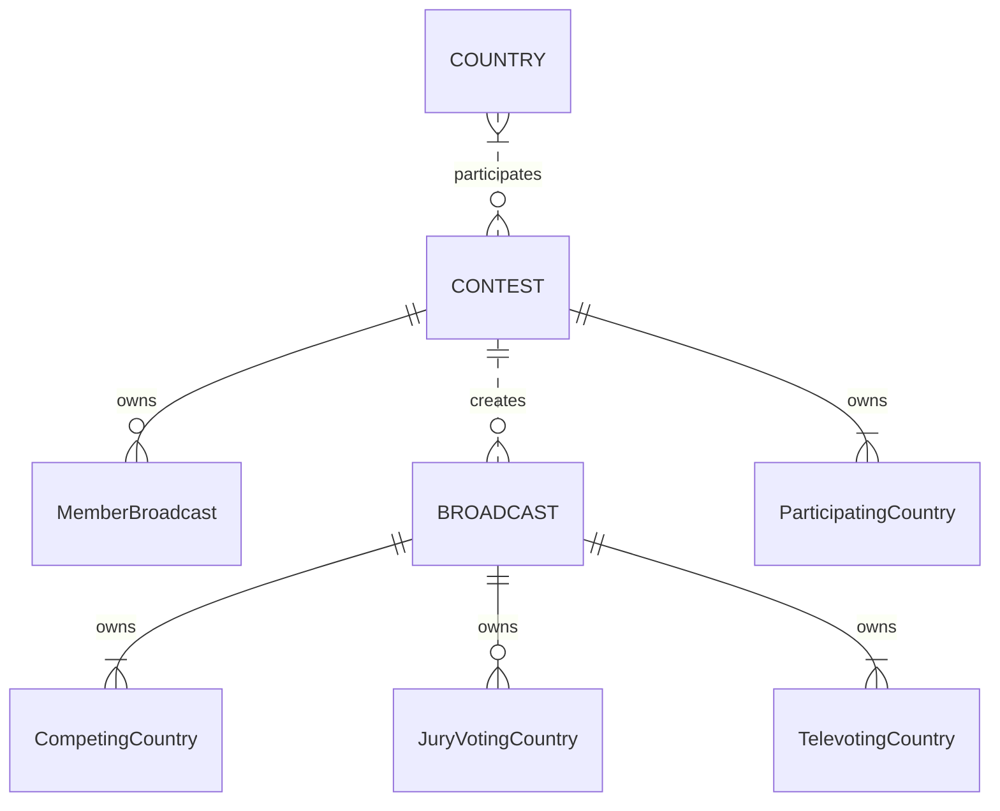
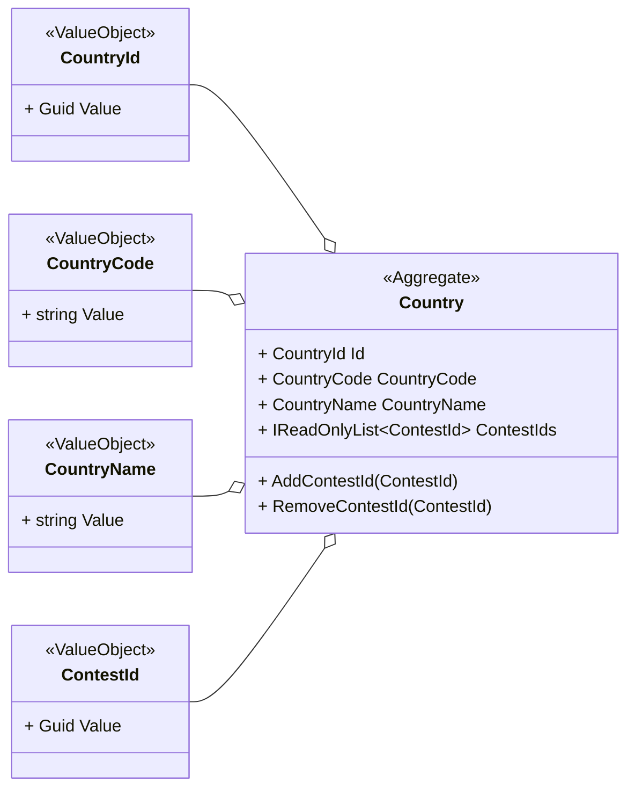
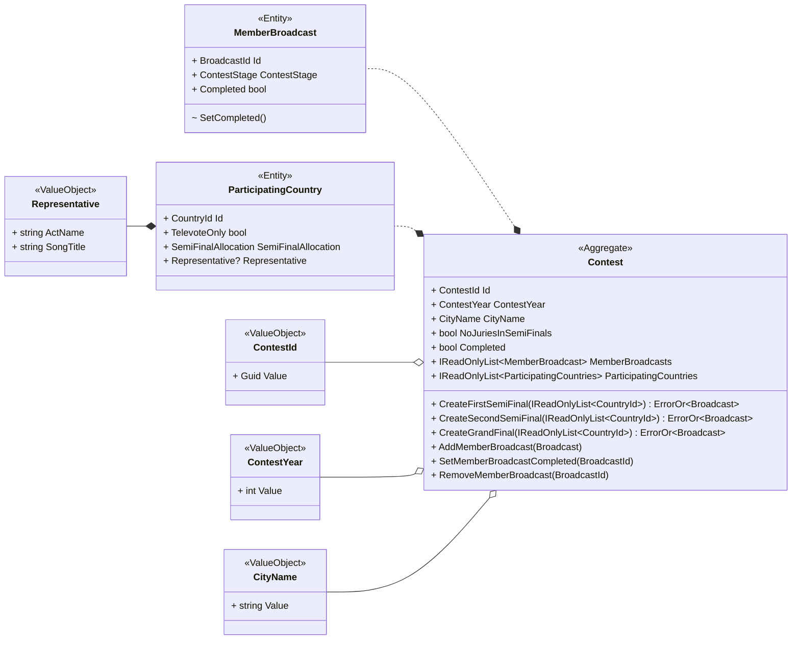
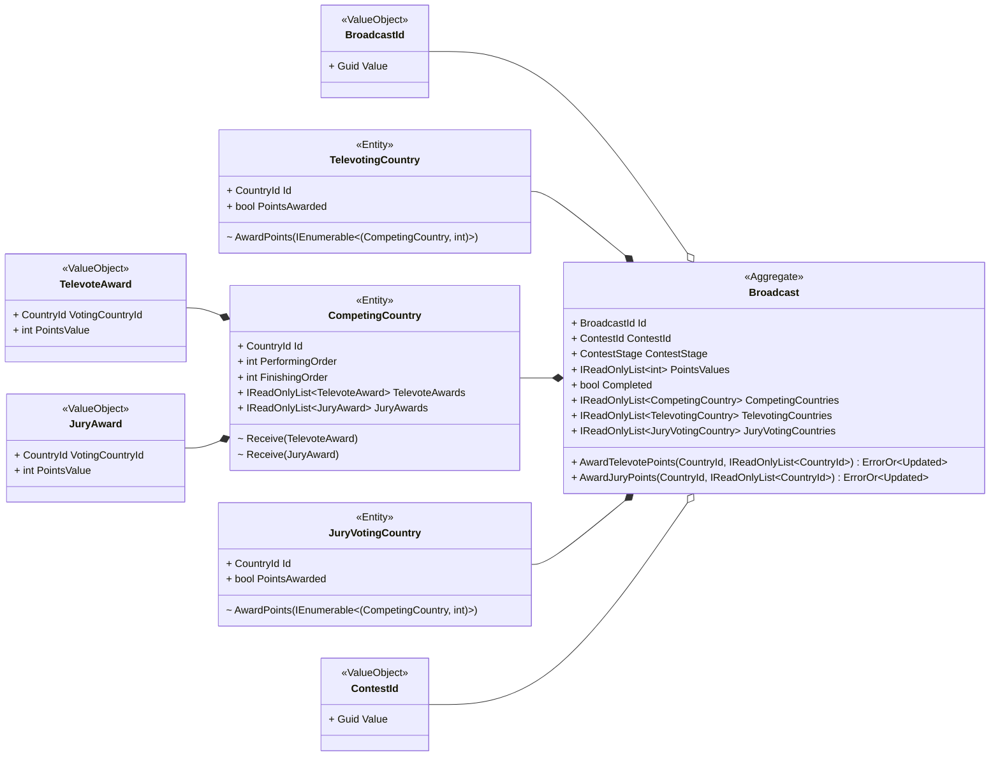

# Domain model

This document outlines the domain model of the Eurovision Song Contest, 2016-present, as implemented in *Eurocentric*.

- [Domain model](#domain-model)
  - [Entities and aggregates](#entities-and-aggregates)
  - [Enums](#enums)
  - [Countries subdomain](#countries-subdomain)
    - [Countries subdomain transactions](#countries-subdomain-transactions)
    - [Countries subdomain types](#countries-subdomain-types)
    - [Countries subdomain invariants](#countries-subdomain-invariants)
    - [Countries subdomain event responses](#countries-subdomain-event-responses)
  - [Contests subdomain](#contests-subdomain)
    - [Contests subdomain transactions](#contests-subdomain-transactions)
    - [Contests subdomain types](#contests-subdomain-types)
    - [Contests subdomain invariants](#contests-subdomain-invariants)
    - [Contests subdomain events](#contests-subdomain-events)
    - [Contests subdomain event responses](#contests-subdomain-event-responses)
    - [Contests subdomain integration events](#contests-subdomain-integration-events)
  - [Broadcasts subdomain](#broadcasts-subdomain)
    - [Broadcasts subdomain transactions](#broadcasts-subdomain-transactions)
    - [Broadcasts subdomain types](#broadcasts-subdomain-types)
    - [Broadcast subdomain invariants](#broadcast-subdomain-invariants)
    - [Broadcasts subdomain events](#broadcasts-subdomain-events)


## Entities and aggregates

The domain model contains 3 base entity types: `BroadcastEntity`, `ContestEntity` and `CountryEntity`.

| Entity base type  | Represents         | Identifier type |
|:-----------------:|:-------------------|:---------------:|
| `BroadcastEntity` | a single broadcast |  `BroadcastId`  |
|  `ContestEntity`  | a single contest   |   `ContestId`   |
|  `CountryEntity`  | a single country   |   `CountryId`   |

The domain model contains 8 concrete entity types, of which 3 are aggregates.

| Concrete type          | Represents                                |                    Extends                     |    Owner    |
|:-----------------------|:------------------------------------------|:----------------------------------------------:|:-----------:|
| `Country`              | a country aggregate                       |  `CountryEntity`, `IAggregateRoot<CountryId>`  |      -      |
| `Contest`              | a contest aggregate                       |   `ContestEntity, IAggregateRoot<ContestId>`   |      -      |
| `MemberBroadcast`      | a broadcast belonging to a contest        |               `BroadcastEntity`                |  `Contest`  |
| `ParticipatingCountry` | a country participating in a contest      |                `CountryEntity`                 |  `Contest`  |
| `Broadcast`            | a broadcast aggregate                     | `BroadcastEntity, IAggregateRoot<BroadcastId>` |      -      |
| `CompetingCountry`     | a country competing in a contest          |                `CountryEntity`                 | `Broadcast` |
| `JuryVotingCountry`    | a country voting by jury in a contest     |                `CountryEntity`                 | `Broadcast` |
| `TelevotingCountry`    | a country voting by televote in a contest |                `CountryEntity`                 | `Broadcast` |

The relationships between the entity types are as follows:

- A `Country` aggregate participates in 0, 1 or multiple `Contest` aggregates.
- A `Contest` aggregate creates 0, 1 or multiple `Broadcast` aggregates.
- A `Contest` aggregate owns 0, 1 or multiple `MemberBroadcast` entities.
- A `Contest` aggregate owns multiple `ParticipatingCountry` entities.
- A `Broadcast` aggregate owns multiple `CompetingCountry` entities.
- A `Broadcast` aggregate owns 0 or multiple `JuryVotingCountry` entities.
- A `Broadcast` aggregate owns multiple `TelevotingCountry` entities.

The relationships are illustrated in the diagram below.



## Enums

The `ContestStage` enum specifies a single stage of a contest.

```cs
public enum ContestStage
{
  FirstSemiFinal,
  SecondSemiFinal,
  GrandFinal
}
```

The `SemiFinalAllocation` enum specifies the semi-final in which a participating country in a contest may compete.

```cs
public enum SemiFinalAllocation
{
  None,
  First,
  Second
}
```

## Countries subdomain

A `Country` aggregate represents a single country in the system. It is responsible for tracking the represented country's participating in contests in the system.

### Countries subdomain transactions

1. The *Admin* creates a `Country` in the system.
2. The *Admin* deletes a `Country` from the system.

### Countries subdomain types



### Countries subdomain invariants

1. A `Country`'s `Id` is its system-wide unique identifier.
2. A `Country` cannot be added to the system if one already exists with the same `CountryCode` value.
3. A `Country` cannot be deleted from the system if its `ContestIds` collection is not empty.
4. A `CountryCode` value is a string of 2 upper-case letters.
5. A `CountryName` value is a non-empty, non-white-space string of no more than 200 characters.

### Countries subdomain event responses

1. On a `ContestCreatedEvent`, every participating `Country` must add the `ContestId` to itself.
2. On a `ContestDeletedEvent`, every participating `Country` must remove the `ContestId` from itself.

## Contests subdomain

A `Contest` aggregate represents a single contest in the system. It is responsible for creating the broadcasts for the represented contest, tracking their completeness, and maintaining an up-to-date record of its own completeness.

### Contests subdomain transactions

1. The *Admin* creates a `Contest` in the system.
2. The *Admin* creates a `Broadcast` for a `Contest` in the system.
3. The *Admin* deletes a `Contest` from the system.

### Contests subdomain types



### Contests subdomain invariants

1. A `Contest`'s `Id` is its system-wide unique identifier.
2. A `Contest` cannot be added to the system if one already exists with the same `ContestYear` value.
3. A `Contest` cannot be deleted from the system if its `MemberBroadcasts` collection is not empty.
4. A `Contest` is complete if and only if it contains 3 `MemberBroadcast` entities, and they are all complete.
5. A `Contest` cannot create a `Broadcast` if it already contains a `MemberBroadcast` with the specified `ContestStage` value.
6. A `Contest` adds a `MemberBroadcast` to itself when it creates a `Broadcast`.
7. A `Contest` has at least 3 `ParticipatingCountry` entities with a `SemiFinalAllocation` value tuple of `First`.
8. A `Contest` has at least 3 `ParticipatingCountry` entities with a `SemiFinalAllocation` value tuple of `Second`.
9. Each `ParticipatingCountry` entity in a `Contest` has a different `Id`, which matches a `Country` aggregate that already exists in the system.
10. A `ContestYear` value is an integer in the range \[2016, 2050\].
11. A `CityName` value is a non-empty, non-white-space string of no more than 200 characters.
12. A `ParticipatingCountry` entity can be created in one of three possible states:
    1.  `TelevoteOnly` = `true`, `SemiFinalAllocation` = `None`, `Representative` = `null`, or
    2.  `TelevoteOnly` = `false`, `SemiFinalAllocation` = `First`, `Representative` = `not null`, or
    3.  `TelevoteOnly` = `false`, `SemiFinalAllocation` = `Second`, `Representative` = `not null`.
13. A `Representative` value has an `ActName` and a `SongTitle` that are both non-empty, non-white-space string of no more than 200 characters.

### Contests subdomain events

1. When a `Contest` is completed, the system publishes a `ContestCreatedEvent`.
2. When a `Contest` is deleted, the system publishes a `ContestDeletedEvent`.

### Contests subdomain event responses

1. On a `BroadcastCompletedEvent`, its creating `Contest` must set its corresponding `MemberBroadcast` as completed, and also update its own completion status.
2. On a `BroadcastDeletedEvent`, its creating `Contest` must remove the corresponding `MemberBroadcast` from itself, and also update its own completion status.

### Contests subdomain integration events

1. When a `Contest` updates its `Completed` value from `false` to `true`, the system publishes a `ContestCompletedEvent`.
2. When a `Contest` updates its `Completed` value from `true` to `false`, the system publishes a `ContestNoLongerCompletedEvent`.

## Broadcasts subdomain

A `Broadcast` aggregate represents a single broadcast in the system. It is responsible for awarding points from the televoting countries and jury-voting countries to the competing countries in the system, and maintaining an up-to-date record of its own completeness.

### Broadcasts subdomain transactions

1. The *Admin* disqualifies a `CompetingCountry` from a `Broadcast` in the system.
2. The *Admin* awards a set of jury points for a `Broadcast` in the system.
3. The *Admin* awards a set of televote points for a `Broadcast` in the system.
4. The *Admin* deletes a `Broadcast` from the system.

### Broadcasts subdomain types



### Broadcast subdomain invariants

1. A `Broadcast`'s `Id` is its system-wide unique identifier.
2. A `Broadcast` cannot be added to the system if one already exists with the same (`ContestId`, `ContestStage`) value tuple.
3. A `Broadcast` is complete if and only if all of its voting countries have awarded their points.
4. A `Broadcast` has a `PointsValues` list that is sorted in descending order and contains one value per `CompetingCountry`, e.g. `[12, 10, 8, 0, 0]` for a `Broadcast` with 5 competing countries.
5. A `Broadcast` has at least 2 `CompetingCountry` entities.
6. Each of a `Broadcast`'s `CompetingCountry` entities has a different `CountryId`, matching a `ParticipatingCountry` in the parent `Contest` that is eligible to compete in the `Broadcast`.
7. A `CompetingCountry` cannot be disqualified from a `Broadcast` if any of the voting countries has awarded its points.
8. A `Broadcast` has at least 2 `TelevotingCountry` entities.
9. Each of a `Broadcast`'s `TelevotingCountry` entities has a different `CountryId`, matching a `ParticipatingCountry` in the parent `Contest` that is eligible to award televote points in the `Broadcast`.
10. For each `CompetingCountry` entity in a broadcast, there must also be a `TelevotingCountry` entity with the same `CountryId`.
11. A `Broadcast` can have 0 or multiple `JuryVotingCountry` entities.
12. Each of a `Broadcast`'s `JuryVotingCountry` entities has a different `CountryId`, matching a `ParticipatingCountry` in the parent `Contest` that is eligible to award jury points in the `Broadcast`.
13. A voting country can only award its points once.
14. A voting country awards points by ranking the competing countries (excluding itself) in order of preference.
15. A `Broadcast` updates the `FinishingOrder` values of all its `CompetingCountries` after each voting country has awarded points.
16. The minimum permitted `PointsValue` of a `TelevoteAward` or `JuryAward` is 0.

### Broadcasts subdomain events

1. When a `Broadcast` is completed, the system publishes a `BroadcastCompletedEvent`.
2. When a `Broadcast` is deleted, the system publishes a `BroadcastDeletedEvent`.
