# Domain model

This document outlines the domain model of the Eurovision Song Contest, 2016-present, as implemented in *Eurocentric*.

- [Domain model](#domain-model)
  - [Key transactions](#key-transactions)
  - [Aggregates and entities](#aggregates-and-entities)
  - [Key business rules](#key-business-rules)
    - [**COUNTRIES** subdomain business rules](#countries-subdomain-business-rules)
    - [**CONTESTS** subdomain business rules](#contests-subdomain-business-rules)
    - [**BROADCASTS** subdomain business rules](#broadcasts-subdomain-business-rules)
  - [Domain types](#domain-types)
    - [Enums](#enums)
      - [`ContestStage` enum](#conteststage-enum)
      - [`ParticipantGroup` enum](#participantgroup-enum)
      - [`PointsValue` enum](#pointsvalue-enum)
    - [Identifiers](#identifiers)
      - [`BroadcastId` class (value object)](#broadcastid-class-value-object)
      - [`ContestId` class (value object)](#contestid-class-value-object)
      - [`CountryId` class (value object)](#countryid-class-value-object)
    - [**COUNTRY** aggregate subdomain](#country-aggregate-subdomain)
      - [`Country` class (aggregate root)](#country-class-aggregate-root)
      - [`CountryCode` class (value object)](#countrycode-class-value-object)
      - [`CountryName` class (value object)](#countryname-class-value-object)
    - [**CONTEST** aggregate subdomain](#contest-aggregate-subdomain)
      - [`Contest` class (aggregate root)](#contest-class-aggregate-root)
      - [`Participant` class (entity)](#participant-class-entity)
      - [`ActName` class (value object)](#actname-class-value-object)
      - [`BroadcastMemo` class (value object)](#broadcastmemo-class-value-object)
      - [`CityName` class (value object)](#cityname-class-value-object)
      - [`ContestYear` class (value object)](#contestyear-class-value-object)
      - [`SongTitle` class (value object)](#songtitle-class-value-object)
    - [**BROADCAST** aggregate subdomain](#broadcast-aggregate-subdomain)
      - [`Broadcast` class (aggregate root)](#broadcast-class-aggregate-root)
      - [`Competitor` class (entity)](#competitor-class-entity)
      - [`Jury` class (entity)](#jury-class-entity)
      - [`Televote` class (entity)](#televote-class-entity)
      - [`BroadcastCode` class (value object)](#broadcastcode-class-value-object)
      - [`JuryAward` class (value object)](#juryaward-class-value-object)
      - [`TelevoteAward` class (value object)](#televoteaward-class-value-object)

## Key transactions

The domain's key transactions, in chronological order, are defined below.

1. The *Admin* creates a **COUNTRY**.
2. The *Admin* creates a **CONTEST**:
   1. Multiple existing **COUNTRIES** are **Participants** in the **CONTEST**.
3. The *Admin* creates a **BROADCAST** for an existing **CONTEST**:
   1. Multiple **Participants** in the **CONTEST** are **Competitors** in the **BROADCAST**,
   2. Multiple **Participants** are **Televotes** in the **BROADCAST**, and
   3. Zero or multiple **Participants** are **Juries** in the **BROADCAST**.
4. The *Admin* awards a set of televote points in an existing **BROADCAST**:
   1. A specified **Televote** in the **BROADCAST** gives a single points award to every **Competitor** in the **BROADCAST** excluding any **Competitor** that originated from the same **Participant** as the **Televote**.
5. The *Admin* awards a set of jury points in an existing **BROADCAST**:
   1. A specified **Jury** in the **BROADCAST** gives a single points award to every **Competitor** in the **BROADCAST** excluding any **Competitor** that originated from the same **Participant** as the **Jury**.

## Aggregates and entities

Three **AGGREGATE** types and four **Owned Entity** types are derived from the key transactions listed above.

|   Aggregate   |             Owned Entities             | Transactions |
|:-------------:|:--------------------------------------:|:------------:|
|  **COUNTRY**  |                   -                    |      1       |
|  **CONTEST**  |            **Participant**             |     2, 3     |
| **BROADCAST** | **Competitor**, **Televote**, **Jury** |     4, 5     |

- A **COUNTRY** aggregate represents a specific country or pseudo-country in the system.
- A **CONTEST** aggregate represents a specific contest in the system.
- A **BROADCAST** aggregate represents a specific broadcast (i.e. a specific stage of a specific contest) in the system.
- A **Participant** owned entity represents a specific **COUNTRY** participating in a specific **CONTEST**.
- A **Competitor** owned entity represents a specific **COUNTRY** competing in a specific **BROADCAST**.
- A **Televote** owned entity represents a specific **COUNTRY** awarding televote points in a specific **BROADCAST**.
- A **Jury** owned entity represents a specific **COUNTRY** awarding jury points in a specific **BROADCAST**.

The relationships between the entity and aggregate types are illustrated in the diagram below.

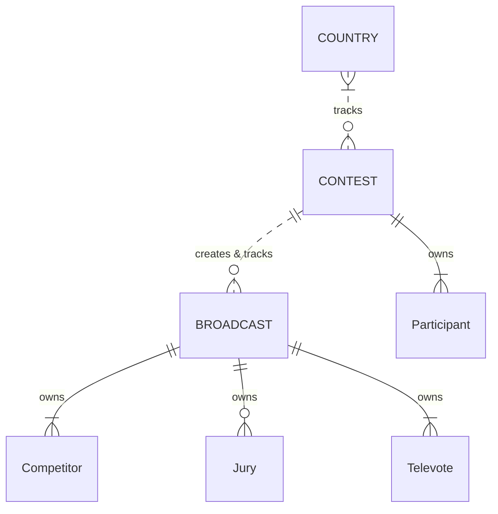

## Key business rules

### **COUNTRIES** subdomain business rules

1. Every **COUNTRY** in the system has a unique *CountryId* (assigned on the server), which is its *system identifier*.
2. Every **COUNTRY** in the system has a unique *CountryCode* (assigned by the *Admin*), which is its *natural identifier*.
3. A **COUNTRY** must hold the *ContestId* of every **CONTEST** in which it is a **Participant**.
4. A **COUNTRY** cannot be deleted from the system when it is a **Participant** in one or more **CONTESTS**.

### **CONTESTS** subdomain business rules

1. Every **CONTEST** in the system has a unique *ContestId* (assigned on the server), which is its *system identifier*.
2. Every **CONTEST** in the system has a unique *ContestYear* (assigned by the *Admin*), which is its *natural identifier*.
3. Every **Participant** in a **CONTEST** must hold the *CountryId* of a **COUNTRY** that exists in the system.
4. Every **Participant** in a **CONTEST** must have a different *CountryId*.
5. A **CONTEST**'s **Participants** are subdivided into three groups:
   - *Group 0* contains participating countries that award televote points in all three stages of the contest but do not compete.
   - *Group 1* contains participating countries that vote and may compete in the First Semi-Final and the Grand Final.
   - *Group 2* contains participating countries that vote and may compete in the Second Semi-Final and the Grand Final.
6. A **CONTEST** must have at least 3 **Participants** in *Group 1* and at least 3 in *Group 2*.
7. A **CONTEST** must hold a reference to the (*BroadcastId*, *ContestStage*) of every **BROADCAST** in the system that it created.
8. A **CONTEST** cannot be deleted from the system when it has created one or more **BROADCASTS**.
9. A **CONTEST** cannot create a **BROADCAST** when it has already created a **BROADCAST** with the same *ContestStage*.

### **BROADCASTS** subdomain business rules

1. Every **BROADCAST** in the system has a unique *BroadcastId* (assigned on the server), which is its *system identifier*.
2. Every **BROADCAST** in the system has a unique *BroadcastCode* (assigned on the server), which is its *natural identifier*.
3. Every **BROADCAST** in the system must hold the *ContestId* of its parent **CONTEST**.
4. Every **BROADCAST** in the system has a unique (*ContestId*, *ContestStage*).
5. A **BROADCAST** must have at least 2 **Competitors**.
6. A **BROADCAST** must have at least 2 **Televotes**.
7. A **BROADCAST** can have zero or multiple **Juries**.
8. A **Televote** in a **BROADCAST** can only award its points once.
9. A **Jury** in a **BROADCAST** can only award its points once.
10. A **BROADCAST** must update the finishing order of its **Competitors** every time it awards a set of points. Refer to the [Eurovision context](eurovision_context.md#determining-the-finishing-order) document for the finishing order algorithm.
11. A **BROADCAST** can only disqualify a **Competitor** *before* any points have been awarded.

## Domain types

### Enums

#### `ContestStage` enum

A `ContestStage` enum value specifies a single stage of a **CONTEST**.

```cs
public enum ContestStage
{
  FirstSemiFinal = 0,
  SecondSemiFinal = 1,
  GrandFinal = 2
}
```

#### `ParticipantGroup` enum

A `ParticipantGroup` enum value specifies a **Participant**'s group in a **CONTEST**.

```cs
{
  Zero = 0,
  One = 1,
  Two = 2
}
```

#### `PointsValue` enum

A `PointsValue` enum value specifies the numeric value of a points award in a **BROADCAST**.

```cs
{
  Zero = 0,
  One = 1,
  Two = 2,
  Three = 3,
  Four = 4,
  Five = 5,
  Six = 6,
  Seven = 7,
  Eight = 8,
  Ten = 10,
  Twelve = 12
}
```

### Identifiers

#### `BroadcastId` class (value object)

A `BroadcastId` value object identifies a **BROADCAST**.

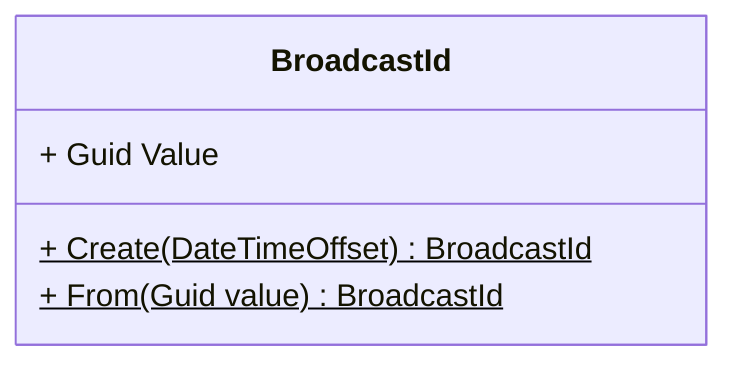

#### `ContestId` class (value object)

A `ContestId` value object identifies a **CONTEST**.

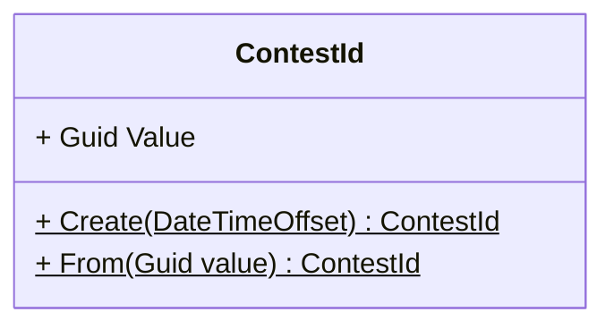

#### `CountryId` class (value object)

A `CountryId` value object identifies a **COUNTRY**.

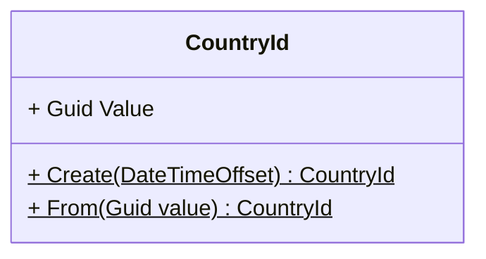

### **COUNTRY** aggregate subdomain

#### `Country` class (aggregate root)

A `Country` aggregate represents a specific **COUNTRY** in the system.

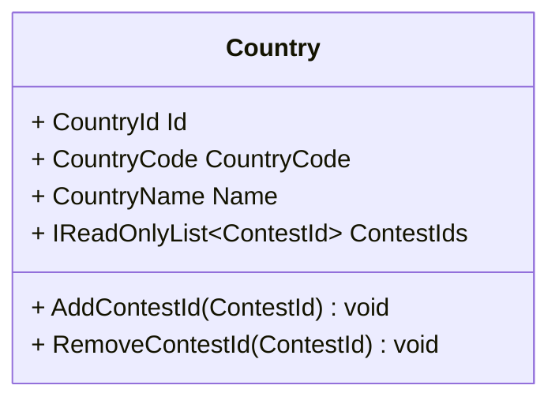

#### `CountryCode` class (value object)

A `CountryCode` value object contains a **COUNTRY**'s ISO 3166-1 alpha-2 code.

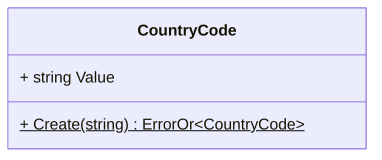

#### `CountryName` class (value object)

A `CountryName` value object contains a **COUNTRY**'s short English name.

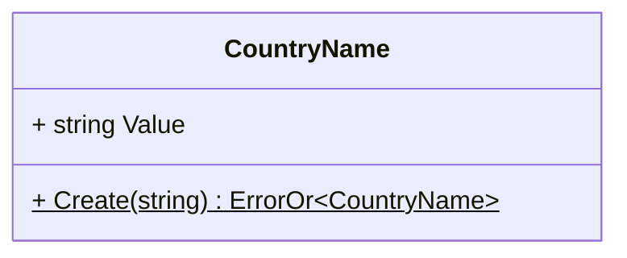

### **CONTEST** aggregate subdomain

#### `Contest` class (aggregate root)

A `Contest` aggregate represents a specific **CONTEST** in the system.

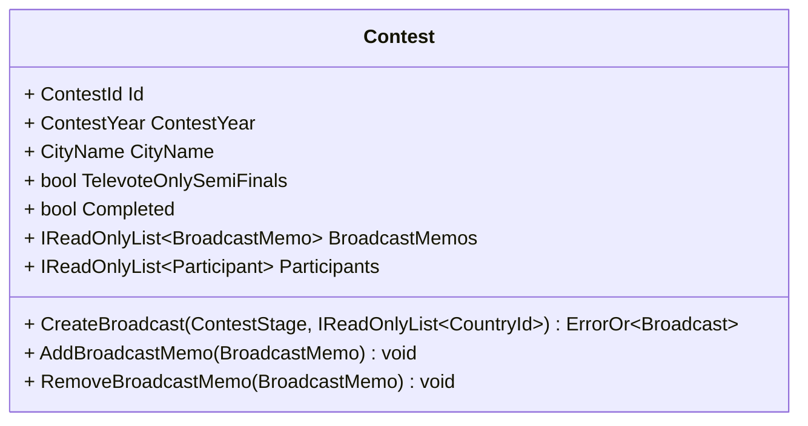

#### `Participant` class (entity)

A `Participant` entity represents a specific **Participant** in a specific **CONTEST**.

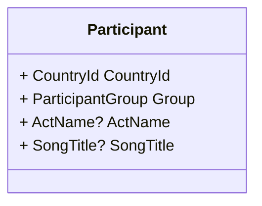

#### `ActName` class (value object)

An `ActName` value object contains a **Participant**'s act name.

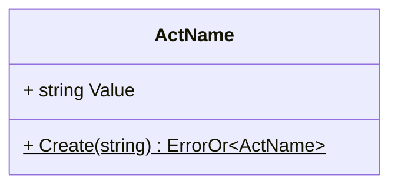

#### `BroadcastMemo` class (value object)

A `BroadcastMemo` value object summarizes a **BROADCAST** in its parent **CONTEST**.

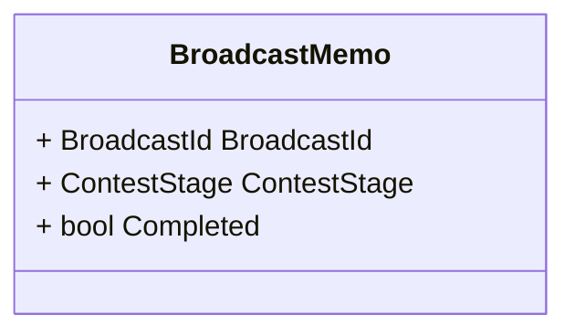

#### `CityName` class (value object)

A `CityName` value object contains the name of a city.

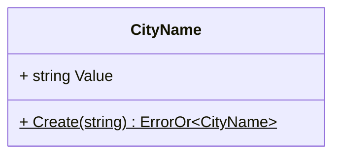

#### `ContestYear` class (value object)

A `ContestYear` value object contains the year in which a contest is held.

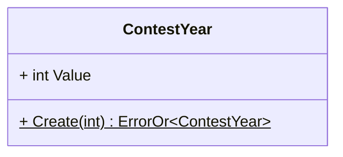

#### `SongTitle` class (value object)

A `SongTitle` value object contains a **Participant**'s song title.

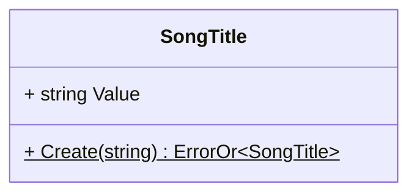

### **BROADCAST** aggregate subdomain

#### `Broadcast` class (aggregate root)

A `Broadcast` entity represents a specific **BROADCAST** in the system.

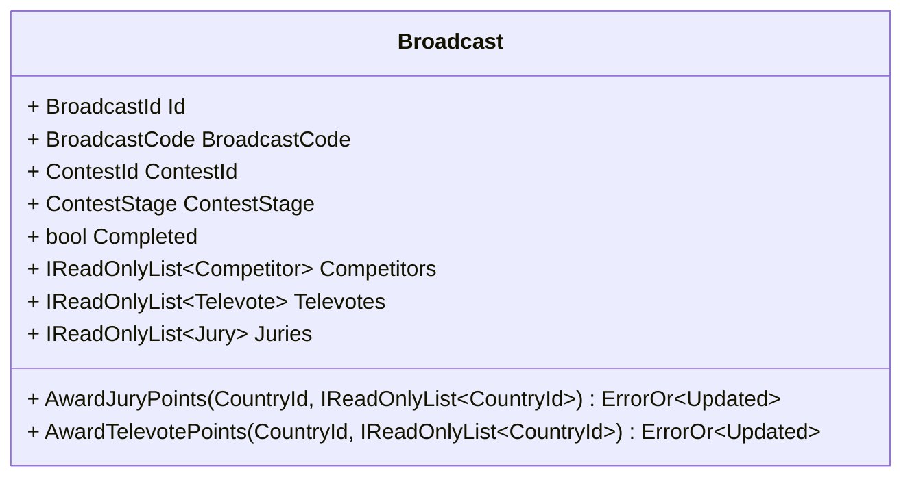

#### `Competitor` class (entity)

A `Competitor` entity represents a specific **Competitor** in a specific **BROADCAST**.

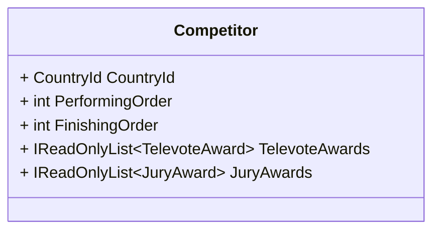

#### `Jury` class (entity)

A `Jury` entity represents a specific **Jury** in a specific **BROADCAST**.

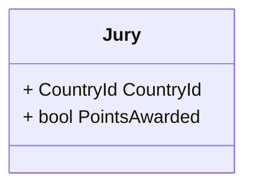

#### `Televote` class (entity)

A `Televote` entity represents a specific **Televote** in a specific **BROADCAST**.

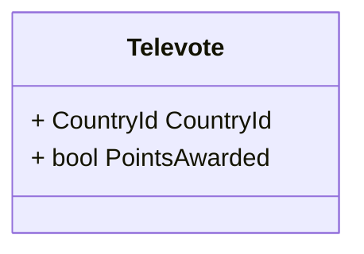

#### `BroadcastCode` class (value object)

A `BroadcastCode` value object contains a **BROADCAST**'s unique code.

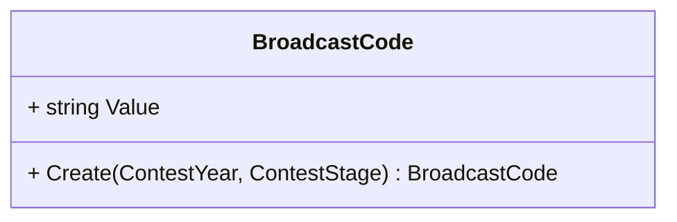

#### `JuryAward` class (value object)

A `JuryAward` value object represents an award of points received by a **Competitor** from a **Jury** a **BROADCAST**.

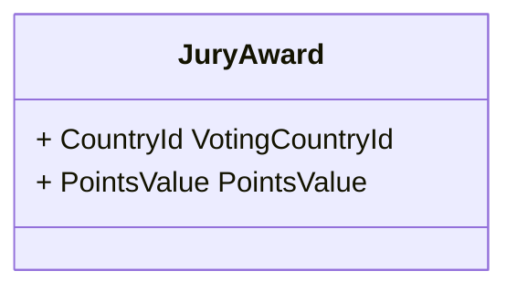

#### `TelevoteAward` class (value object)

A `TelevoteAward` value object represents an award of points received by a **Competitor** from a **Televote** a **BROADCAST**.

```mermaid
classDiagram

class TelevoteAward {
  + CountryId VotingCountryId
  + PointsValue PointsValue
}
```
