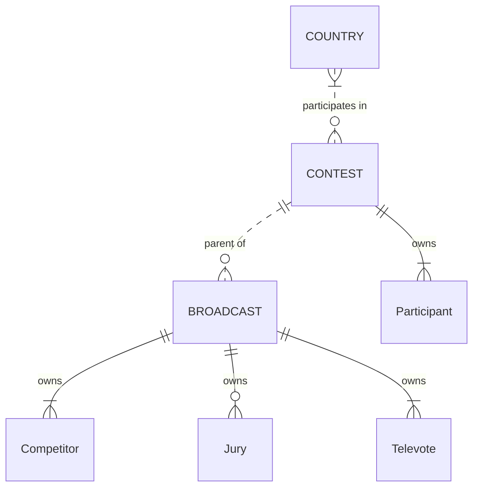

# Domain model

This document outlines the domain model of the Eurovision Song Contest, 2016-present, as implemented in *Eurocentric*.

- [Domain model](#domain-model)
  - [Key domain transactions](#key-domain-transactions)
  - [Aggregates and owned entities](#aggregates-and-owned-entities)
  - [Entity relationship diagram](#entity-relationship-diagram)
  - [Key business rules](#key-business-rules)
    - [Countries subdomain](#countries-subdomain)
    - [Contests subdomain](#contests-subdomain)
    - [Broadcasts subdomain](#broadcasts-subdomain)

## Key domain transactions

The following are the key domain transactions. Aggregates are in **BOLD CAPITALS**. Owned entities are in **Bold**. Transactions are listed in temporal dependency order.

1. The *Admin* creates a new **COUNTRY**.
2. The *Admin* creates a new **CONTEST** in which multiple existing **COUNTRIES** have **Participants**.
3. The *Admin* creates a new **BROADCAST** for an existing **CONTEST**, in which multiple **Participants** in the **CONTEST** have **Competitors**, **Televotes** and/or **Juries**.
4. The *Admin* awards a set of points from a **Jury** to the **Competitors** in an existing **BROADCAST**.
5. The *Admin* awards a set of points from a **Televote** to the **Competitors** in an existing **BROADCAST**.

## Aggregates and owned entities

The domain has 3 aggregate types:

- A **COUNTRY** aggregate represents a specific country or pseudo-country in the system. It tracks all the **CONTEST** aggregates in which the **COUNTRY** is a **Participant**.
- A **CONTEST** aggregate represents a specific contest in the system. It owns multiple **Participants**. It creates and tracks its child **BROADCAST** aggregates.
- A **BROADCAST** aggregate represents a specific stage of a specific contest in the system. It owns multiple **Competitors**, zero or multiple **Juries**, and multiple **Televotes**. It awards the points to the **Competitors** from the **Juries** and **Televotes**.

The domain has 4 owned entity types:

- A **Participant** entity represents a specific country participating in a specific contest. It is owned by a **CONTEST**.
- A **Competitor** entity represents a specific country competing in a specific broadcast. It is owned by a **BROADCAST**.
- A **Jury** entity represents a specific country awarding a set of jury points in a specific broadcast. It is owned by a **BROADCAST**.
- A **Televote** entity represents a specific country awarding a set of televote points in a specific broadcast. It is owned by a **BROADCAST**.

## Entity relationship diagram

## Key business rules

### Countries subdomain

1. A **COUNTRY** has a unique ID.
2. A **COUNTRY** has a unique country code.
3. A **COUNTRY** maintains an always up-to-date record of all the **CONTESTS** in which it has a **Participant**.
4. A **COUNTRY** can only be deleted from the system when it participates in zero **CONTESTS**.

### Contests subdomain

1. A **CONTEST** has a unique ID.
2. A **CONTEST** has a unique contest year.
3. A **CONTEST** maintains an always up-to-date record of all its child **BROADCASTS**.
4. A **CONTEST** can only be deleted from the system when it has zero child **BROADCASTS**.
5. A **CONTEST** has a status, which is one of { `Initialized`, `InProgress`, `Completed` }.
6. A **CONTEST**'s status is `Completed` when it has created 3 child **BROADCASTS**, and they all have the status `Completed`.
7. A **CONTEST** using the "Stockholm" format has at least 3 **Participants** in group 1, at least 3 in group 2, and none in group 0.
8. A **CONTEST** using the "Liverpool" format has at least 3 **Participants** in group 1, at least 3 in group 2, and one in group 0.
9. A **CONTEST** cannot create a child **BROADCAST** when it already has a child **BROADCAST** with the same contest stage.
10. Each **Participant** in a **CONTEST** represents a different **COUNTRY**.

### Broadcasts subdomain

1. A **BROADCAST** has a unique ID.
2. A **BROADCAST** has a unique (parent **CONTEST** ID, contest stage) tuple.
3. A **BROADCAST** has a unique broadcast date.
4. A **BROADCAST**'s broadcast date has the same year as its parent **CONTEST**.
5. A **BROADCAST** has a status, which is one of { `Initialized`, `InProgress`, `Completed` }.
6. A **BROADCAST**'s status is `Completed` when all of its **Juries** and all of its **Televotes** have awarded their points.
7. A **BROADCAST** has at least 2 **Competitors**.
8. Each **Competitor** in a **BROADCAST** represents a different **Participant** in the parent **CONTEST**.
9. Each **Jury** in a **BROADCAST** represents a different **Participant** in the parent **CONTEST**.
10. Each **Televote** in a **BROADCAST** represents a different **Participant** in the parent **CONTEST**.
11. A **Jury** awards its points by ordering all the **Competitors** from first to last, excluding the **Competitor** representing the **Jury**'s **COUNTRY** if present.
12. A **Televote** awards its points by ordering all the **Competitors** from first to last, excluding the **Competitor** representing the **Televote**'s **COUNTRY** if present.
13. A **Jury** awards its points exactly once.
14. A **Televote** awards its points exactly once.
15. A **Competitor** may be disqualified from a **BROADCAST** only if its status is `Initialized`.
16. When a **Competitor** is disqualified from a **BROADCAST**, the remaining **Competitors** update their finishing positions to close the gap but leave their running order positions unchanged.
