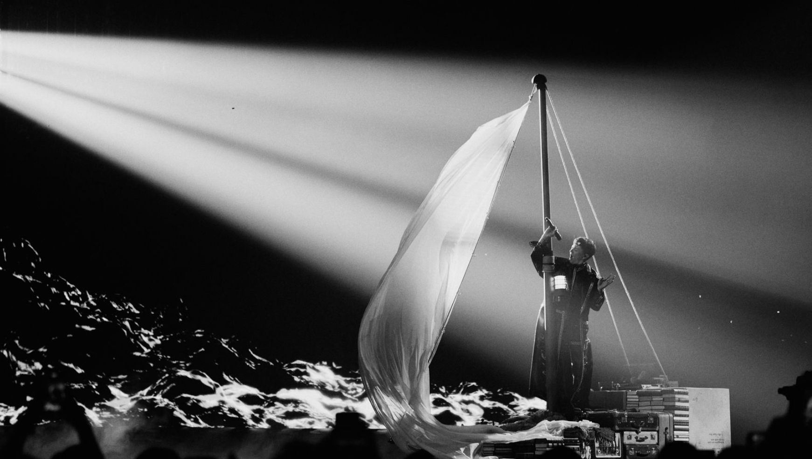

# 3: Real-world context

This document is part of the [launch specification](../README.md#launch-specification).

- [3: Real-world context](#3-real-world-context)
  - [What is the Eurovision Song Contest?](#what-is-the-eurovision-song-contest)
  - [Contest structure](#contest-structure)
    - [Contest stages](#contest-stages)
    - [Participant Groups](#participant-groups)
    - [Qualification](#qualification)
    - [Voter eligibility](#voter-eligibility)
  - [Broadcast structure](#broadcast-structure)
    - [How a Televote or Jury awards points](#how-a-televote-or-jury-awards-points)
    - [Determining the result](#determining-the-result)
  - [Unusual events](#unusual-events)
    - [A Participant withdraws from a Contest before it starts](#a-participant-withdraws-from-a-contest-before-it-starts)
    - [A Competitor is disqualified from a Broadcast](#a-competitor-is-disqualified-from-a-broadcast)
    - [Substitute Televote points are used](#substitute-televote-points-are-used)
    - [Substitute Jury points are used](#substitute-jury-points-are-used)
  - [Images from the Eurovision official website](#images-from-the-eurovision-official-website)

## What is the Eurovision Song Contest?

|  |
|:-----------------------------------------------------------------------------------------------------------------------------------------------------------------------------------------------------------------------------:|
|                                                                         The logo for the 2025 Eurovision Song Contest in Basel, Switzerland (© EBU).                                                                          |

The Eurovision Song Contest is an annual televised song contest between national broadcasters, organized by the European Broadcasting Union (EBU).

A Contest has c.40 Participants, each of which is an Act with a Song representing a Participating Country. Contests from 2023 onwards also have a Global Televote.

A Contest is composed of three Broadcasts: two Semi-Finals and the Grand Final. Each Broadcast has multiple Competitors, drawn from the Contest's Participants. The Broadcast also has Televotes and Juries, each of which represents a Voting Country. A Televote or Jury gives a set of points awards to all the Competitors in the Broadcast, excluding the Competitor with the same Competing Country as the Voting Country.

The winning Competing Country in the Grand Final is the overall winner of the Contest. Customarily, the winning Country hosts the following year's Contest.

For example:

> The 2025 Eurovision Song Contest was held in Basel, Switzerland. There were 37 participating countries, plus an additional "Rest of the World" televote. The winner was the singer JJ with the song "Wasted Love", representing the Austrian national broadcaster ORF. The 2026 Eurovision Song Contest is going to be held in Vienna, Austria.

## Contest structure

### Contest stages

A Contest's three stages, in Broadcast order, are:

| Contest stage     | Competitors |
|:------------------|------------:|
| First Semi-Final  |       15-18 |
| Second Semi-Final |       15-18 |
| Grand Final       |       25-26 |

### Participant Groups

Before the start of the Contest, each Participant is randomly drawn into one of two equal groups.

- Group 1 Participants must vote in and may compete in the First Semi-Final.
- Group 2 Participants must vote in and may compete in the Second Semi-Final.
- All Participants must vote in and may compete in the Grand Final.

### Qualification

Each group contains 2-3 Participants who automatically qualify for the Grand Final. These Participants do not compete in their allocated Semi-Final, but still vote.

The remaining Participants in each group must compete in their allocated Semi-Final. The top 10 finishers in the group, along with the automatic qualifiers, go on to compete in the Grand Final.

### Voter eligibility

From **2016 to 2022**:

- Every Group 1 Participant has a Televote and a Jury in the First Semi-Final Broadcast.
- Every Group 2 Participant has a Televote and a Jury in the Second Semi-Final Broadcast.
- Every Participant has a Televote and a Jury in the Grand Final Broadcast.

From **2023 to 2025**:

- Every Group 1 Participant has a Televote (and no Jury) in the First Semi-Final Broadcast.
- Every Group 2 Participant has a Televote (and no Jury) in the Second Semi-Final Broadcast.
- Every Participant has a Televote and a Jury in the Grand Final Broadcast.
- The Contest has a Global Televote representing the "Rest of the World".
- The Global Televote has a Televote in all three Broadcasts.

From **2026**:

- Every Group 1 Participant has a Televote and a Jury in the First Semi-Final Broadcast.
- Every Group 2 Participant has a Televote and a Jury in the Second Semi-Final Broadcast.
- Every Participant has a Televote and a Jury in the Grand Final Broadcast.
- The Contest has a Global Televote.
- The Global Televote has a Televote in all three Broadcasts.

**In *Eurocentric*:** a Contest has *either* Televote-and-Jury *or* Televote-Only Semi-Finals; a Contest has *either* 0 *or* 1 Global Televote.

## Broadcast structure

In a Broadcast, the Competitors perform in a pre-determined running order. The Televotes and Juries award points to the Competitors.This determines their finishing Positions.

### How a Televote or Jury awards points

A Televote or Jury (representing a Voting Country) ranks all the Competitors from first place to last place (excluding that of the same Competing Country as the Voting Country).

The ranking determines the value of the points award the Televote/Jury gives to the Competitor. The highest ranked Competitors receive the following points values: 12, 10, 8, 7, 6, 5, 4, 3, 2, 1. All other Competitors receive 0 points.

### Determining the result

The Competitors in a broadcast are assigned a finishing position based on descending total points.

Ties are not permitted. The following tie-break rules are used in order:

1. If two Competitors are tied on total points, the Competitor with more Televote points wins the tie.
2. If they are still tied, the Competitor with more non-zero points Televote awards wins the tie.
3. If they are still tied, a "count-back" is used: the Competitor that received more 12 points Televote awards wins the tie, then 10 points Televote awards, and so on down to 1 point Televote awards.
4. If they are still tied, the Competitor with the earlier running order spot wins the tie.

## Unusual events

This section lists some unusual events that have occurred at the Eurovision Song Contest between 2016 and 2025. Each event includes a description of how it is handled in *Eurocentric*.

### A Participant withdraws from a Contest before it starts

Moldova withdrew from the Basel 2025 Contest before it had selected their Act. Romania was disqualified from the Stockholm 2016 Contest after its Act was selected but before the Contest began.

**In *Eurocentric*:** a withdrawn Participant is disregarded when creating a Contest.

### A Competitor is disqualified from a Broadcast

The Netherlands was assigned running order spot 5 in the Malmö 2024 Contest Grand Final, but was disqualified, leaving running order Spot 5 vacant in the televised Grand Final.

**In *Eurocentric*:** a disqualified Competitor is disregarded when creating a Broadcast; the Competitors' running order spots incorporate the vacant spot.

### Substitute Televote points are used

San Marino's Televote points are usually determined by taking a statistical average of the points awarded by neighbouring countries.

**In *Eurocentric*:** Televote points are taken at face value.

### Substitute Jury points are used

In the Turin 2022 Grand Final Broadcast, six Participating Countries' Juries were disqualified and statistical average Jury points were given in their place.

**In *Eurocentric*:** Jury points are taken at face value.

## Images from the Eurovision official website

|  |
|:-----------------------------------------------------------------------------------------------------------------:|
|                   *The Eurovision 2025 stage in St. Jakobshalle, Basel (© EBU/Alma Bengtsson).*                   |

|  |
|:--------------------------------------------------------------------------------------------------------------------------------------:|
|  *The qualifying acts representing Austria, Latvia and Malta at the Eurovision 2025 Second Semi-Final (© EBU/Sarah Louise Bennett).*   |

|  |
|:----------------------------------------------------------------------------------------------------------------------------------------------------------------------:|
|                       *JJ from Austria participating in the flag parade at the start of the Eurovision 2025 Grand Final (© EBU/Alma Bengtsson).*                       |

|  |
|:-----------------------------------------------------------------------------------------------------------------------------------------:|
|                   *JJ from Austria performing "Wasted Love" in the Eurovision 2025 Grand Final (© EBU/Alma Bengtsson).*                   |

|  |
|:----------------------------------------------------------------------------------------------------------:|
|                         *Scoreboard from the Eurovision 2025 Grand Final (© EBU).*                         |

|  |
|:------------------------------------------------------------------------------------------------------------------------------------:|
|         *JJ from Austria holding the winner's trophy at the end of the Eurovision 2025 Grand Final (© EBU/Corinne Cumming).*         |
