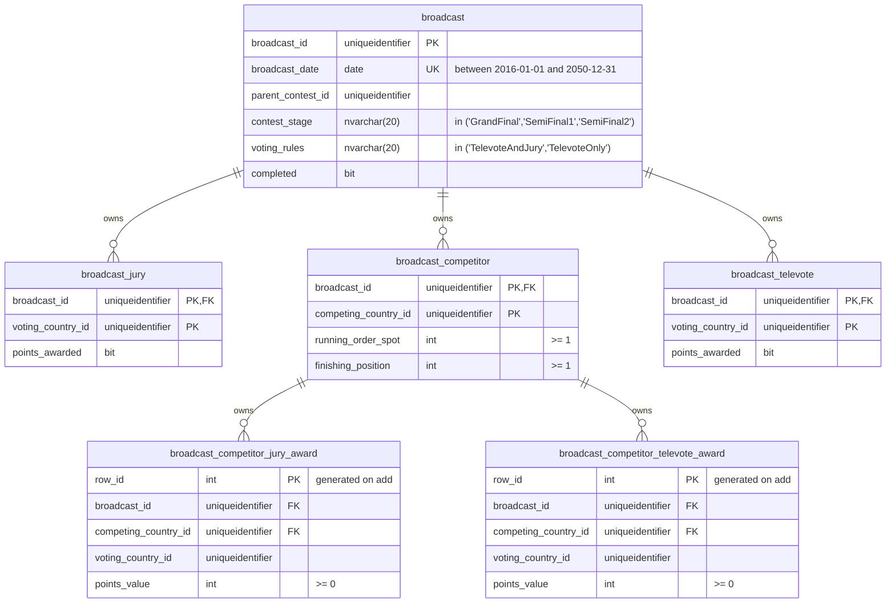
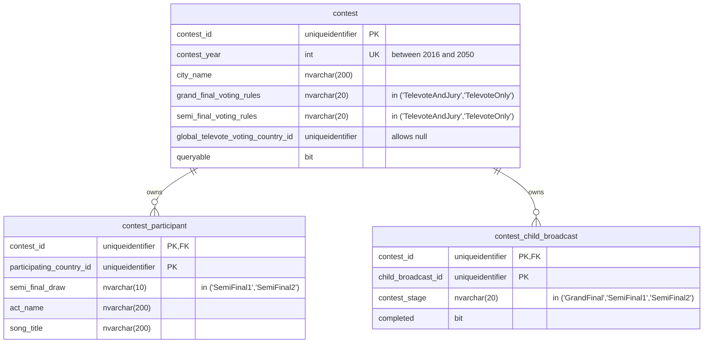
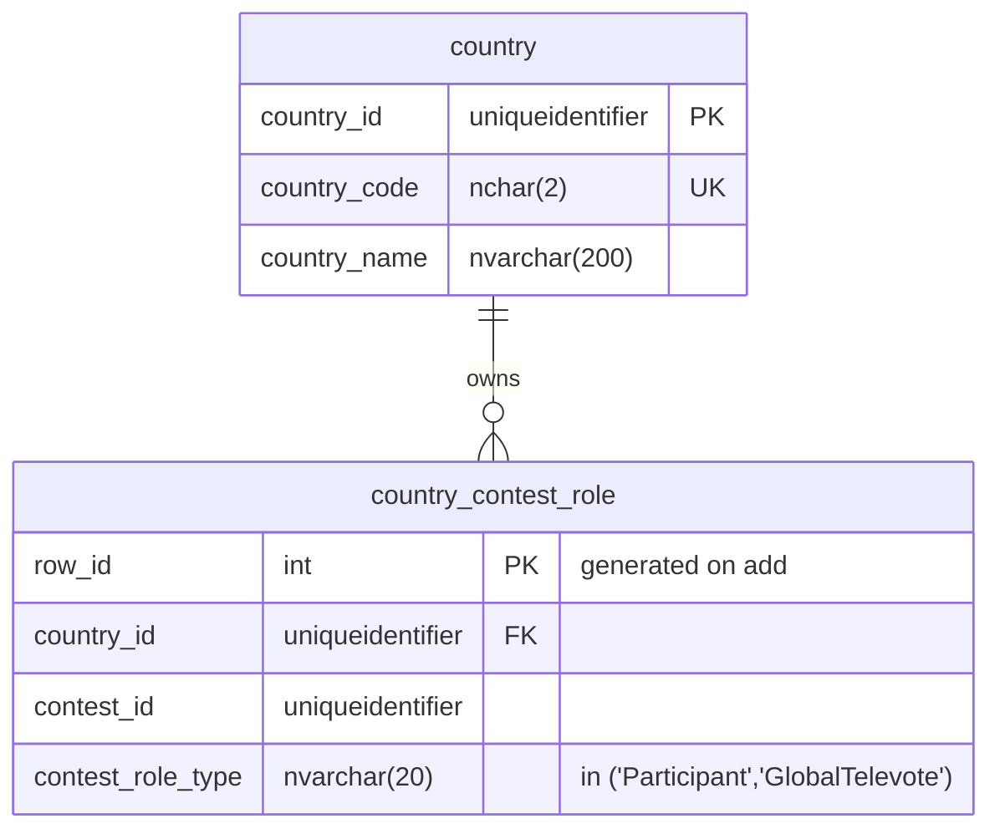

# 8. Database schema

This document is part of the [launch specification](../README.md#launch-specification).

- [8. Database schema](#8-database-schema)
  - [Conventions](#conventions)
  - [**BROADCAST** aggregate tables](#broadcast-aggregate-tables)
  - [**CONTEST** aggregate tables](#contest-aggregate-tables)
  - [**COUNTRY** aggregate tables](#country-aggregate-tables)

## Conventions

1. All columns are `not null` unless specified.
2. Any column named `row_id` contains a database-generated integer row identifier that is not part of the domain model.
3. Enum values are stored as their string names.

## **BROADCAST** aggregate tables

**Additional constraints:**

- In the `broadcast` table:
  - (`parent_contest_id`, `contest_stage`) is unique.
- In the `broadcast_competitor` table:
  - (`broadcast_id`, `running_order_spot`) is unique.
- In the `broadcast_competitor_jury_award` table:
  - `competing_country_id` <> `voting_country_id`.
  - (`broadcast_id`, `competing_country_id`, `voting_country_id`) is unique.
- In the `broadcast_competitor_televote_award` table:
  - `competing_country_id` <> `voting_country_id`.
  - (`broadcast_id`, `competing_country_id`, `voting_country_id`) is unique.

## **CONTEST** aggregate tables

**Additional constraints:**

- In the `contest_child_broadcast` table:
  - (`contest_id`, `contest_stage`) is unique.

## **COUNTRY** aggregate tables

Additional constraints:

- In the `country_contest_role` table:
  - (`country_id`, `contest_id`) is unique.
