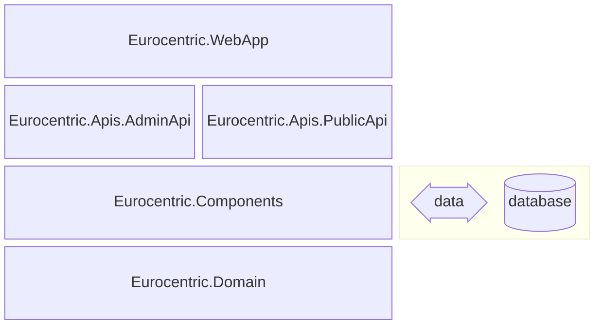

# 10. System architecture

This document is part of the [launch specification](../README.md#launch-specification).

- [10. System architecture](#10-system-architecture)
  - [SDK](#sdk)
  - [Assembly architecture](#assembly-architecture)
  - [API feature architecture](#api-feature-architecture)
    - [Request-Endpoint-Response (REPR)](#request-endpoint-response-repr)
    - [Railway-Oriented Programming (ROP)](#railway-oriented-programming-rop)
    - [Vertical Slices](#vertical-slices)
  - [Third-party libraries](#third-party-libraries)

## SDK

The system uses the .NET 10 SDK.

## Assembly architecture

The system is composed of five .NET assemblies:

| Name                         | .NET project type | Role                                                                                             |
|:-----------------------------|:-----------------:|:-------------------------------------------------------------------------------------------------|
| `Eurocentric.WebApp`         |      Web API      | composition root and executable                                                                  |
| `Eurocentric.Apis.AdminApi`  |   Class library   | Admin API features                                                                               |
| `Eurocentric.Apis.PublicApi` |   Class library   | Public API features                                                                              |
| `Eurocentric.Components`     |   Class library   | Messaging interfaces, domain service implementations, data access services, API middleware, etc. |
| `Eurocentric.Domain`         |   Class library   | Domain aggregate types, error types, domain service interfaces, etc.                             |

The assemblies are illustrated in the diagram below, in which each assembly explicitly references the assembly/assemblies immediately below it.

## API feature architecture

The following structures are used for all `admin-api` and `public-api` features:

### Request-Endpoint-Response (REPR)

Each endpoint feature has its own public request body and/or query parameters and or response body types, which constitute its API contract.

### Railway-Oriented Programming (ROP)

An API request *either* succeeds and returns a successful HTTP response, *or* fails and returns an unsuccessful response with a serialized `ProblemDetails` object.

### Vertical Slices

Within the `Eurocentric.Apis.AdminApi` and `Eurocentric.Apis.PublicApi` assemblies, all the source code for a given feature is located in the same namespace.

## Third-party libraries

The following key third-party libraries are used in the `Eurocentric.Domain` class library:

| Library                    | Role                                    |
|:---------------------------|:----------------------------------------|
| CSharpFunctionalExtensions | Errors and results                      |

The following key third-party libraries are used in the `Eurocentric.Components` class library:

| Library                                  | Role                                                |
|:-----------------------------------------|:----------------------------------------------------|
| Asp.Versioning.Mvc.ApiExplorer           | API versioning                                      |
| Dapper                                   | Database stored procedure execution                 |
| EFCore.CheckConstraints                  | Database configuration                              |
| EntityFrameworkCore.Exceptions.SqlServer | Database exceptions                                 |
| Microsoft.AspNetCore.OpenApi             | OpenAPI document generation                         |
| Microsoft.EntityFrameworkCore            | Database configuration and domain model data access |
| Microsoft.EntityFrameworkCore.SqlServer  | Database configuration and domain model data access |
| Riok.Mapperly                            | Mapping from domain types to API response types     |
| Scalar.AspNetCore                        | OpenAPI documentation web pages                     |
| SlimMessageBus.Host.Memory               | In-memory command/query/event messaging             |

The following key third-party library is used in the `Eurocentric.WebApp` assembly:

| Library                                  | Role                                                |
|:-----------------------------------------|:----------------------------------------------------|
| Microsoft.EntityFrameworkCore.Design     | Database design-time configuration                  |
