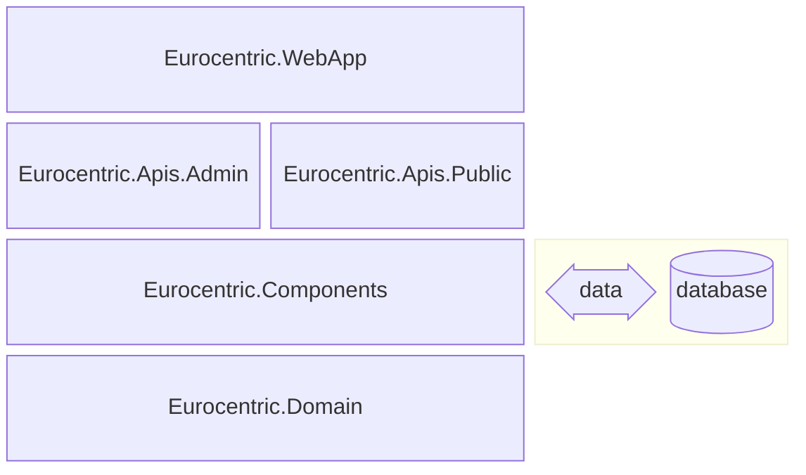
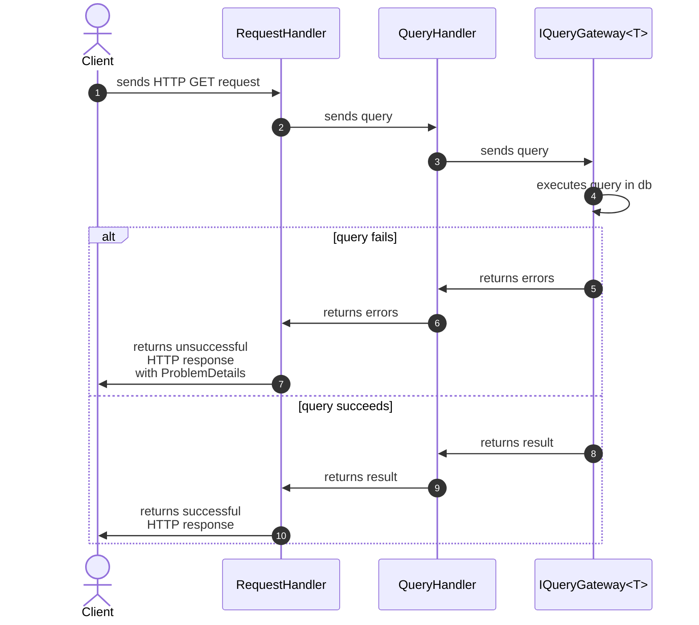
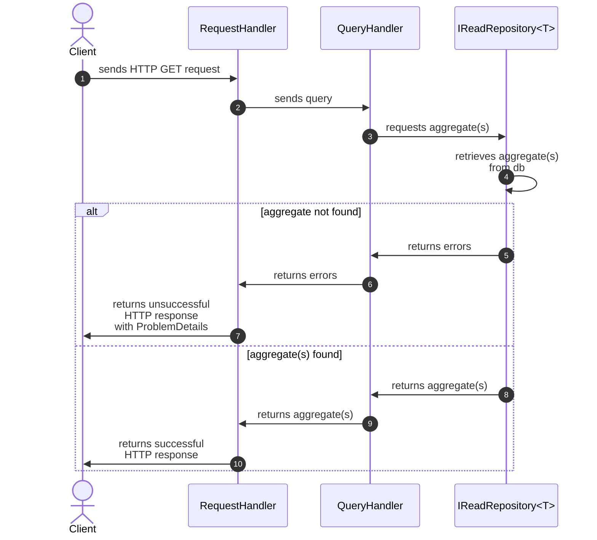
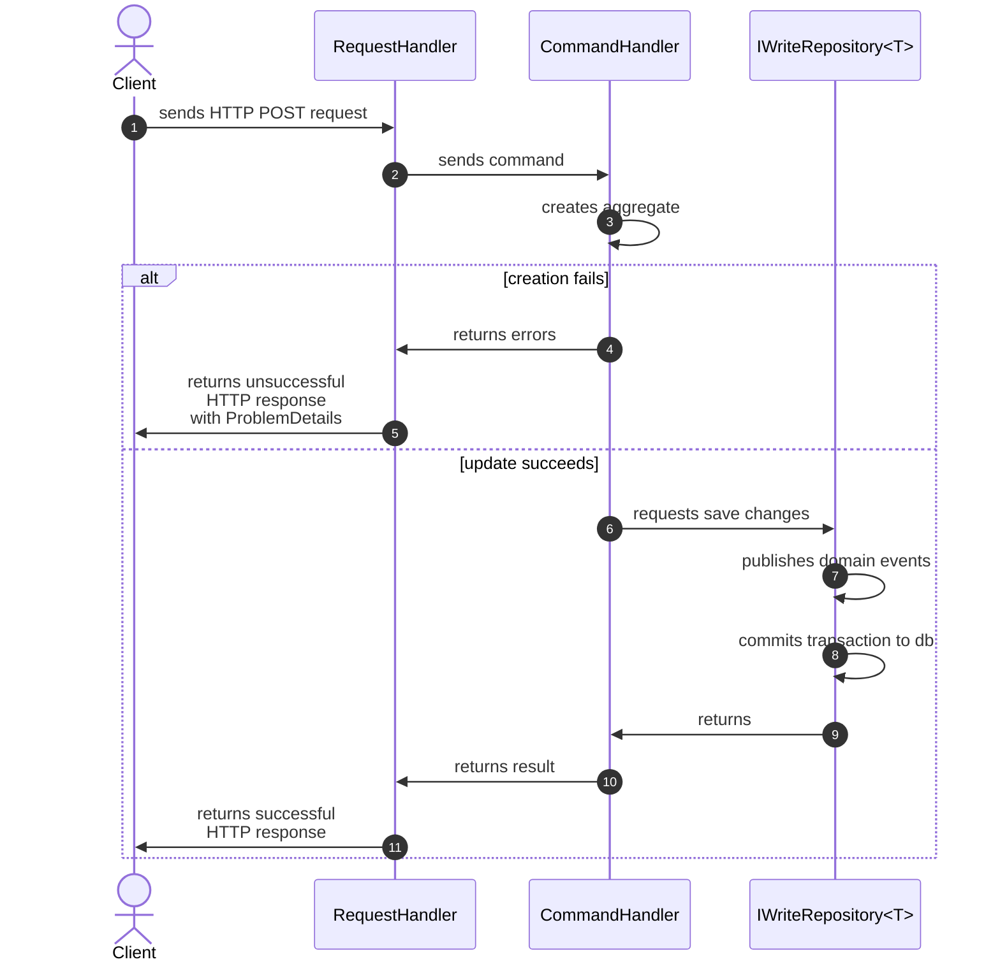
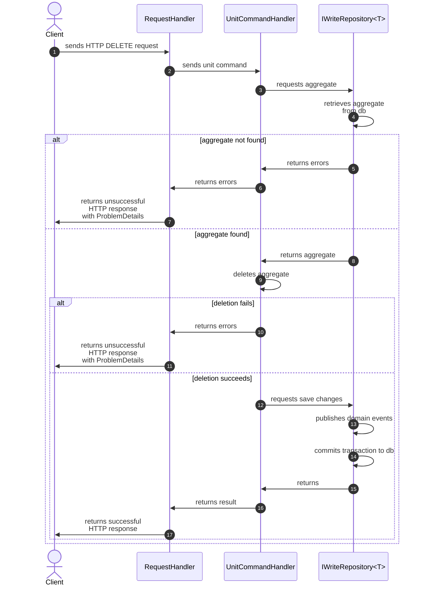

# 10. System architecture

This document is part of the [launch specification](../README.md#launch-specification).

- [10. System architecture](#10-system-architecture)
  - [SDK](#sdk)
  - [Assembly architecture](#assembly-architecture)
  - [Vertical slice architecture](#vertical-slice-architecture)
  - [Domain event handling](#domain-event-handling)
  - [Railway oriented programming](#railway-oriented-programming)
  - [Request handling workflow](#request-handling-workflow)
    - [GET endpoint (Public API) workflow](#get-endpoint-public-api-workflow)
    - [GET endpoint (Admin API) workflow](#get-endpoint-admin-api-workflow)
    - [POST endpoint (Admin API) workflow](#post-endpoint-admin-api-workflow)
    - [PATCH endpoint (Admin API) workflow](#patch-endpoint-admin-api-workflow)
    - [DELETE endpoint (Admin API) workflow](#delete-endpoint-admin-api-workflow)
  - [Third-party libraries](#third-party-libraries)

## SDK

The system uses the .NET 10 SDK.

## Assembly architecture

The system is composed of five .NET assemblies:

| Name                      | .NET project type | Role                                                                       |
|:--------------------------|:-----------------:|:---------------------------------------------------------------------------|
| `Eurocentric.WebApp`      |      Web API      | composition root and executable                                            |
| `Eurocentric.Apis.Admin`  |   Class library   | *admin-api* features                                                       |
| `Eurocentric.Apis.Public` |   Class library   | *public-api* features                                                      |
| `Eurocentric.Components`  |   Class library   | Domain service implementations, data access services, API middleware, etc. |
| `Eurocentric.Domain`      |   Class library   | Domain aggregate types, error types, domain service interfaces, etc.       |

The assemblies are illustrated in the diagram below, in which each assembly explicitly references the assembly/assemblies immediately below it.

## Vertical slice architecture

All the internal types for a given feature are nested types belonging to a single static class that is named after the feature.

The HTTP request/response types for a given feature are public non-nested record types located alongside feature class, with the name `{FeatureName}Request` or `{FeatureName}Response`.

Each feature has at most one endpoint, defined using the Minimal API syntax.

## Domain event handling

An application command that creates, updates or deletes a single domain aggregate *may* raise a domain event.

Domain events are handled as part of the same transaction in which they are raised.

Domain aggregate write repositories are designed to publish domain events in tracked aggregates when the `SaveChangesAsync` method is invoked, and to wait for the domain events to be handled before committing the entire transaction to the database.

## Railway oriented programming

Every API endpoint feature request *either* succeeds and generates a result *or* fails and generates a list of domain errors.

A successfully handled request returns an HTTP response with a successful status code and an optional serialized response body object.

An unsuccessfully handled request returns an HTTP response with an unsuccessful status code and a serialized `ProblemDetails` object in the response body, which is mapped from the first domain error.

## Request handling workflow

Every API endpoint feature uses the same request handling workflow, which combines the Request-Endpoint-Response (REPR) and Railway-Oriented Programming (ROP) patterns.

### GET endpoint (Public API) workflow

A Public API GET endpoint feature defines the following types:

- A `Response` record type, which:
  - is the successful HTTP response body object.
  - is part of the API contract.
  - is composed of API DTOs and/or .NET native types only.
- An optional `Request` record type, which:
  - contains the HTTP request query parameters.
  - is part of the API contract.
  - is composed of API DTOs and/or .NET native types only.
- A `Query` record type, which:
  - is the application query type.
  - returns a `Result<T, Error>` or `Result<T[], Error>`, where `T` is the domain query result type.
  - is composed of domain types and/or .NET native types only.
- A `QueryHandler` class, which:
  - is the application query handler type.
  - depends on an `IQueryGateway<T>` service, which has a method that returns a `Result<T, Error>` or `Result<T[], Error>`, where `T` is the domain query result type.

### GET endpoint (Admin API) workflow

An Admin API GET endpoint feature defines the following types:

- A `Response` record type, which:
  - is the successful HTTP response body object.
  - is part of the API contract.
  - is composed of API DTOs and/or .NET native types only.
- A `Query` record type, which:
  - is the application query type.
  - returns a `Result<T, Error>` or `Result<T[], Error>`, where `T` is the domain aggregate type.
  - is composed of domain types and/or .NET native types only.
- A `QueryHandler` class, which:
  - is the application query handler type.
  - depends on an `IReadRepository<T>` service, where `T` is the domain aggregate type.

### POST endpoint (Admin API) workflow

An Admin API POST endpoint feature defines the following types:

- A `Response` record type, which:
  - is the successful HTTP response body object.
  - is part of the API contract.
  - is composed of API DTOs and/or .NET native types only.
- A `Request` record type, which:
  - is the HTTP request body object.
  - is part of the API contract.
  - is composed of API DTOs and/or .NET native types only.
- A `Command` record type, which:
  - is the application command type.
  - returns a `Result<T, Error>`, where `T` is the domain aggregate type.
  - is composed of domain types and/or .NET native types only.
- A `CommandHandler` class, which:
  - is the application command handler type.
  - depends on an `IWriteRepository<T>` service, where `T` is the domain aggregate type.

### PATCH endpoint (Admin API) workflow

An Admin API PATCH endpoint feature defines the following types:

- A `Request` record type, which:
  - is the HTTP request body object.
  - is part of the API contract.
  - is composed of API DTOs and/or .NET native types only.
- A `UnitCommand` record type, which:
  - is the application unit command type.
  - returns a `UnitResult<Error>`.
  - is composed of domain types and/or .NET native types only.
- A `UnitCommandHandler` unit class, which:
  - is the application command handler type.
  - depends on an `IWriteRepository<T>` service, where `T` is the domain aggregate type.

### DELETE endpoint (Admin API) workflow

An Admin API DELETE endpoint feature defines the following types:

- A `UnitCommand` record type, which:
  - is the application unit command type.
  - returns a `UnitResult<Error>`.
  - is composed of domain types and/or .NET native types only.
- A `UnitCommandHandler` class, which:
  - is the application unit command handler type.
  - depends on an `IWriteRepository<T>` service, where `T` is the domain aggregate type.

## Third-party libraries

The following key third-party libraries are used in the `Eurocentric.Domain` class library:

| Library                    | Role                                    |
|:---------------------------|:----------------------------------------|
| CSharpFunctionalExtensions | Errors and results                      |
| SlimMessageBus             | Application command and query contracts |

The following key third-party libraries are used in the `Eurocentric.Components` class library:

| Library                                  | Role                                                |
|:-----------------------------------------|:----------------------------------------------------|
| Asp.Versioning.Mvc.ApiExplorer           | API versioning                                      |
| Dapper                                   | Database stored procedure execution                 |
| EFCore.CheckConstraints                  | Database configuration                              |
| EFCore.NamingConventions                 | Database configuration                              |
| EntityFrameworkCore.Exceptions.SqlServer | Database exceptions                                 |
| Microsoft.AspNetCore.OpenApi             | OpenAPI document generation                         |
| Microsoft.EntityFrameworkCore.SqlServer  | Database configuration and domain model data access |
| Scalar.AspNetCore                        | OpenAPI documentation web pages                     |
| SlimMessageBus.Host.Memory               | In-memory command/query/event messaging             |

The following key third-party library is used in the `Eurocentric.WebApp` assembly:

| Library                                  | Role                                                |
|:-----------------------------------------|:----------------------------------------------------|
| Microsoft.EntityFrameworkCore.Design     | Database design-time configuration                  |
