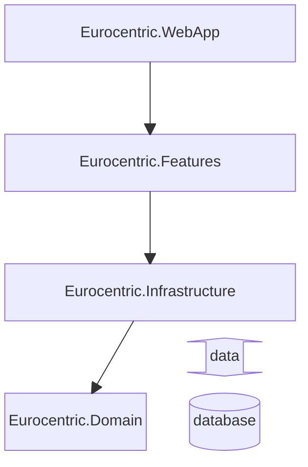
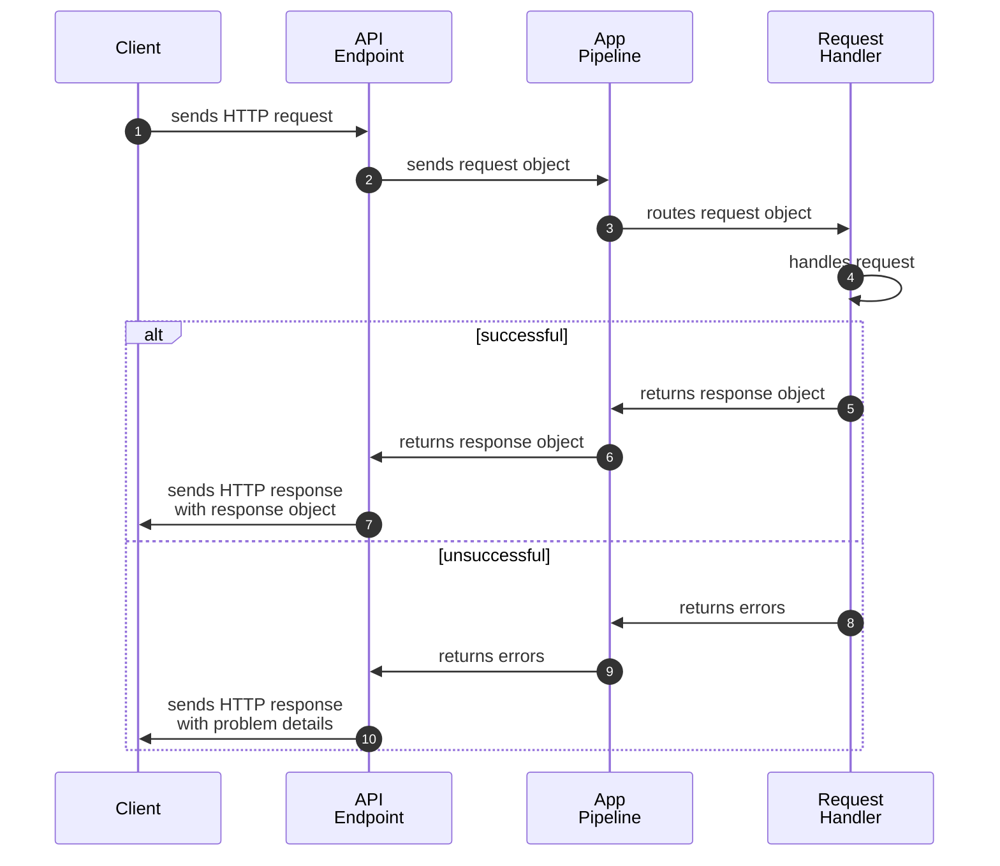

# System design decisions

This document outlines system design decisions taken during development of the *Eurocentric* project.

- [System design decisions](#system-design-decisions)
  - [Technical specification](#technical-specification)
  - [Assembly architecture](#assembly-architecture)
  - [API architecture](#api-architecture)
    - [Vertical slices](#vertical-slices)
    - [Request-endpoint-response (REPR pattern)](#request-endpoint-response-repr-pattern)
    - [Command/query responsibility segregation](#commandquery-responsibility-segregation)
    - [Railway oriented programming](#railway-oriented-programming)
    - [Request handling workflow](#request-handling-workflow)
  - [Domain model rules](#domain-model-rules)
    - [Identity](#identity)
    - [Instantiation](#instantiation)
    - [Mutability](#mutability)
    - [Enforcement of invariants](#enforcement-of-invariants)
  - [Version control](#version-control)
  - [CI/CD](#cicd)

## Technical specification

- The system is written using .NET version 9.
- The APIs are implemented using the ASP.NET *minimal API* technique.
- The system aims for level 2 REST maturity.
- As far as possible, the native ASP.NET libraries are used to implement the APIs.
- The system is hosted in the cloud as an Azure Web App.
- The system uses an Azure SQL Database, hosted in the cloud.
- The language used by the system is UK English.

## Assembly architecture

The system is composed of four .NET assemblies:

| Name                         | .NET project type | Role                                                                                                                  |
|:-----------------------------|:-----------------:|:----------------------------------------------------------------------------------------------------------------------|
| `Eurocentric.WebApp`         |      Web API      | composition root and executable                                                                                       |
| `Eurocentric.Features`       |   Class library   | *admin-api*, *public-api* and *shared* features (i.e. clean architecture application + presentation layers)           |
| `Eurocentric.Infrastructure` |   Class library   | data access, timing, other services that reach outside the application (i.e. clean architecture infrastructure layer) |
| `Eurocentric.Domain`         |   Class library   | domain types                                                                                                          |

- `Eurocentric.Domain` depends on nothing.
- `Eurocentric.Infrastructure` depends on `Eurocentric.Domain`.
- `Eurocentric.Features` depends on `Eurocentric.Infrastructure`.
- `Eurocentric.WebApp` depends on `Eurocentric.Features`.

The four assemblies are illustrated in the below diagram, in which arrows indicate the directions of dependencies.

## API architecture

Each of the two APIs is structured using the following patterns:

### Vertical slices

All the types for a feature are stored together in their own designated folder named after the feature. Each feature has at most one endpoint, defined using the Minimal API syntax.

### Request-endpoint-response (REPR pattern)

Each API endpoint defines a request type and/or a response type. All the requests and responses for an API have properties that are *either* native .NET types *or* public types defined in the API, but *never* in the `Eurocentric.Domain` assembly.

### Command/query responsibility segregation

A request type is *either* a command (which changes the state of the system) *or* a query (which only reads data from the system).

### Railway oriented programming

Every request is handled on the server and *either* succeeds and returns a response *or* fails and returns a list of errors.

### Request handling workflow

The following diagram illustrates the request handling workflow used for every feature that has an endpoint.

1. The client sends an HTTP request to the API endpoint.
2. The API endpoint sends the request object to the app pipeline.
3. The app pipeline routes the request object to its request handler.
4. The request handler handles the request, which is *either* successful (go to step 5) *or* unsuccessful (go to step 8).
5. The request handler returns the response object to the app pipeline.
6. The app pipeline returns the response object to the API endpoint.
7. The API endpoint sends the request object to the client as an HTTP response with a successful status code.
8. The request handler returns errors to the app pipeline.
9. The app pipeline returns the errors to the API endpoint.
10. The API endpoint creates a problem details object from the first error and sends the problem details to the client as an HTTP response with an unsuccessful status code.

## Domain model rules

This section describes the rules for domain aggregate, entity, and value object types.

### Identity

1. An aggregate is assigned an ID on the server when it is first created, before it is persisted to the database. The [RFC 9562 Version 7](https://learn.microsoft.com/en-us/dotnet/api/system.guid.createversion7?view=net-9.0) GUID specification is used.
2. An entity has no ID of its own, but has a property that uniquely identifies it within its aggregate. The entity therefore has a composite ID of its identifying property and the ID of its aggregate.
3. A value object has no identity.

### Instantiation

1. An aggregate can be instantiated using its public API and queried by its ID.
2. An entity cannot be instantiated or queried except as part of its aggregate.
3. A value object can be instantiated anywhere using a factory method.

### Mutability

1. An aggregate is mutable through its public API.
2. An entity can only be mutated through the public API of its aggregate.
3. A value object is immutable.

### Enforcement of invariants

1. An aggregate enforces its internal invariants, including those of all its entities, at all times.
   1. An aggregate cannot be instantiated in a state that violates any of its internal invariants.
   2. An aggregate cannot be mutated if doing so would violate any of its internal invariants.
2. A value object cannot be instantiated in an illegal state.
3. An instantiated or updated aggregate cannot be persisted to the system if it violates any inter-aggregate invariants given the aggregates that currently exist in the system.
4. If one or more aggregates in a system need to be updated as a result of a given aggregate being created, updated or deleted, all updates must be carried out as part of the original transaction. The transaction must be rolled back if any invariant is violated.

## Version control

Git is used for version control of source code.

Commit messages are written using the [Conventional Commits](https://www.conventionalcommits.org/en/v1.0.0/) standard.

## CI/CD

At an early stage in development, an action is added to the GitHub source code repository that automatically publishes and deploys the application to the Azure App Service. This action is triggered every time source code is pushed to the main branch in the remote repository.
