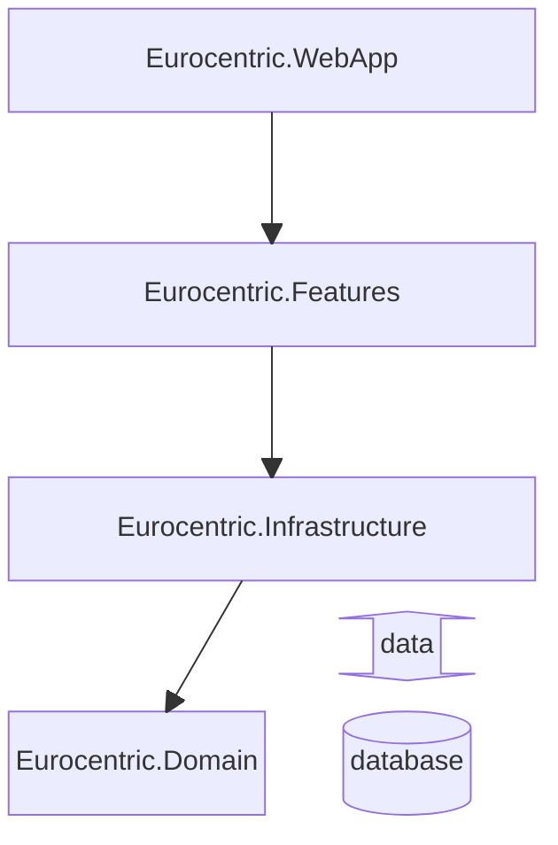

# System design decisions

This document outlines system design decisions taken during development of the *Eurocentric* project.

- [System design decisions](#system-design-decisions)
  - [Technical specification](#technical-specification)
  - [Assembly architecture](#assembly-architecture)
  - [API architecture](#api-architecture)
  - [Aggregate ID assignment](#aggregate-id-assignment)
  - [Version control](#version-control)
  - [CI/CD](#cicd)

## Technical specification

- The system is written using .NET version 9.
- The APIs are implemented using the ASP.NET *minimal API* technique.
- The system aims for level 2 REST maturity.
- As far as possible, the native ASP.NET libraries are used to implement the APIs.
- The system is hosted in the cloud as an Azure Web App.
- The system uses an Azure SQL Database, hosted in the cloud.
- The language used by the system is UK English.

## Assembly architecture

The system is composed of four .NET assemblies:

| Name                         | .NET project type | Role                                                                                                                  |
|:-----------------------------|:-----------------:|:----------------------------------------------------------------------------------------------------------------------|
| `Eurocentric.WebApp`         |      Web API      | composition root and executable                                                                                       |
| `Eurocentric.Features`       |   Class library   | *admin-api*, *public-api* and *shared* features (i.e. clean architecture application + presentation layers)           |
| `Eurocentric.Infrastructure` |   Class library   | data access, timing, other services that reach outside the application (i.e. clean architecture infrastructure layer) |
| `Eurocentric.Domain`         |   Class library   | domain types                                                                                                          |

- `Eurocentric.Domain` depends on nothing.
- `Eurocentric.Infrastructure` depends on `Eurocentric.Domain`.
- `Eurocentric.Features` depends on `Eurocentric.Infrastructure`.
- `Eurocentric.WebApp` depends on `Eurocentric.Features`.

The four assemblies are illustrated in the below diagram, in which arrows indicate the directions of dependencies.

## API architecture

Each of the two APIs is structured using the following patterns:

- vertical slices: each feature is arranged into its own folder
- request-endpoint-response: each endpoint defines its own request and response types
- command query responsibility segregation: a request type is *either* a command (which changes the state of the system) *or* a query (which only reads data from the system).
- railway-oriented programming: each request type enters the application pipeline and returns *either* a successful response value *or* a list of errors.

## Aggregate ID assignment

Domain aggregates are assigned an ID on the server when they are first created, before they are persisted to the database. The [RFC 9562 Version 7](https://learn.microsoft.com/en-us/dotnet/api/system.guid.createversion7?view=net-9.0) GUID specification is used.

## Version control

Git is used for version control of source code.

Commit messages are written using the [Conventional Commits](https://www.conventionalcommits.org/en/v1.0.0/) standard.

## CI/CD

At an early stage in development, an action is added to the GitHub source code repository that automatically publishes and deploys the application to the Azure App Service. This action is triggered every time source code is pushed to the main branch in the remote repository.
