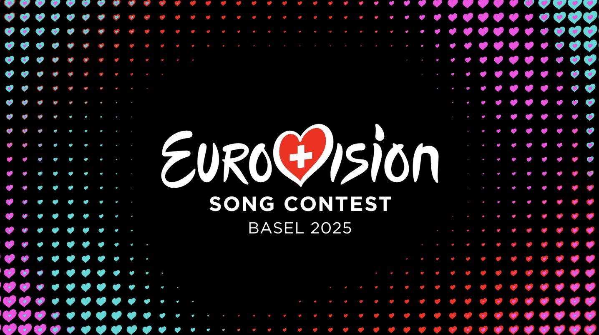
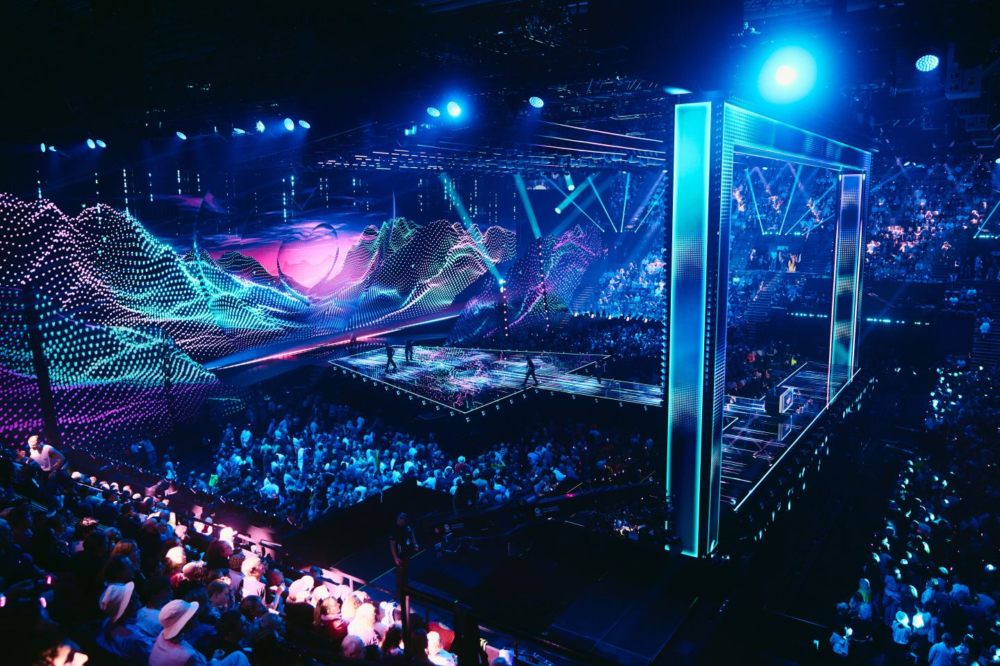
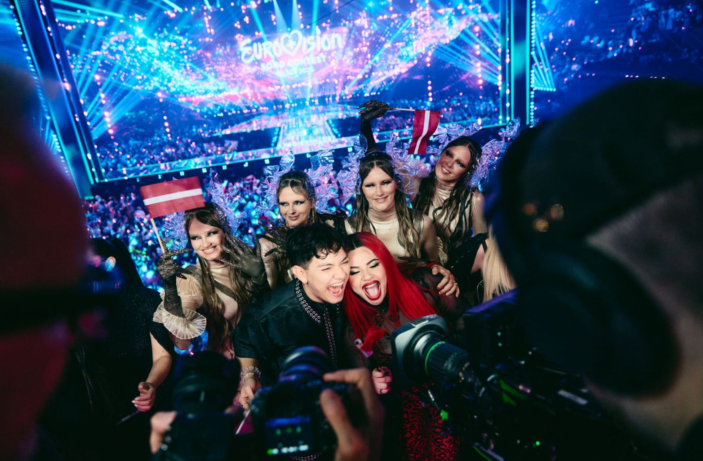
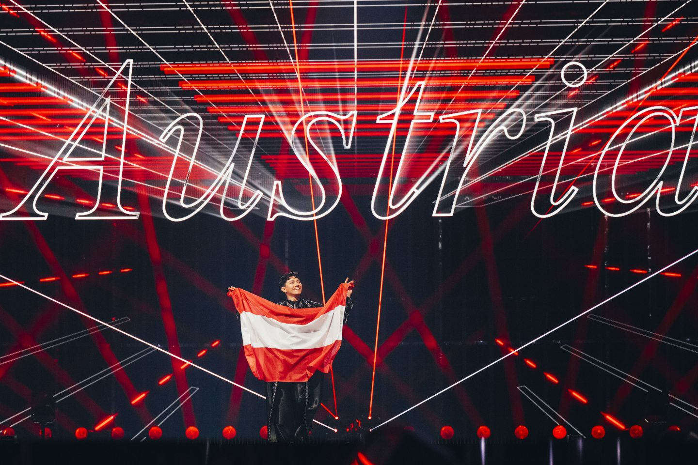
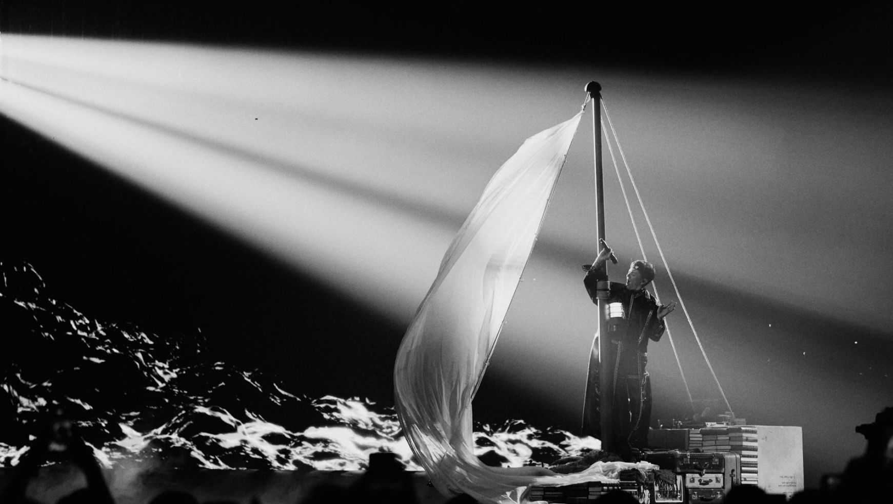
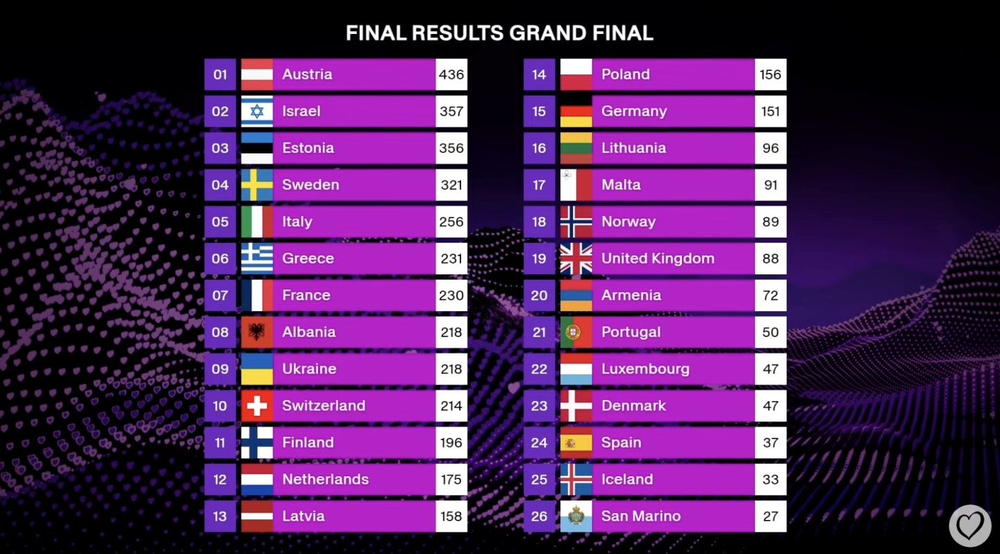
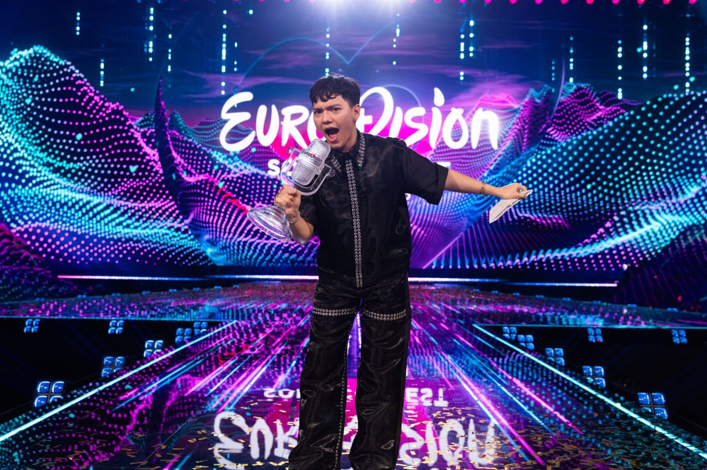

# 3. Real-world context

This document is part of the [launch specification](../README.md#launch-specification).

- [3. Real-world context](#3-real-world-context)
  - [What is the Eurovision Song Contest?](#what-is-the-eurovision-song-contest)
  - [Contest structure](#contest-structure)
    - [Contest stages](#contest-stages)
    - [Competing and voting eligibility](#competing-and-voting-eligibility)
    - [Automatic qualifiers](#automatic-qualifiers)
    - ["Liverpool" contest rules](#liverpool-contest-rules)
    - ["Stockholm" contest rules](#stockholm-contest-rules)
  - [A broadcast](#a-broadcast)
    - [Determining points award values](#determining-points-award-values)
    - [Determining the finishing order](#determining-the-finishing-order)
  - [Unusual events](#unusual-events)
    - [A participant withdraws from a contest](#a-participant-withdraws-from-a-contest)
    - [A competitor is disqualified from a broadcast](#a-competitor-is-disqualified-from-a-broadcast)
    - [A substitute jury or televote is used](#a-substitute-jury-or-televote-is-used)
  - [Images from the Eurovision official website](#images-from-the-eurovision-official-website)

## What is the Eurovision Song Contest?

|  |
|:-----------------------------------------------------------------------------------------------------------------------------------------------------------------------------------------------------------------------------:|
|                                                                         The logo for the 2025 Eurovision Song Contest in Basel, Switzerland (© EBU).                                                                          |

The Eurovision Song Contest is an annual televised song contest between national broadcasters, organized by the European Broadcasting Union (EBU).

A contest has c.40 participants, each of which is an act with a song representing a participating country. Contests from 2023 onwards also have a global televote for viewers outside the participating countries.

A contest is composed of three broadcasts: two Semi-Finals and the Grand Final. Each broadcast has multiple competitors, drawn from the contest's participants.

A broadcast also has national juries and national televotes. Each jury/televote awards a set of points from a voting country to all the competing countries in the broadcast (excluding the voting country).

The winning competing country in the Grand Final is the overall winner of the contest. Customarily, the winning country hosts the following year's contest.

For example:

> The 2025 Eurovision Song Contest was held in Basel, Switzerland. There were 37 participating countries, plus an additional "Rest of the World" televote. The winner was the singer JJ with the song "Wasted Love", representing the Austrian national broadcaster ORF. The 2026 Eurovision Song Contest is going to be held in Vienna, Austria.

## Contest structure

This section summarizes the structure of the Eurovision Song Contest, and the two sets of voting rules used between 2016 and 2025.

### Contest stages

A contest's three stages, in broadcast order, are:

| Contest stage | Competitors |
|:--------------|------------:|
| Semi-Final 1  |       15-18 |
| Semi-Final 2  |       15-18 |
| Grand Final   |       25-26 |

### Competing and voting eligibility

A contest's participants are split evenly between the two Semi-Finals for competing and voting, using a semi-random draw.

The top 10 finishing competing countries in each Semi-Final qualify for the Grand Final, along with 5-6 automatic qualifiers defined below.

Every participating country votes in the Grand Final, including the non-qualifiers.

### Automatic qualifiers

In a contest, 5-6 of the participants automatically qualify for the Grand Final. They are:

- The previous year's winner.
- The "Big Five" (France, Germany, Italy, Spain, the United Kingdom).

Each automatic qualifier votes in one of the two Semi-Finals, but does not compete.

### "Liverpool" contest rules

The "Liverpool" contest rules in *Eurocentric* are a simplified version of the voting rules introduced at the Liverpool 2023 Contest:

- In Semi-Final 1 and Semi-Final 2, each voting country has a televote that awards a set of points.
- In the Grand Final, each voting country has a jury and a televote, each of which awards a set of points.
- The contest has a global televote that awards a single set of points in each broadcast.

### "Stockholm" contest rules

The "Stockholm" contest rules in *Eurocentric* are a simplified version of the voting rules introduced at the Stockholm 2016 Contest and last used at the Turin 2022 Contest.

- In all three stages, each voting country has a jury and a televote, each of which awards a set of points.
- The contest has no global televote.

## A broadcast

In a broadcast, the competitors perform in a pre-determined running order.

Each national jury or televote representing a voting country gives a single points award to each competitor representing a different competing country to the voting country.

### Determining points award values

A televote or jury ranks all the competitors (excluding its own) from first to last.

The top ten highest ranked competitors receive awards with the following points values: 12, 10, 8, 7, 6, 5, 4, 3, 2, then 1.

All other ranked competitors receive a 0 points award.

### Determining the finishing order

The competitors in a broadcast are assigned a finishing order based on descending total points.

Ties are not permitted. The following tie-break rules are used in order:

1. If two competitors are tied on total points, the competitor with more televote points wins the tie.
2. If they are still tied, the competitor with more non-zero televote awards wins the tie.
3. If they are still tied, a "count-back" is used: the competitor that received more 12 points televote awards wins the tie, then 10 points televote awards, and so on down to 1 point televote awards.
4. If they are still tied, the competitor with the earlier running order spot wins the tie.

## Unusual events

This section lists some unusual events that have occurred at the Eurovision Song Contest between 2016 and 2025, and how they are handled in the design of *Eurocentric*.

### A participant withdraws from a contest

**Example:**

Moldova withdrew from the Basel 2025 Contest while in the process of selecting its act.

**How *Eurocentric* handles this:**

A withdrawn participant is disregarded when creating the contest in the system.

### A competitor is disqualified from a broadcast

**Example:**

The Netherlands was disqualified from the Malmö 2024 Grand Final.

**How *Eurocentric* handles this:**

The running order spot for a disqualified competitor is left vacant when creating a broadcast.

### A substitute jury or televote is used

**Examples:**

In the Turin 2022 Contest, the juries of 6 participating countries were disqualified due to irregular voting patterns. They were replaced with substitute jury scores calculated from the averages of similar voting countries.

In the Basel 2025 Contest, San Marino had no televote. Its televote points were determined using a back-up jury.

**How *Eurocentric* handles this:**

Jury and televote points are taken at face value.

## Images from the Eurovision official website

|  |
|:-----------------------------------------------------------------------------------------------------------------:|
|                   *The Eurovision 2025 stage in St. Jakobshalle, Basel (© EBU/Alma Bengtsson).*                   |

|  |
|:--------------------------------------------------------------------------------------------------------------------------------------:|
|  *The qualifying acts representing Austria, Latvia and Malta at the Eurovision 2025 Second Semi-Final (© EBU/Sarah Louise Bennett).*   |

|  |
|:----------------------------------------------------------------------------------------------------------------------------------------------------------------------:|
|                       *JJ from Austria participating in the flag parade at the start of the Eurovision 2025 Grand Final (© EBU/Alma Bengtsson).*                       |

|  |
|:-----------------------------------------------------------------------------------------------------------------------------------------:|
|                   *JJ from Austria performing "Wasted Love" in the Eurovision 2025 Grand Final (© EBU/Alma Bengtsson).*                   |

|  |
|:----------------------------------------------------------------------------------------------------------:|
|                         *Scoreboard from the Eurovision 2025 Grand Final (© EBU).*                         |

|  |
|:------------------------------------------------------------------------------------------------------------------------------------:|
|         *JJ from Austria holding the winner's trophy at the end of the Eurovision 2025 Grand Final (© EBU/Corinne Cumming).*         |
