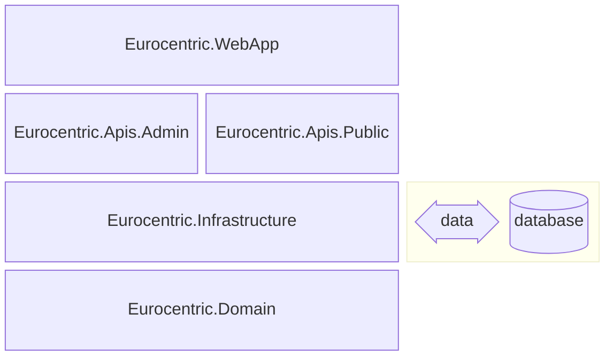

# 10. System architecture

This document is part of the [launch specification](../README.md#launch-specification).

- [10. System architecture](#10-system-architecture)
  - [SDK](#sdk)
  - [Assembly architecture](#assembly-architecture)
  - [Third-party libraries](#third-party-libraries)
  - [API architecture](#api-architecture)
    - [Vertical slices](#vertical-slices)
    - [Request handling workflow](#request-handling-workflow)
      - [GET endpoint workflow](#get-endpoint-workflow)
      - [POST endpoint workflow](#post-endpoint-workflow)
      - [PATCH endpoint workflow](#patch-endpoint-workflow)
      - [DELETE endpoint workflow](#delete-endpoint-workflow)

## SDK

The system uses the .NET 10 SDK.

## Assembly architecture

The system is composed of five .NET assemblies:

| Name                         | .NET project type | Role                                                                                         |
|:-----------------------------|:-----------------:|:---------------------------------------------------------------------------------------------|
| `Eurocentric.WebApp`         |      Web API      | composition root and executable                                                              |
| `Eurocentric.Apis.Admin`     |   Class library   | *admin-api* features                                                                         |
| `Eurocentric.Apis.Public`    |   Class library   | *public-api* features                                                                        |
| `Eurocentric.Infrastructure` |   Class library   | Non-functional features, data access, ID generators, analytics gateway implementations, etc. |
| `Eurocentric.Domain`         |   Class library   | Domain types, analytics gateway interfaces, etc.                                             |

The assemblies are illustrated in the diagram below, in which each assembly explicitly references the assembly/assemblies immediately below it.

## Third-party libraries

The following key third-party libraries are used in source code:

| Library                                  | Role                                                |
|:-----------------------------------------|:----------------------------------------------------|
| ErrorOr                                  | Domain errors and results                           |
| Asp.Versioning.Mvc.ApiExplorer           | API versioning                                      |
| SlimMessageBus.Host.Memory               | In-memory command/query/event messaging             |
| Microsoft.AspNetCore.OpenApi             | OpenAPI document generation                         |
| Scalar.AspNetCore                        | OpenAPI documentation web pages                     |
| Microsoft.EntityFrameworkCore.SqlServer  | Database configuration and domain model data access |
| EFCore.NamingConventions                 | Database configuration                              |
| EntityFrameworkCore.Exceptions.SqlServer | Database exceptions                                 |
| Dapper                                   | Database stored procedure execution                 |

## API architecture

Each of the two APIs is structured using the following patterns:

### Vertical slices

All the types for a given feature are nested types belonging to a single static class that is named after the feature.

Each feature has at most one endpoint, defined using the Minimal API syntax.

### Request handling workflow

Every API endpoint feature uses the same request handling workflow, which combines the Request-Endpoint-Response (REPR) and Railway-Oriented Programming (ROP) patterns.

#### GET endpoint workflow

A GET endpoint feature uses the following types:

- A `Response` class, which:
  - is the successful HTTP response body object.
  - is public.
  - is part of the API contract.
  - is composed of API DTO types and native .NET types only.
- An optional `Request` class, which:
  - contains HTTP request query parameters.
  - is public.
  - is part of the API contract.
  - is composed of API DTO types and native .NET types only.
- A `Result` class, which:
  - is the result of the successfully handled `Query`.
  - is internal.
  - is composed of domain types and native .NET types only.
- A `Query` class, which:
  - represents a query placed on the application bus
  - *either* fails and returns a list of errors *or* succeeds and returns a `Result`.
  - is internal.
  - is composed of domain types and native .NET types only.
- A `QueryHandler` class, which:
  - handles a `Query`.
  - *either* fails and returns a list of errors *or* succeeds and returns a `Result`.
  - is internal.
  - is composed of domain types and native .NET types only.

**Happy path workflow:**

1. The API receives an HTTP GET request, with:
    - the optional `Request` as a query string.
2. The route handler receives the request and maps it to a `Query`.
3. The route handler puts the `Query` on the bus.
4. The `QueryHandler` receives the `Query`.
5. The `QueryHandler` successfully handles the `Query` and generates a `Result`.
6. The `QueryHandler` puts the `Result` on the bus.
7. The route handler receives the `Result` and maps it to a `Response`.
8. The route handler returns an HTTP response with:
    - status code 200.
    - the serialized `Response` in the body.

**Sad path workflow (branch at 5):**

1. The `QueryHandler` unsuccessfully handles the `Query` and generates a list of errors.
2. The `QueryHandler` puts the errors on the bus.
3. The route handler receives the errors and maps the first error to a `ProblemDetails`.
4. The route handler returns an HTTP response with:
    - an unsuccessful status code, e.g. 404, 409, 422.
    - the serialized `ProblemDetails` in the body.

#### POST endpoint workflow

A POST endpoint feature uses the following types:

- A `Response` class, which:
  - is the successful HTTP response body object.
  - is public.
  - is part of the API contract.
  - is composed of API DTO types and native .NET types only.
- A `Request` class, which:
  - contains the HTTP request body object.
  - is public.
  - is part of the API contract.
  - is composed of API DTO types and native .NET types only.
- A `Result` class, which:
  - is the result of the successfully handled `Command`.
  - is internal.
  - is composed of domain types and native .NET types only.
- A `Command` class, which:
  - represents a command placed on the application bus
  - *either* fails and returns a list of errors *or* succeeds and returns a `Result`.
  - is internal.
  - is composed of domain types and native .NET types only.
- A `CommandHandler` class, which:
  - handles a `Command`.
  - *either* fails and returns a list of errors *or* succeeds and returns a `Result`.
  - is internal.
  - is composed of domain types and native .NET types only.

**Happy path workflow:**

1. The API receives an HTTP POST request, with:
    - the serialized `Request` in the body.
2. The route handler receives the request and maps it to a `Command`.
3. The route handler puts the `Command` on the bus.
4. The `CommandHandler` receives the `Command`.
5. The `CommandHandler` successfully handles the `Command` and generates a `Result`.
6. The `CommandHandler` requests all changes to be saved to the database.
7. The saving changes interceptor publishes all existing domain events and waits for them to be handled.
8. All changes are saved to the database.
9. The `CommandHandler` puts the `Result` on the bus.
10. The route handler receives the `Result` and maps it to a `Response`.
11. The route handler returns an HTTP response with:
    - status code 201.
    - the location of the created resource.
    - the serialized `Response` in the body.

**Sad path workflow (branch at 5):**

1. The `CommandHandler` unsuccessfully handles the `Command` and generates a list of errors.
2. The `CommandHandler` puts the errors on the bus.
3. The route handler receives the errors and maps the first error to a `ProblemDetails`.
4. The route handler returns an HTTP response with:
    - an unsuccessful status code, e.g. 404, 409, 422.
    - the serialized `ProblemDetails` in the body.

#### PATCH endpoint workflow

A PATCH endpoint feature uses the following types:

- A `Request` class, which:
  - contains the HTTP request body object.
  - is public.
  - is part of the API contract.
  - is composed of API DTO types and native .NET types only.
- A `Command` class, which:
  - represents a command placed on the application bus.
  - *either* fails and returns a list of errors *or* succeeds and returns an `Updated` value.
  - is internal.
  - is composed of domain types and native .NET types only.
- A `CommandHandler` class, which:
  - handles a `Command`.
  - *either* fails and returns a list of errors *or* succeeds and returns an `Updated` value.
  - is internal.
  - is composed of domain types and native .NET types only.

**Happy path workflow:**

1. The API receives an HTTP PATCH request, with:
    - the serialized `Request` in the body.
2. The route handler receives the request and maps it to a `Command`.
3. The route handler puts the `Command` on the bus.
4. The `CommandHandler` receives the `Command`.
5. The `CommandHandler` successfully handles the `Command` and generates an `Updated` value.
6. The `CommandHandler` requests all changes to be saved to the database.
7. The saving changes interceptor publishes all existing domain events and waits for them to be handled.
8. All changes are saved to the database.
9. The `CommandHandler` puts the `Updated` value on the bus.
10. The route handler receives the `Updated` value.
11. The route handler returns an HTTP response with:
    - status code 204.
    - no response body.

**Sad path workflow (branch at 5):**

1. The `CommandHandler` unsuccessfully handles the `Command` and generates a list of errors.
2. The `CommandHandler` puts the errors on the bus.
3. The route handler receives the errors and maps the first error to a `ProblemDetails`.
4. The route handler returns an HTTP response with:
    - an unsuccessful status code, e.g. 404, 409, 422.
    - the serialized `ProblemDetails` in the body.

#### DELETE endpoint workflow

A DELETE endpoint feature uses the following types:

- A `Command` class, which:
  - represents a command placed on the application bus.
  - *either* fails and returns a list of errors *or* succeeds and returns a `Deleted` value.
  - is internal.
  - is composed of domain types and native .NET types only.
- A `CommandHandler` class, which:
  - handles a `Command`.
  - *either* fails and returns a list of errors *or* succeeds and returns a `Deleted` value.
  - is internal.
  - is composed of domain types and native .NET types only.

**Happy path workflow:**

1. The API receives an HTTP DELETE request, with:
    - the serialized `Request` in the body.
2. The route handler receives the request and maps it to a `Command`.
3. The route handler puts the `Command` on the bus.
4. The `CommandHandler` receives the `Command`.
5. The `CommandHandler` successfully handles the `Command` and generates a `Deleted` value.
6. The `CommandHandler` requests all changes to be saved to the database.
7. The saving changes interceptor publishes all existing domain events and waits for them to be handled.
8. All changes are saved to the database.
9. The `CommandHandler` puts the `Deleted` value on the bus.
10. The route handler receives the `Deleted` value.
11. The route handler returns an HTTP response with:
    - status code 204.
    - no response body.

**Sad path workflow (branch at 5):**

1. The `CommandHandler` unsuccessfully handles the `Command` and generates a list of errors.
2. The `CommandHandler` puts the errors on the bus.
3. The route handler receives the errors and maps the first error to a `ProblemDetails`.
4. The route handler returns an HTTP response with:
    - an unsuccessful status code, e.g. 404, 409, 422.
    - the serialized `ProblemDetails` in the body.
