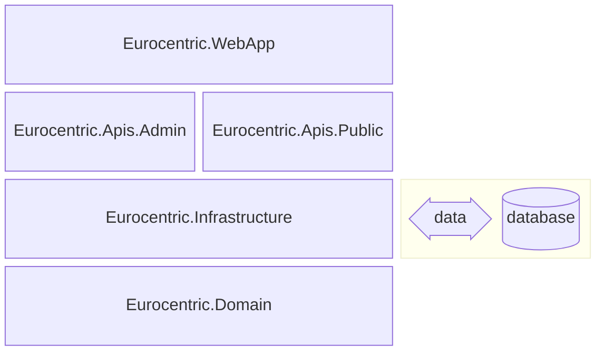

# 10. System architecture

This document is part of the [launch specification](../README.md#launch-specification).

- [10. System architecture](#10-system-architecture)
  - [Assembly architecture](#assembly-architecture)
  - [Third-party libraries](#third-party-libraries)
  - [API architecture](#api-architecture)
    - [Vertical slices](#vertical-slices)
    - [Request-endpoint-response (REPR pattern)](#request-endpoint-response-repr-pattern)
    - [Railway-oriented endpoints](#railway-oriented-endpoints)
      - [GET endpoints](#get-endpoints)
      - [POST endpoints](#post-endpoints)
      - [DELETE endpoints](#delete-endpoints)
      - [PATCH endpoints](#patch-endpoints)

## Assembly architecture

The system is composed of five .NET assemblies:

| Name                         | .NET project type | Role                                                                                        |
|:-----------------------------|:-----------------:|:--------------------------------------------------------------------------------------------|
| `Eurocentric.WebApp`         |      Web API      | composition root and executable                                                             |
| `Eurocentric.Apis.Admin`     |   Class library   | *admin-api* features                                                                        |
| `Eurocentric.Apis.Public`    |   Class library   | *public-api* features                                                                       |
| `Eurocentric.Infrastructure` |   Class library   | Non-functional features, data access, ID generators, rankings gateway implementations, etc. |
| `Eurocentric.Domain`         |   Class library   | Domain types, rankings gateway abstractions, etc.                                           |

The assemblies are illustrated in the diagram below, in which each assembly explicitly references the assembly/assemblies immediately below it.

## Third-party libraries

The following key third-party libraries are used in source code:

| Library                                  | Role                                                |
|:-----------------------------------------|:----------------------------------------------------|
| ErrorOr                                  | Domain errors and results                           |
| Asp.Versioning.Mvc.ApiExplorer           | API versioning                                      |
| SlimMessageBus.Host.Memory               | In-memory command/query/event messaging             |
| Microsoft.AspNetCore.OpenApi             | OpenAPI document generation                         |
| Scalar.AspNetCore                        | OpenAPI documentation web pages                     |
| Microsoft.EntityFrameworkCore.SqlServer  | Database configuration and domain model data access |
| EFCore.NamingConventions                 | Database configuration                              |
| EntityFrameworkCore.Exceptions.SqlServer | Database exceptions                                 |
| Dapper                                   | Database stored procedure execution                 |

## API architecture

Each of the two APIs is structured using the following patterns:

### Vertical slices

All the types for a given feature are nested types belonging to a single static class that is named after the feature.

Each feature has at most one endpoint, defined using the Minimal API syntax.

### Request-endpoint-response (REPR pattern)

Each API endpoint defines a request type and/or a response type. All the requests and responses for an API have properties that are *either* native .NET types *or* public types defined in the API major version namespace, but *never* in the `Eurocentric.Domain` assembly.

### Railway-oriented endpoints

Every API endpoint follows a standard workflow. A request either succeeds and returns an endpoint-specific HTTP response, or fails and returns an unsuccessful HTTP response with problem details describing the failure.

#### GET endpoints

A GET endpoint defines:

- an optional public request class (i.e. for query parameters).
- a public response class.
- an internal query class, which returns *either* a list of errors *or* a response object.
- an internal query handler class, which *either* fails and returns a list of errors *or* succeeds and returns the response.

A successful HTTP response from the endpoint has:

- status code 200.
- the serialized response object in the body.

An unsuccessful HTTP response from the endpoint has:

- an unsuccessful status code.
- a serialized `ProblemDetails` object, mapped from the first error, in the body.

#### POST endpoints

A POST endpoint defines:

- a public request class.
- a public response class.
- an internal command class, which returns *either* a list of errors *or* a response object.
- an internal command handler class, which *either* fails and returns a list of errors *or* succeeds and returns the response.

A successful HTTP response from the endpoint has:

- status code 201.
- the path to the created aggregate as a `"Location"` header.
- the serialized response object in the body.

An unsuccessful HTTP response from the endpoint has:

- an unsuccessful status code.
- a serialized `ProblemDetails` object, mapped from the first error, in the body.

#### DELETE endpoints

A DELETE endpoint defines:

- an internal command class, which returns *either* a list of errors *or* a `Deleted` value.
- an internal command handler class, which *either* fails and returns a list of errors *or* succeeds and returns `Deleted`.

A successful HTTP response from the endpoint has:

- status code 204.
- no response body.

An unsuccessful HTTP response from the endpoint has:

- an unsuccessful status code.
- a serialized `ProblemDetails` object, mapped from the first error, in the body.

#### PATCH endpoints

A PATCH endpoint defines:

- an internal command class, which returns *either* a list of errors *or* an `Updated` value.
- an internal command handler class, which *either* fails and returns a list of errors *or* succeeds and returns `Updated`.

A successful HTTP response from the endpoint has:

- status code 204.
- no response body.

An unsuccessful HTTP response from the endpoint has:

- an unsuccessful status code.
- a serialized `ProblemDetails` object, mapped from the first error, in the body.
