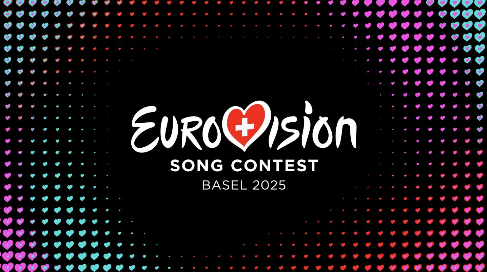
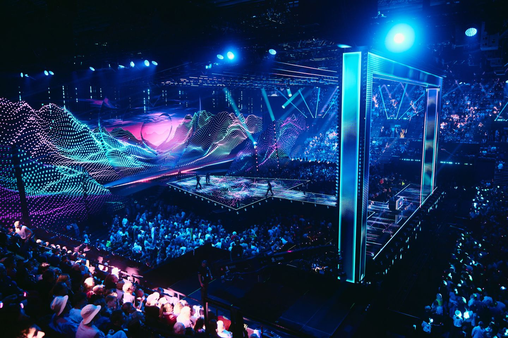
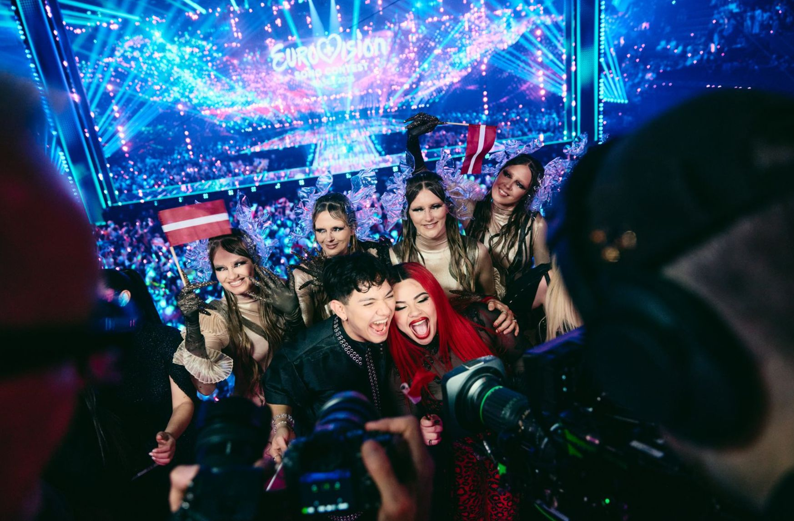
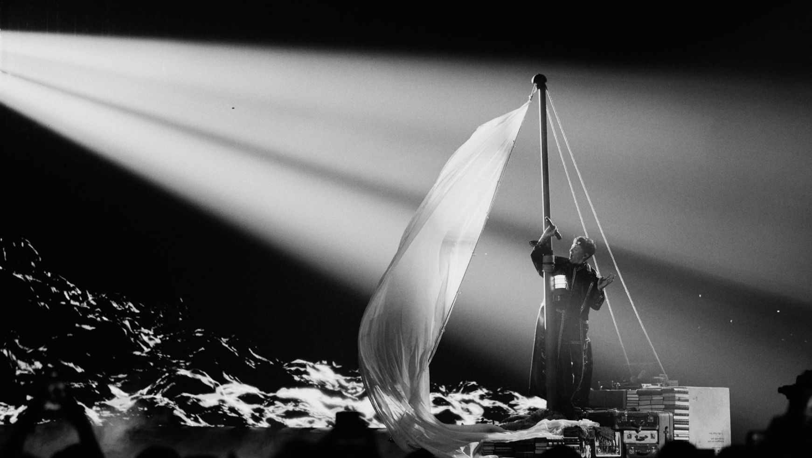
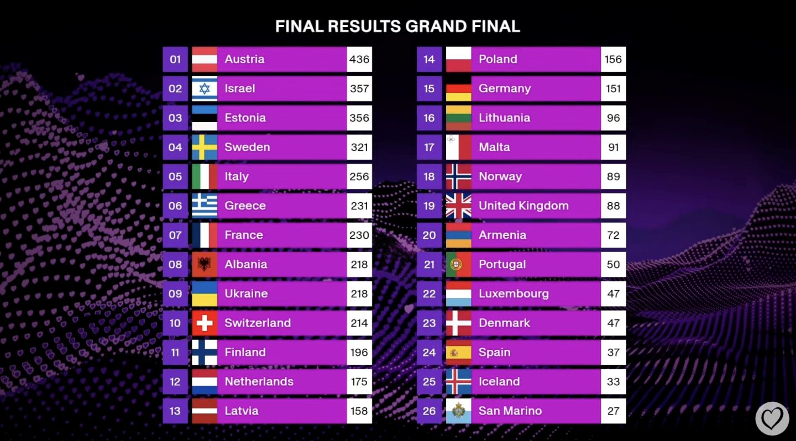
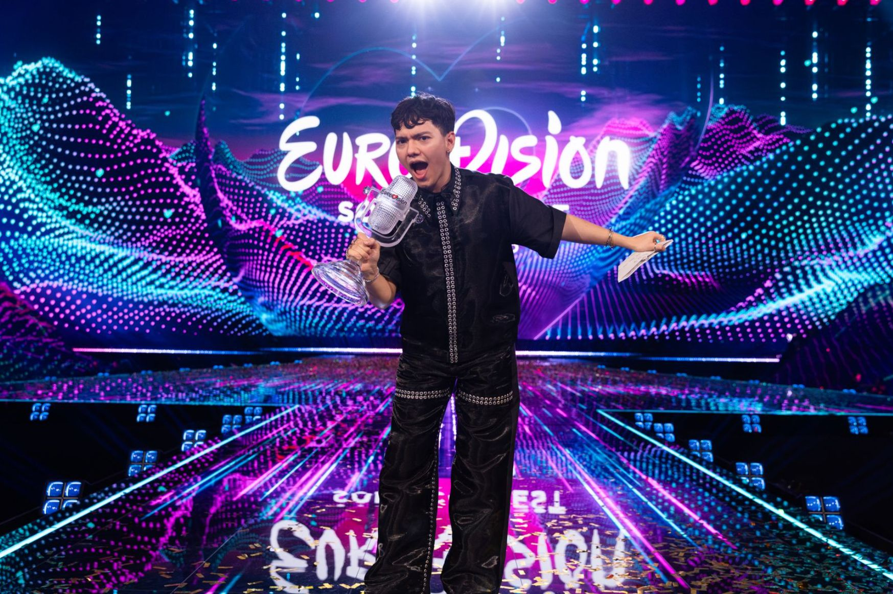

# 2. Real world context

This document is part of the [*Eurocentric* launch specification](README.md).

- [2. Real world context](#2-real-world-context)
  - [What is the Eurovision Song Contest?](#what-is-the-eurovision-song-contest)
  - [Project scope](#project-scope)
  - [contest structure](#contest-structure)
    - [contest stages](#contest-stages)
    - [The Semi-Final draw](#the-semi-final-draw)
    - [Qualification](#qualification)
    - [contest stage voting formats](#contest-stage-voting-formats)
  - [broadcast structure](#broadcast-structure)
    - [How a televote or jury awards points](#how-a-televote-or-jury-awards-points)
    - [Determining the result](#determining-the-result)
  - [Unusual events](#unusual-events)
    - [A participant withdraws from a contest before the contest starts](#a-participant-withdraws-from-a-contest-before-the-contest-starts)
    - [A competitor is disqualified from a broadcast](#a-competitor-is-disqualified-from-a-broadcast)
    - [Substitute televote points are used](#substitute-televote-points-are-used)
    - [Substitute jury points are used](#substitute-jury-points-are-used)
  - [Images from the Eurovision official website](#images-from-the-eurovision-official-website)

## What is the Eurovision Song Contest?

|  |
|:-----------------------------------------------------------------------------------------------------------------------------------------------------------------------------------------------------------------------------:|
|                                                                         The logo for the 2025 Eurovision Song Contest in Basel, Switzerland (© EBU).                                                                          |

The Eurovision Song Contest is an annual televised song contest between national broadcasters, organized by the European broadcasting Union (EBU).

A contest has between 35 and 45 participants, each of which is an act with a song representing a participating country. From 2023 onwards, a contest also has a global televote representing viewers who do not reside in a participating country.

A contest is made up of 3 broadcasts: two Semi-Finals and a Grand Final.

A broadcast has multiple competitors, each of which represents a competing country, as well as televotes and juries, each of which represents a voting country.

The televotes and juries award points to the competitors to determine the finishing order in the broadcast.

The competing country finishing in 1st place in the Grand Final broadcast is the overall winner of the contest and customarily hosts the event the following year.

For example:

> The 2025 Eurovision Song Contest was held in Basel, Switzerland. There were 37 participating countries, plus an additional "Rest of the World" televote. The winner was the singer JJ with the song "Wasted Love", representing the Austrian national broadcaster ORF. The 2026 Eurovision Song Contest was announced as to be held in Vienna, Austria.

## Project scope

The *Eurocentric* project is restricted to editions of the Eurovision Song Contest from 2016 to the present (2026 at time of writing). It is not concerned with the cancelled 2020 edition.

## contest structure

### contest stages

A contest's three stages, in broadcast order, are:

| Contest stage | Competitors |
|:--------------|------------:|
| Semi-Final 1  |       15-18 |
| Semi-Final 2  |       15-18 |
| Grand Final   |       25-26 |

**In *Eurocentric*:**

- A broadcast has 3 or more competitors.
- Therefore, a contest has 6 or more participants.

### The Semi-Final draw

Before the start of the contest, each participant is randomly drawn into one of two Semi-Final groups.

- participants who draw Semi-Final 1 *must* vote in and *may* compete in the Semi-Final 1 broadcast.
- participants who draw Semi-Final 2 *must* vote in and *may* compete in the Semi-Final 2 broadcast.
- All participants must vote in and may compete in the Grand Final broadcast.

### Qualification

Each Semi-Final group contains 2 to 3 participants who automatically qualify for the Grand Final. These participants do not compete in their allocated Semi-Final, but still vote.

The remaining participants in each group must compete in their allocated Semi-Final. The top 10 finishers in the Semi-Final, along with the automatic qualifiers, go on to compete in the Grand Final.

**In *Eurocentric*:**

- Qualification is not explicitly modelled

### contest stage voting formats

From **2016 to 2022**:

- Every participant that has drawn Semi-Final 1 in the contest has a televote and a jury in the Semi-Final 1 broadcast.
- Every participant that has drawn Semi-Final 2 in the contest has a televote and a jury in the Semi-Final 2 broadcast.
- Every participant has a televote and a jury in the Grand Final broadcast.

From **2023 to 2025**:

- Every participant that has drawn Semi-Final 1 in the contest has a televote (and no jury) in the Semi-Final 1 broadcast.
- Every participant that has drawn Semi-Final 2 in the contest has a televote (and no jury) in the Semi-Final 2 broadcast.
- Every participant has a televote and a jury in the Grand Final broadcast.
- The contest has a global televote representing the "Rest of the World" pseudo-country.
- The global televote has a televote in all three broadcasts.

From **2026**:

- Every participant that has drawn Semi-Final 1 in the contest has a televote and a jury in the Semi-Final 1 broadcast.
- Every participant that has drawn Semi-Final 2 in the contest has a televote and a jury in the Semi-Final 2 broadcast.
- Every participant has a televote and a jury in the Grand Final broadcast.
- The contest has a global televote representing the "Rest of the World" pseudo-country.
- The global televote has a televote in all three broadcasts.

## broadcast structure

A broadcast is split into a first half and a second half. Each competitor is assigned a performing spot in one of the two halves. After all the competitors have performed, the televotes and juries award their points to the competitors. A competitor's points total determines its finishing spot.

### How a televote or jury awards points

A voting country's televote or jury ranks all the competitors from first place to last place, excluding any competitor whose competing country is the same as the voting country.

The ranking determines the value of the points award the televote/jury gives to the competitor. The highest ranked competitors receive the following points values: 12, 10, 8, 7, 6, 5, 4, 3, 2, 1. All other competitors receive 0 points.

For example, these are the points awarded by the Icelandic televote in the 2025 Semi-Final 1 broadcast, in which Iceland competed and voted:

| Competing country | Points value |
|:------------------|-------------:|
| Sweden            |           12 |
| Norway            |           10 |
| Netherlands       |            8 |
| Poland            |            7 |
| Estonia           |            6 |
| Belgium           |            5 |
| Ukraine           |            4 |
| San Marino        |            3 |
| Albania           |            2 |
| Portugal          |            1 |
| Slovenia          |            0 |
| Azerbaijan        |            0 |
| Croatia           |            0 |
| Cyprus            |            0 |
| Iceland           |          n/a |

### Determining the result

The competitors in a broadcast are ranked in a finishing order based on descending total points. Ties are not permitted. The following tie-break rules are used in order:

1. If two competitors are tied on total points, the competitor with more televote points wins the tie.
2. If they are still tied, the competitor with more non-zero points televote awards wins the tie.
3. If they are still tied, a "count-back" is used: the competitor that received more 12-points televote awards wins the tie, then 10-points televote awards, and so on down to 1-point televote awards.
4. If they are still tied, the competitor with the earlier performing spot wins the tie.

## Unusual events

This section lists some unusual events that have occurred at the Eurovision Song Contest between 2016 and the present.

### A participant withdraws from a contest before the contest starts

Moldova withdrew from the Basel 2025 Contest before they had selected their Act. Romania was disqualified from the Stockholm 2016 contest after their Act was selected but before the contest began.

**In *Eurocentric*:**

- A withdrawn participant is disregarded when creating a contest.

### A competitor is disqualified from a broadcast

The Netherlands were assigned performing spot 5 in the Malmö 2024 Contest Grand Final, but they were then disqualified, leaving performing spot 5 vacant in the Grand Final broadcast.

**In *Eurocentric*:**

- A disqualified competitor is disregarded when creating a broadcast, but the vacant performing spot is retained.

### Substitute televote points are used

San Marino's televote points are usually determined by taking a statistical average of the points awarded by Italy and other neighbouring countries.

**In *Eurocentric*:**

- televote points awards are taken at face value.

### Substitute jury points are used

In the Turin 2022 Grand Final broadcast, six juries were disqualified and statistical average jury points were given in their place.

**In *Eurocentric*:**

- jury points awards are taken at face value.

## Images from the Eurovision official website

|  |
|:-----------------------------------------------------------------------------------------------------------------:|
|                   *The Eurovision 2025 stage in St. Jakobshalle, Basel (© EBU/Alma Bengtsson).*                   |

|  |
|:--------------------------------------------------------------------------------------------------------------------------------------:|
|   *The qualifying acts representing Austria, Latvia and Malta at the Basel 2025 Contest Semi-Final 2 (© EBU/Sarah Louise Bennett).*    |

|  |
|:----------------------------------------------------------------------------------------------------------------------------------------------------------------------:|
|                     *JJ from Austria participating in the flag parade at the start of the Basel 2025 Contest Grand Final (© EBU/Alma Bengtsson).*                      |

|  |
|:-----------------------------------------------------------------------------------------------------------------------------------------:|
|                 *JJ from Austria performing "Wasted Love" in the Basel 2025 Contest Grand Final (© EBU/Alma Bengtsson).*                  |

|  |
|:----------------------------------------------------------------------------------------------------------:|
|                       *Scoreboard from the Basel 2025 Contest Grand Final (© EBU).*                        |

|  |
|:------------------------------------------------------------------------------------------------------------------------------------:|
|                *JJ from Austria holding the winner's tropy at the end of the Basel 2025 Contest Grand Final (© EBU).*                |
