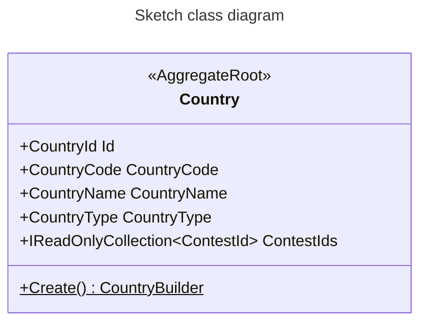
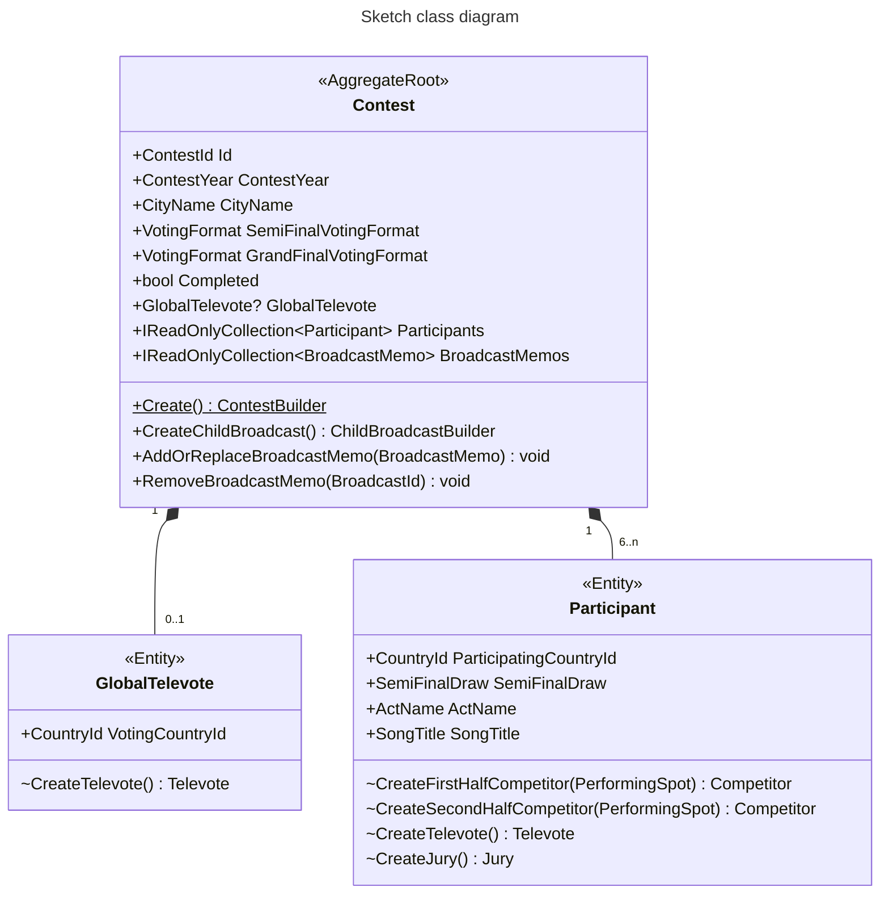
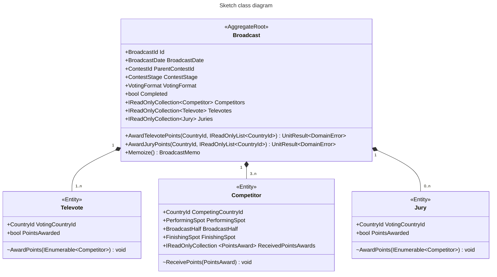

# 3. Domain model

This document is part of the [*Eurocentric* launch specification](README.md).

- [3. Domain model](#3-domain-model)
  - [Enums](#enums)
    - [`BroadcastHalf` enum](#broadcasthalf-enum)
    - [`ContestStage` enum](#conteststage-enum)
    - [`CountryType` enum](#countrytype-enum)
    - [`SemiFinalDraw` enum](#semifinaldraw-enum)
    - [`VotingFormat` enum](#votingformat-enum)
    - [`VotingMethod` enum](#votingmethod-enum)
  - [Guid atomic value objects](#guid-atomic-value-objects)
    - [`BroadcastId` value object](#broadcastid-value-object)
    - [`ContestId` value object](#contestid-value-object)
    - [`CountryId` value object](#countryid-value-object)
  - [Int32 atomic value objects](#int32-atomic-value-objects)
    - [`ContestYear` value object](#contestyear-value-object)
    - [`FinishingSpot` value object](#finishingspot-value-object)
    - [`PerformingSpot` value object](#performingspot-value-object)
    - [`PointsValue` value object](#pointsvalue-value-object)
  - [DateOnly atomic value objects](#dateonly-atomic-value-objects)
    - [`BroadcastDate` value object](#broadcastdate-value-object)
  - [String atomic value objects](#string-atomic-value-objects)
    - [`ActName` value object](#actname-value-object)
    - [`CountryCode` value object](#countrycode-value-object)
    - [`CityName` value object](#cityname-value-object)
    - [`CountryName` value object](#countryname-value-object)
    - [`SongTitle` value object](#songtitle-value-object)
  - [Compound value objects](#compound-value-objects)
    - [`BroadcastMemo` value object](#broadcastmemo-value-object)
    - [`PointsAward` value object](#pointsaward-value-object)
  - [`Country` aggregate entities](#country-aggregate-entities)
    - [`Country` aggregate root entity](#country-aggregate-root-entity)
  - [`Contest` aggregate entities](#contest-aggregate-entities)
    - [`Contest` aggregate root entity](#contest-aggregate-root-entity)
    - [`GlobalTelevote` entity](#globaltelevote-entity)
    - [`Participant` entity](#participant-entity)
  - [Broadcast aggregate entities](#broadcast-aggregate-entities)
    - [`Broadcast` aggregate root entity](#broadcast-aggregate-root-entity)
    - [`Competitor` entity](#competitor-entity)
    - [`Televote` entity](#televote-entity)
    - [`Jury` entity](#jury-entity)

## Enums

### `BroadcastHalf` enum

- A `BroadcastHalf` enum value specifies a half of a broadcast's performing order.
- The enum values are `{ First, Second }`.

### `ContestStage` enum

- A `ContestStage` enum value specifies a Broadcast's stage in a contest.
- The enum values are `{ SemiFinal1, SemiFinal2, GrandFinal }`.

### `CountryType` enum

- A `CountryType` enum value specifies a country's type.
- The enum values are `{ Real, Pseudo }`.

### `SemiFinalDraw` enum

- A `SemiFinalDraw` enum value specifies a participant's Semi-Final draw in their contest.
- The enum values are `{ SemiFinal1, SemiFinal2 }`.

### `VotingFormat` enum

- A `VotingFormat` enum value specifies the voting format used in a broadcast.
- The enum values are  `{ TelevoteAndJury, TelevoteOnly }`.

### `VotingMethod` enum

- A `VotingMethod` enum value specifies the voting method used to determine the value of a points award in a broadcast.
- The enum values are  `{ Televote, Jury }`.

## Guid atomic value objects

### `BroadcastId` value object

- A `BroadcastId` value object is a `(Guid Value)` that identifies a `Broadcast` aggregate in the system.

### `ContestId` value object

- A `ContestId` value object is a `(Guid Value)` that identifies a `Contest` aggregate in the system.

### `CountryId` value object

- A `CountryId` value object is a `(Guid Value)` that identifies a `Country` aggregate in the system.

## Int32 atomic value objects

### `ContestYear` value object

- A `ContestYear` value object is an `(int Value)` that represents the year in which a contest is held.
- Its integer `Value` must be in the range \[2016, 2050\].

### `FinishingSpot` value object

- A `FinishingSpot` value object is an `(int Value)` that represents a spot in a broadcast's finishing order.
- Its integer `Value` must be greater than 0.

### `PerformingSpot` value object

- A `PerformingSpot` value object is an `(int Value)` that represents a spot in a broadcast's performing order.
- Its integer `Value` must be greater than 0.

### `PointsValue` value object

- A `PointsValue` value object is an `(int Value)` that represents the numerical value of a points award in a broadcast.
- Its integer `Value` must be in the range \[0, 12\].

## DateOnly atomic value objects

### `BroadcastDate` value object

- A `BroadcastDate` value object is a `(DateOnly Value)` that represents the date on which a broadcast is televised.
- Its date `Value` must have a year in the range \[2016, 2050\].

## String atomic value objects

### `ActName` value object

- An `ActName` value object is a `(string Value)` that represents an act's official name.
- Its string `Value` must not be empty or whitespace, must not be longer than 100 characters, must not contain a line-break, and must not begin or end with whitespace.

### `CountryCode` value object

- A `CountryCode` value object is a `(string Value)` that represents a country's ISO 3166 alpha-2 country code.
- Its string `Value` must be 2 upper-case ASCII letters.

### `CityName` value object

- A `CityName` value object is a `(string Value)` that represents a city's short UK English name.
- Its string `Value` must not be empty or whitespace, must not be longer than 100 characters, must not contain a line-break, and must not begin or end with whitespace.

### `CountryName` value object

- A `CountryName` value object is a `(string Value)` that represents a country's short UK English name.
- Its string `Value` must not be empty or whitespace, must not be longer than 100 characters, must not contain a line-break, and must not begin or end with whitespace.

### `SongTitle` value object

- A `SongTitle` value object is a `(string Value)` that represents a song's official title.
- Its string `Value` must not be empty or whitespace, must not be longer than 100 characters, must not contain a line-break, and must not begin or end with whitespace.

## Compound value objects

### `BroadcastMemo` value object

- A `BroadcastMemo` value object is a `(BroadcastId BroadcastId, ContestStage ContestStage, bool Completed)` that summarizes a `Broadcast` aggregate's current state.

### `PointsAward` value object

- A `PointsAward` value object is a `(CountryId VotingCountryId, VotingMethod VotingMethod, PointsValue PointsValue)` that represents a single points award received by a competitor in a broadcast.

## `Country` aggregate entities

### `Country` aggregate root entity

- A `Country` aggregate root entity represents a real or pseudo-country.
- It is responsible for tracking the `Contest` aggregates in which it has a `Participant` or `GlobalTelevote`.
- It has:
  - a `CountryId`.
  - a `CountryCode`.
  - a `CountryName`.
  - a `CountryType` value.
  - a `ContestId` collection, which is initially empty.
- Its system identifier is its `CountryId`.

## `Contest` aggregate entities

### `Contest` aggregate root entity

- A `Contest` aggregate root entity represents a contest.
- It is responsible for creating child `Broadcast` aggregates, and tracking their status, and maintaining an up to date "queryable" status.
- It has:
  - a `ContestId`.
  - a `ContestYear`.
  - a `CityName`.
  - a Semi-Final `VotingFormat` value.
  - a Grand Final `VotingFormat` value.
  - a "queryable" boolean value, which is initially `false`.
  - 1 or 0 `GlobalTelevote`.
  - a `Participant` collection.
  - a child `BroadcastMemo` collection, which is initially empty.
- Its system identifier is its `ContestId`.

### `GlobalTelevote` entity

- A `GlobalTelevote` entity represents a global televote in a contest.
- It is responsible for creating `Televote` entities for child `Broadcast` aggregates.
- It has:
  - a voting `CountryId`.
- It is owned by a `Contest` aggregate root entity.

### `Participant` entity

- A `Participant` entity represents a participant in a contest.
- It is responsible for creating `Competitor`, `Televote` and `Jury` entities for child `Broadcast` aggregates.
- It has:
  - a participating `CountryId`.
  - a `SemiFinalDraw` value.
  - an `ActName`.
  - a `SongTitle`.
- It is owned by a `Contest` aggregate root entity.
- It is uniquely identified within its collection by its participating `CountryId`.

## Broadcast aggregate entities

### `Broadcast` aggregate root entity

- A `Broadcast` aggregate root entity represents a broadcast.
- It is responsible for awarding the points from its televotes/juries to its competitors, and updating its competitors' finishing spots, and maintaining an up-to-date "completed" status.
- It has:
  - a `BroadcastId`.
  - a `BroadcastDate`.
  - a parent `ContestId`.
  - a `ContestStage` value.
  - a `VotingFormat` value.
  - a "completed" boolean value, which is initially `false`.
  - a `Competitor` collection.
  - a `Televote` collection.
  - a `Jury` collection, which may be empty.
- Its system identifier is its `BroadcastId`.

### `Competitor` entity

- A `Competitor` entity represents a competitor in a broadcast.
- It is responsible for receiving points awards, and maintaining an up-to-date finishing spot.
- It has:
  - a competing `CountryId`.
  - a `PerformingSpot`.
  - a `BroadcastHalf` value.
  - an internally mutable `FinishingSpot`.
  - a `PointsAward` collection, which is initially empty.
- It is owned by a `Broadcast` aggregate.
- It is uniquely identified within its collection by its competing `CountryId`.

### `Televote` entity

- A `Televote` entity represents a televote in a broadcast.
- It is responsible for awarding a single set of points awards to the competitors in the broadcast, and maintaining an up-to-date "points awarded" status.
- It has:
  - a voting `CountryId`.
  - a "points awarded" boolean value, which is initially `false`.
- It is owned by a `Broadcast` aggregate.
- It is uniquely identified within its collection by its voting `CountryId`.

### `Jury` entity

- A `Jury` entity represents a jury in a broadcast.
- It is responsible for awarding a single set of points awards to the competitors in the broadcast, and maintaining an up-to-date "points awarded" status.
- It has:
  - a voting `CountryId`.
  - a "points awarded" boolean value, which is initially `false`.
- It is owned by a `Broadcast` aggregate.
- It is uniquely identified within its collection by its voting `CountryId`.
