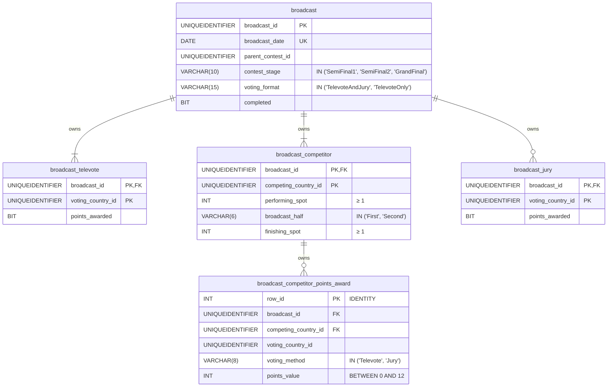
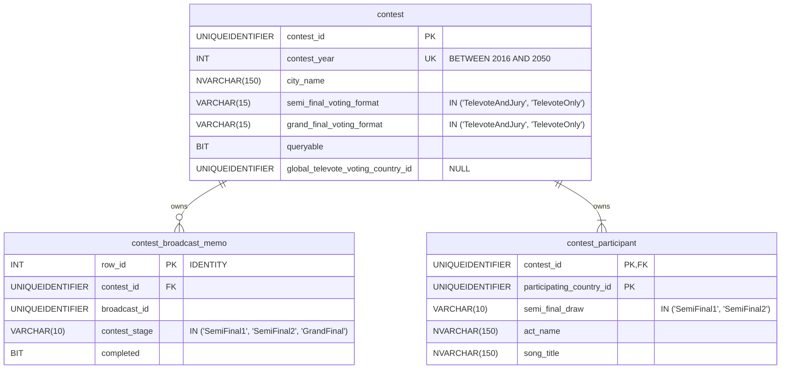
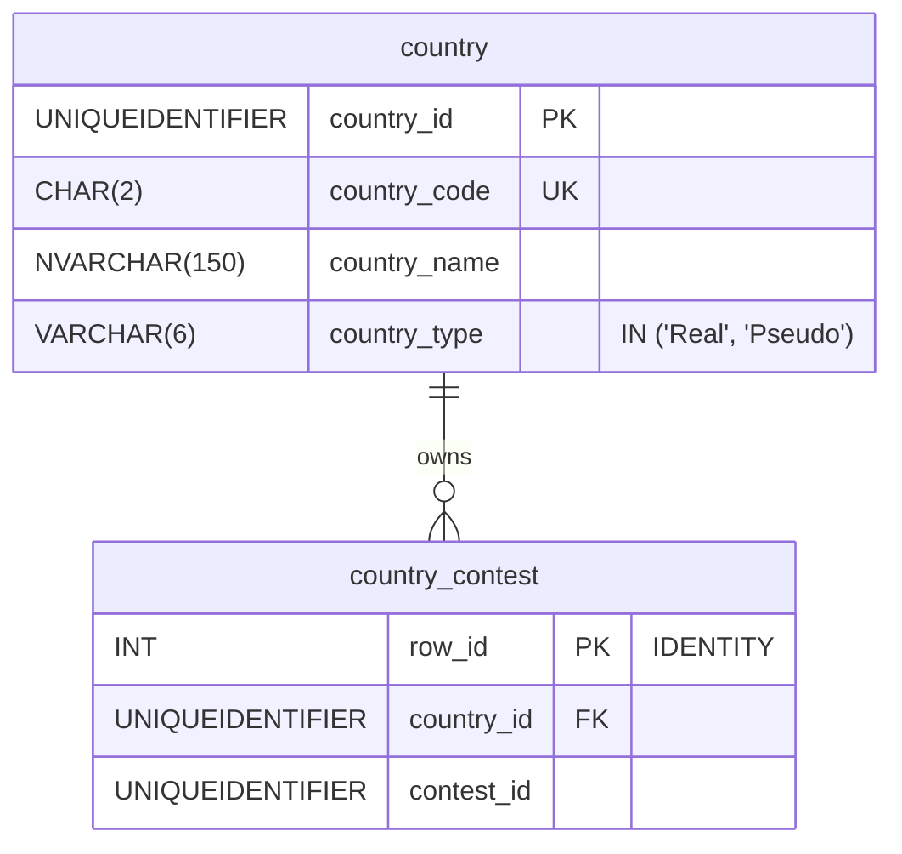
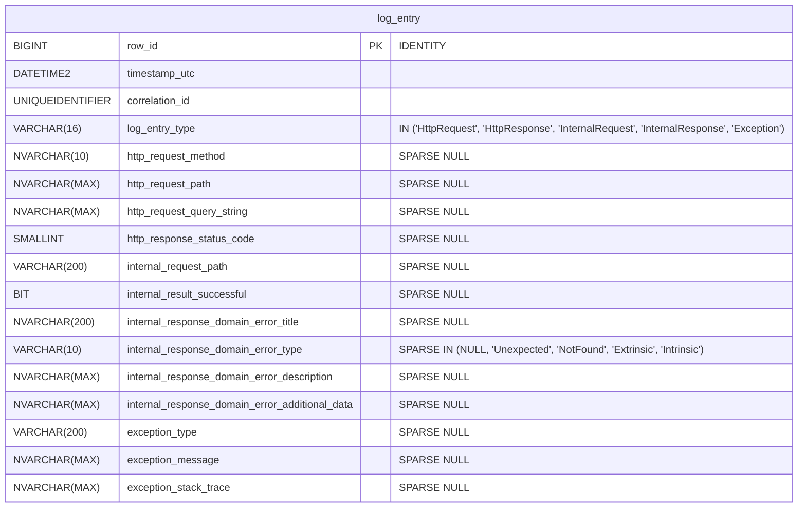

# 7. Database schema

This document is part of the [*Eurocentric* launch specification](README.md).

- [7. Database schema](#7-database-schema)
  - [`Broadcast` aggregate tables](#broadcast-aggregate-tables)
  - [`Contest` aggregate tables](#contest-aggregate-tables)
  - [`Country` aggregate tables](#country-aggregate-tables)
  - [Logging table](#logging-table)

## `Broadcast` aggregate tables

**Notes:**

- All columns are `NOT NULL`.
- In the `broadcast` table:
  - there is a unique index on (`parent_contest_id`, `contest_stage`).
- In the `broadcast_competitor` table:
  - there is a unique index on (`broadcast_id`, `performing_spot`).
- In the `broadcast_competitor_points_award` table:
  - there is a unique index on (`broadcast_id`, `competing_country_id`, `voting_country_id`, `voting_method`).
  - there is an index on `competing_country_id`.
  - there is an index on `voting_country_id`.
  - there is a check constraint that ensures `competing_country_id` &ne; `voting_country_id`.

## `Contest` aggregate tables

**Notes:**

- All columns are `NOT NULL` unless explicitly labelled `NULL`.

## `Country` aggregate tables

**Notes:**

- All columns are `NOT NULL`.
- In the `country_contest`:
  - there is a unique index on (`country_id`, `contest_id`).

## Logging table

**Notes:**

- All columns are `NOT NULL` unless explicitly labelled `NULL`.
- In the `log_entry` table:
  - there is an index on `timestamp_utc`.
  - there is an index on `correlation_id`.
  - `internal_response_domain_error_additional_data`, when not `NULL`, is a JSON-serialized `Dictionary<string, object>`.
  - records are populated using the Table-Per-Hierarchy pattern, with the `log_entry_type` column as the discriminator.
