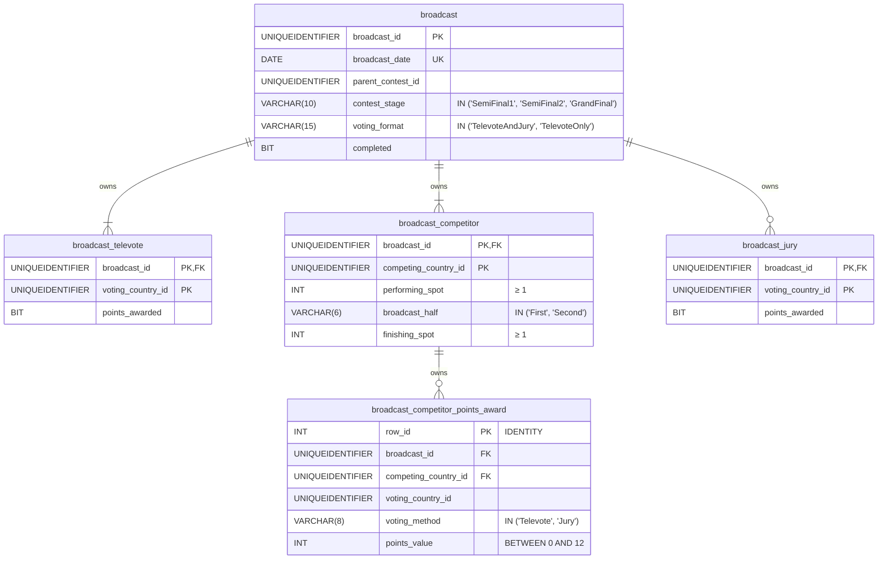
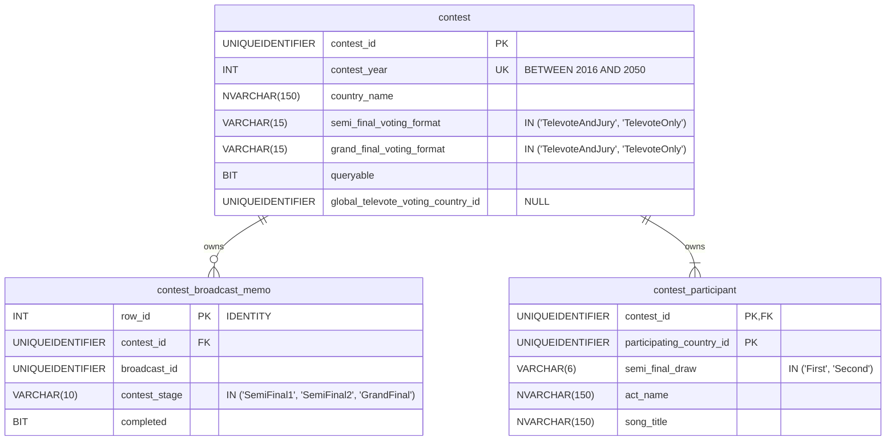
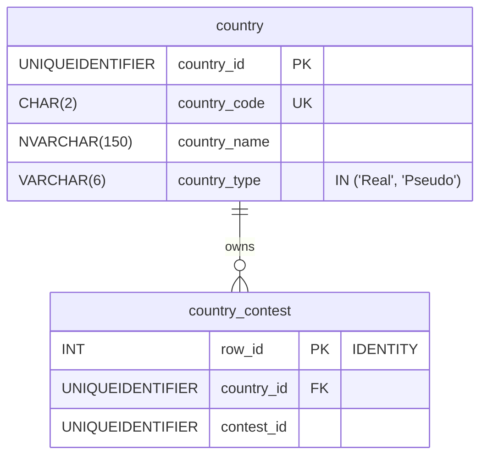
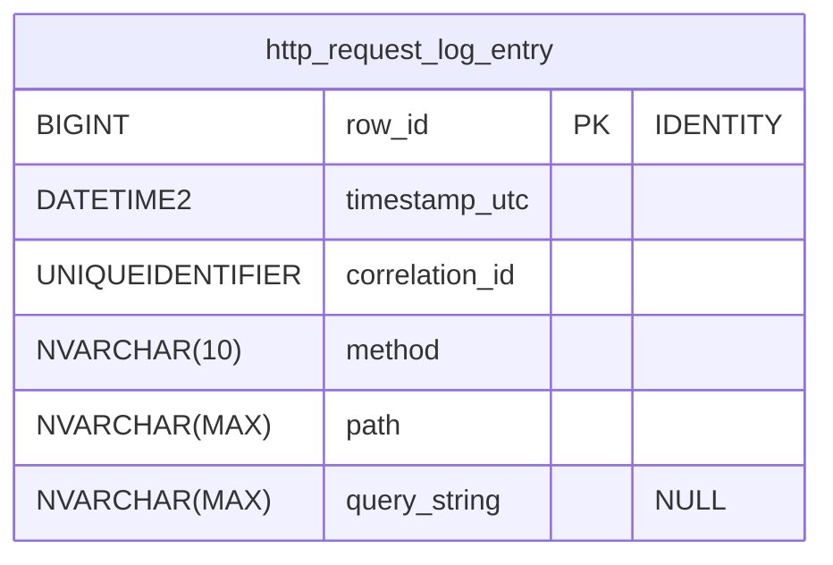
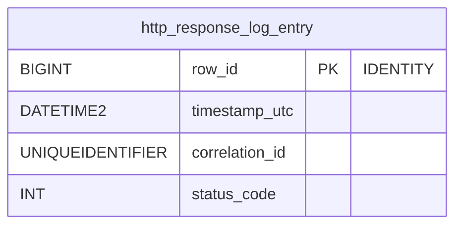
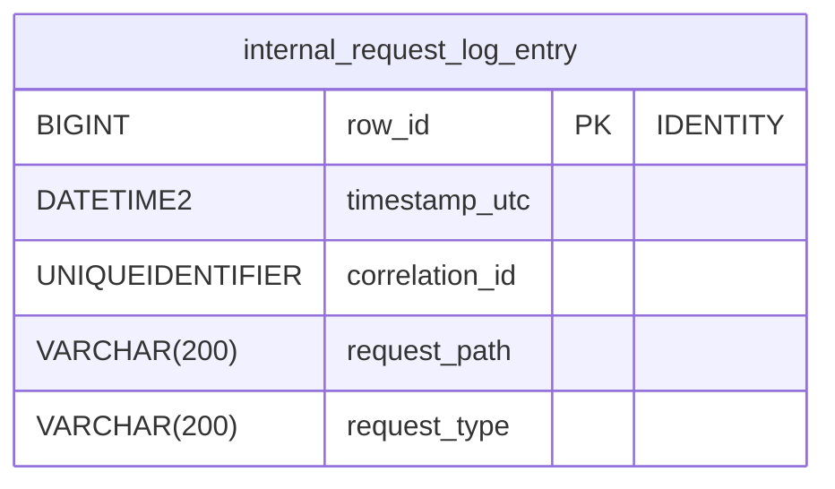
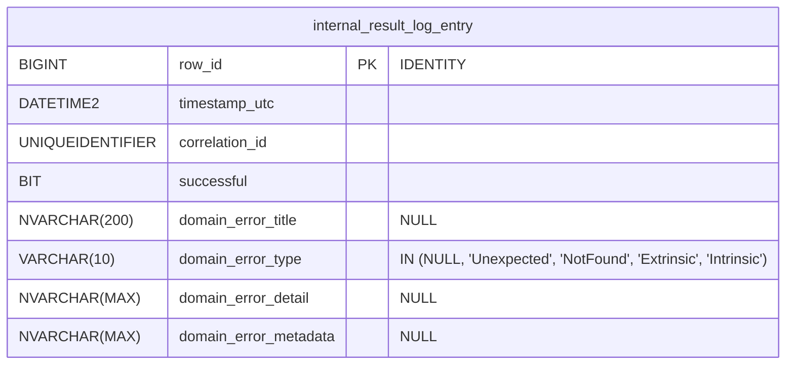
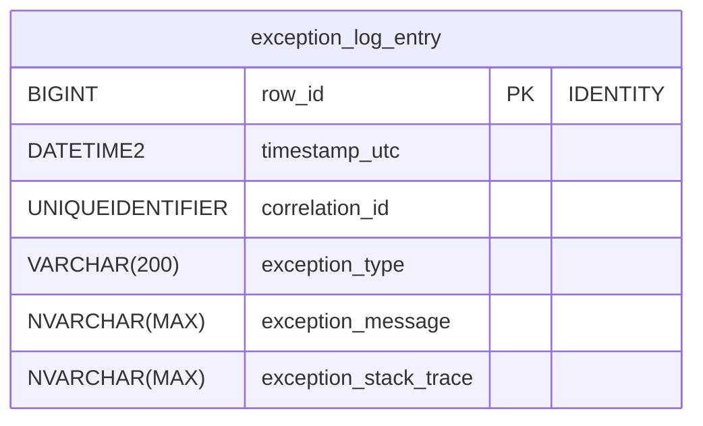

# 7. Database schema

This document is part of the [*Eurocentric* launch specification](README.md).

- [7. Database schema](#7-database-schema)
  - [`Broadcast` aggregate tables](#broadcast-aggregate-tables)
  - [`Contest` aggregate tables](#contest-aggregate-tables)
  - [`Country` aggregate tables](#country-aggregate-tables)
  - [Logging tables](#logging-tables)

## `Broadcast` aggregate tables

```mermaid
erDiagram

broadcast {
  UNIQUEIDENTIFIER broadcast_id PK
  DATE broadcast_date UK
  UNIQUEIDENTIFIER parent_contest_id
  VARCHAR(10) contest_stage "IN ('SemiFinal1', 'SemiFinal2', 'GrandFinal')"
  VARCHAR(15) voting_format "IN ('TelevoteAndJury', 'TelevoteOnly')"
  BIT completed
}

broadcast_televote {
  UNIQUEIDENTIFIER broadcast_id PK,FK
  UNIQUEIDENTIFIER voting_country_id PK
  BIT points_awarded
}

broadcast_competitor {
  UNIQUEIDENTIFIER broadcast_id PK,FK
  UNIQUEIDENTIFIER competing_country_id PK
  INT performing_spot "&ge; 1"
  VARCHAR(6) broadcast_half "IN ('First', 'Second')"
  INT finishing_spot "&ge; 1"
}

broadcast_competitor_points_award {
  INT row_id PK "IDENTITY"
  UNIQUEIDENTIFIER broadcast_id FK
  UNIQUEIDENTIFIER competing_country_id FK
  UNIQUEIDENTIFIER voting_country_id
  VARCHAR(8) voting_method "IN ('Televote', 'Jury')"
  INT points_value "BETWEEN 0 AND 12"
}

broadcast_jury {
  UNIQUEIDENTIFIER broadcast_id PK,FK
  UNIQUEIDENTIFIER voting_country_id PK
  BIT points_awarded
}

broadcast ||--|{ broadcast_televote : owns
broadcast ||--|{ broadcast_competitor : owns
broadcast ||--o{ broadcast_jury : owns

broadcast_competitor ||--o{ broadcast_competitor_points_award : owns
```

**Notes:**

- All columns are `NOT NULL`.
- The `broadcast` table has:
  - a unique index on (`parent_contest_id`, `contest_stage`).
- The `broadcast_competitor` table has:
  - a unique index on (`broadcast_id`, `performing_spot`).
- The `broadcast_competitor_points_award` table has:
  - a unique index on (`broadcast_id`, `competing_country_id`, `voting_country_id`, `voting_method`).
  - an index on `competing_country_id`.
  - an index on `voting_country_id`.
  - a check constraint that ensures `competing_country_id` &ne; `voting_country_id`.

## `Contest` aggregate tables

```mermaid
erDiagram

contest {
  UNIQUEIDENTIFIER contest_id PK
  INT contest_year UK "BETWEEN 2016 AND 2050"
  NVARCHAR(150) country_name
  VARCHAR(15) semi_final_voting_format "IN ('TelevoteAndJury', 'TelevoteOnly')"
  VARCHAR(15) grand_final_voting_format "IN ('TelevoteAndJury', 'TelevoteOnly')"
  BIT queryable
  UNIQUEIDENTIFIER global_televote_voting_country_id "NULL"
}

contest_broadcast_memo {
  INT row_id PK "IDENTITY"
  UNIQUEIDENTIFIER contest_id FK
  UNIQUEIDENTIFIER broadcast_id
  VARCHAR(10) contest_stage "IN ('SemiFinal1', 'SemiFinal2', 'GrandFinal')"
  BIT completed
}

contest_participant {
  UNIQUEIDENTIFIER contest_id PK,FK
  UNIQUEIDENTIFIER participating_country_id PK
  VARCHAR(6) semi_final_draw "IN ('First', 'Second')"
  NVARCHAR(150) act_name
  NVARCHAR(150) song_title
}

contest ||--o{ contest_broadcast_memo : owns
contest ||--|{ contest_participant : owns

```

**Notes:**

- All columns are `NOT NULL` unless explicitly labelled `NULL`.

## `Country` aggregate tables

```mermaid
erDiagram

country {
  UNIQUEIDENTIFIER country_id PK
  CHAR(2) country_code UK
  NVARCHAR(150) country_name
  VARCHAR(6) country_type "IN ('Real', 'Pseudo')"
}

country_contest {
  INT row_id PK "IDENTITY"
  UNIQUEIDENTIFIER country_id FK
  UNIQUEIDENTIFIER contest_id
}

country ||--o{ country_contest : owns
```

**Notes:**

- All columns are `NOT NULL`.
- The `country_contest` table has:
  - a unique index on (`country_id`, `contest_id`).

## Logging tables

```mermaid
erDiagram

  http_request_log_entry {
    BIGINT row_id PK "IDENTITY"
    DATETIME2 timestamp_utc
    UNIQUEIDENTIFIER correlation_id
    NVARCHAR(10) method
    NVARCHAR(MAX) path
    NVARCHAR(MAX) query_string "NULL"
  }
```

```mermaid
erDiagram

  http_response_log_entry {
    BIGINT row_id PK "IDENTITY"
    DATETIME2 timestamp_utc
    UNIQUEIDENTIFIER correlation_id
    INT status_code
  }
```

```mermaid
erDiagram

  internal_request_log_entry {
    BIGINT row_id PK "IDENTITY"
    DATETIME2 timestamp_utc
    UNIQUEIDENTIFIER correlation_id
    VARCHAR(200) request_path
    VARCHAR(200) request_type
  }
```

```mermaid
erDiagram

  internal_result_log_entry {
    BIGINT row_id PK "IDENTITY"
    DATETIME2 timestamp_utc
    UNIQUEIDENTIFIER correlation_id
    BIT successful
    NVARCHAR(200) domain_error_title "NULL"
    VARCHAR(10) domain_error_type "IN (NULL, 'Unexpected', 'NotFound', 'Extrinsic', 'Intrinsic')"
    NVARCHAR(MAX) domain_error_detail "NULL"
    NVARCHAR(MAX) domain_error_metadata "NULL"
  }
```

```mermaid
erDiagram

  exception_log_entry {
    BIGINT row_id PK "IDENTITY"
    DATETIME2 timestamp_utc
    UNIQUEIDENTIFIER correlation_id
    VARCHAR(200) exception_type
    NVARCHAR(MAX) exception_message
    NVARCHAR(MAX) exception_stack_trace
  }
```

**Notes:**

- All columns are `NOT NULL` unless explicitly labelled `NULL`.
- All five tables have:
  - an index on `timestamp_utc`.
  - an index on `correlation_id`.
  - an after-insert trigger that deletes all records with a `timestamp_utc` date more than 60 days earlier than the date of the inserted record.
- In the `internal_result_log_entry` table:
  - `domain_error_metadata`, when not `NULL`, is a JSON-serialized `Dictionary<string, object>`.
