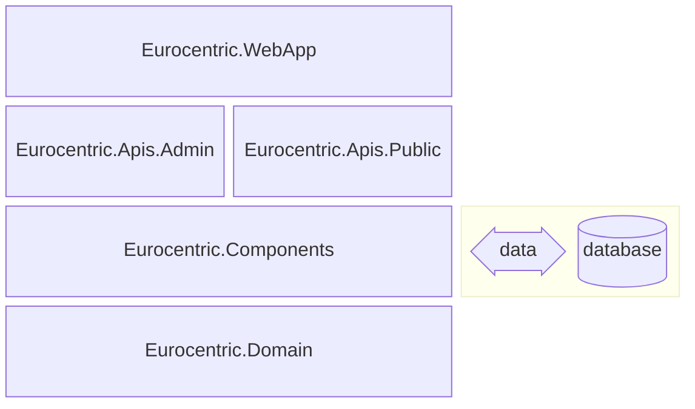

# 7 System architecture

This document is part of the [*Eurocentric* launch specification](README.md).

- [7 System architecture](#7-system-architecture)
  - [SDK](#sdk)
  - [Assembly architecture](#assembly-architecture)
  - [API feature organization](#api-feature-organization)
  - [Request handling workflow](#request-handling-workflow)
    - [HTTP requests and responses](#http-requests-and-responses)
      - [GET endpoint](#get-endpoint)
      - [POST endpoint](#post-endpoint)
      - [PATCH endpoint](#patch-endpoint)
      - [DELETE endpoint](#delete-endpoint)
    - [Internal requests and results](#internal-requests-and-results)
      - [Query](#query)
      - [Command](#command)
      - [Unit Command](#unit-command)
    - [Domain errors](#domain-errors)
    - [Exceptions](#exceptions)
  - [Logging points](#logging-points)
  - [Third-party libraries](#third-party-libraries)

## SDK

The system uses the .NET 10 SDK and runtime.

## Assembly architecture

The system is composed of five .NET assemblies:

| Name                         | .NET project type | Role                                                                       |
|:-----------------------------|:-----------------:|:---------------------------------------------------------------------------|
| `Eurocentric.WebApp`         |      Web API      | Composition root and executable                                            |
| `Eurocentric.Apis.Admin`     |   Class library   | *admin-api* features                                                       |
| `Eurocentric.Apis.Public`    |   Class library   | *public-api* features                                                      |
| `Eurocentric.Components`     |   Class library   | Domain service implementations, data access services, API middleware, etc. |
| `Eurocentric.Domain`         |   Class library   | Domain aggregate types, error types, domain service interfaces, etc.       |

The assemblies are illustrated in the diagram below, in which each assembly explicitly references the assembly/assemblies immediately below it.



## API feature organization

API feature source code is organized using the **Vertical Slice** architecture.

All types specific to a single feature are located in the same namespace.

A feature has a single, static, internal `{FeatureName}` class, which contains all the internal methods and nested types necessary for the feature to work.

The only exceptions to the above are the endpoint request body, query parameters, and response body record types that make up the feature's API contract, each of which is a public, non-nested type named `{FeatureName}RequestBody`, `{FeatureName}QueryParameters`, or `{FeatureName}ResponseBody`.

## Request handling workflow

Every client request is handled using a standard workflow, based on the **Railway-Oriented Programming (ROP)** design.

### HTTP requests and responses

The client sends an HTTP request to an endpoint. The client receives *either* a successful HTTP response *or* an unsuccessful HTTP response with a `ProblemDetails` object.

There are 4 endpoint types.

#### GET endpoint

A GET endpoint executes a query on the system without changing its state. An HTTP request has the `GET` method, a path, and an optional query string. A successful HTTP response has status code `200 OK`, and an endpoint-specific response body object.

#### POST endpoint

A POST endpoint executes a command on the system that creates a new aggregate and returns a representation of the created aggregate. An HTTP request has the `POST` method, a path, and an endpoint-specific request body object. A successful HTTP response has status code `201 Created`, a `"Location"` header, and an endpoint-specific response body object.

#### PATCH endpoint

A PATCH endpoint executes a command on the system that updates an existing aggregate. An HTTP request has the `PATCH` method, a path, and an endpoint-specific request body object. A successful HTTP response has status code `204 No Content`.

#### DELETE endpoint

A DELETE endpoint executes a command on the system that deletes an existing aggregate. An HTTP request has the `DELETE` method, and a path. A successful HTTP response has status code `204 No Content`.

### Internal requests and results

An HTTP request that has been successfully authenticated, authorized, and parsed ultimately reaches the endpoint route handler. The route handler maps the HTTP request to an internal request and places it on the system bus to be handled. The result is *either* successful or unsuccessful. An unsuccessful result always has a `DomainError` object.

There are 3 internal request types.

#### Query

A query is sent by a GET endpoint route handler. The query *either* succeeds and returns an instance of the endpoint's response body type, which the route handler sends as an HTTP response with status code `200 OK`, *or* fails and returns a `DomainError`, which the route handler maps to a `ProblemDetails` object and sends as an unsuccessful HTTP response.

#### Command

A command is sent by a POST endpoint route handler. The command *either* succeeds and returns an instance of the endpoint's response body type, which the route handler sends as an HTTP response with status code `201 Created`, *or* fails and returns a `DomainError`, which the route handler maps to a `ProblemDetails` object and sends as an unsuccessful HTTP response.

#### Unit Command

A unit command is sent by a PATCH or DELETE endpoint route handler. The unit command *either* succeeds and returns no value, which causes the route handler to send an HTTP response with status code `204 No Content`, *or* fails and returns a `DomainError`, which the route handler maps to a `ProblemDetails` object and sends as an unsuccessful HTTP response.

### Domain errors

The `DomainError` record type represents an HTTP request that is authenticated, *and* authorized, *and* well-formed, *and* does not throw a server-side exception, but fails due to a client error. The following types are defined:

```csharp
public enum DomainErrorType
{
  Unexpected, // maps to status code 500 Internal Server Error
  NotFound,   // maps to status code 404 Not Found
  Extrinsic,  // maps to status code 409 Conflict
  Intrinsic   // maps to status code 422 Unprocessable Entity
}

public abstract record DomainError
{
  public required string Title { get; init; }

  public required string Description { get; init; }

  public required DomainErrorType Type { get; init; }

  public IReadOnlyDictionary<string, object?>? AdditionalData { get; init; }
}
```

### Exceptions

Any exception thrown on the server is caught by exception handling middleware and mapped to a `ProblemDetails` object that describes the exception without exposing any internal system logic. The `ProblemDetails` object is sent to the client as an unsuccessful HTTP response.

| Exception type                |  HTTP response status code  |
|:------------------------------|:---------------------------:|
| `BadHttpRequestException`     |      `400 Bad Request`      |
| `DbTimeoutException` (custom) |  `503 Service Unavailable`  |
| Any other exception           | `500 Internal Server Error` |

## Logging points

A request is logged at the following points in the workflow:

1. HTTP request is received
2. HTTP response is sent
3. Internal request is sent
4. Internal result is returned
5. Exception is thrown

An HTTP request is assigned a unique correlation ID when it enters the HTTP request pipeline. The correlation ID is attached to the internal request when it is placed on the system bus. It is attached to the HTTP response as an `"X-Correlation-ID"` header. It is attached to all log entries generated for the request.

An exception's stack trace is only logged when the exception is not a `BadHttpRequestException` or a `DbTimeoutException`.

## Third-party libraries

The following key third-party libraries are used in the `Eurocentric.Domain` class library:

| Library                    | Role                                    |
|:---------------------------|:----------------------------------------|
| CSharpFunctionalExtensions | Errors and results                      |
| SlimMessageBus             | Application command and query contracts |

The following key third-party libraries are used in the `Eurocentric.Components` class library:

| Library                                  | Role                                                |
|:-----------------------------------------|:----------------------------------------------------|
| Asp.Versioning.Mvc.ApiExplorer           | API versioning                                      |
| Dapper                                   | Database stored procedure execution                 |
| EFCore.CheckConstraints                  | Database configuration                              |
| EntityFrameworkCore.Exceptions.SqlServer | Database exceptions                                 |
| Microsoft.AspNetCore.OpenApi             | OpenAPI document generation                         |
| Microsoft.EntityFrameworkCore            | Database configuration and domain model data access |
| Microsoft.EntityFrameworkCore.SqlServer  | Database configuration and domain model data access |
| Riok.Mapperly                            | Mapping from domain types to API response types     |
| Scalar.AspNetCore                        | OpenAPI documentation UI pages                      |
| SlimMessageBus.Host.Memory               | In-memory command/query/event messaging             |

The following key third-party library is used in the `Eurocentric.WebApp` assembly:

| Library                                  | Role                                                |
|:-----------------------------------------|:----------------------------------------------------|
| Microsoft.EntityFrameworkCore.Design     | Database design-time configuration                  |
