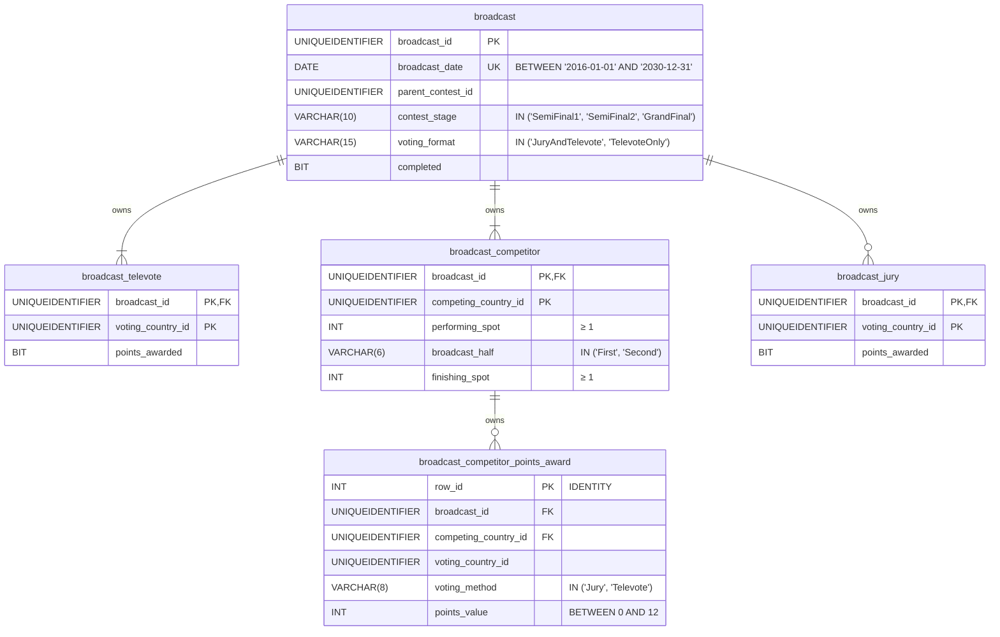
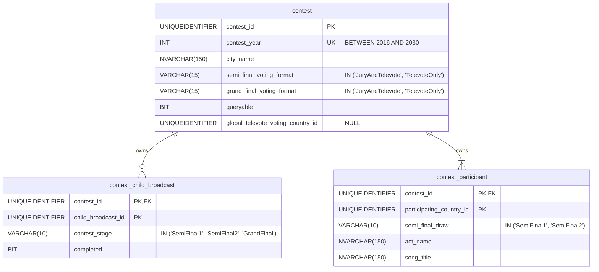
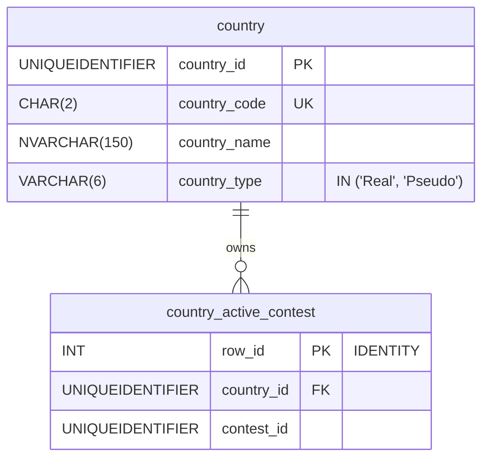
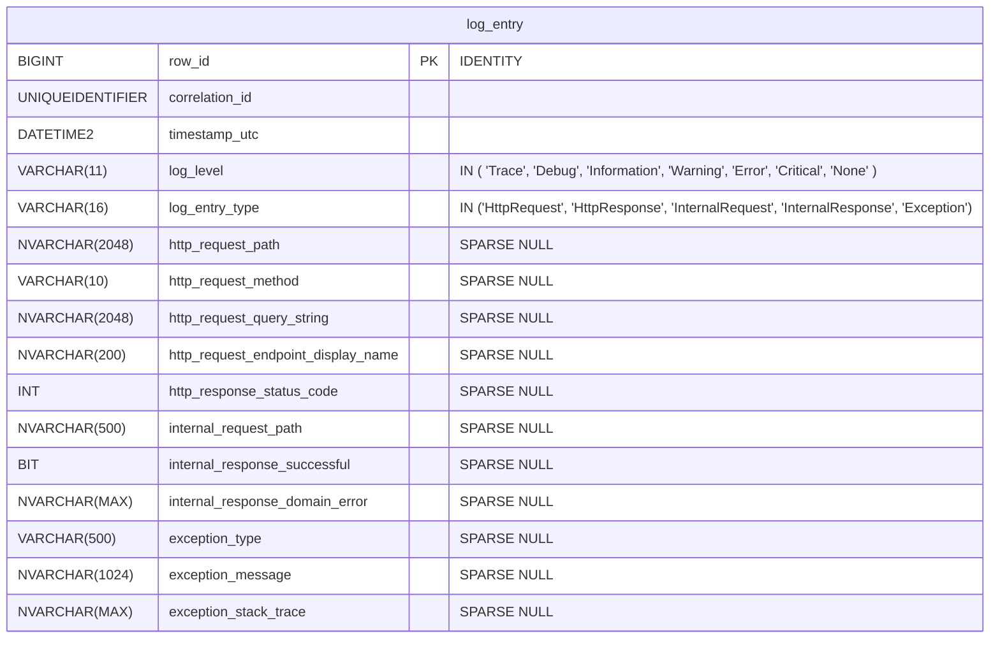

# 8. Database schema

This document is part of the [launch specification](README.md).

- [8. Database schema](#8-database-schema)
  - [`Broadcast` aggregate tables](#broadcast-aggregate-tables)
  - [`Contest` aggregate tables](#contest-aggregate-tables)
  - [`Country` aggregate tables](#country-aggregate-tables)
  - [Logging table](#logging-table)

## `Broadcast` aggregate tables

**Notes:**

- All columns are `NOT NULL`
- In the `broadcast` table:
  - there is a unique index on (`parent_contest_id`, `contest_stage`)
- In the `broadcast_competitor` table:
  - there is a unique index on (`broadcast_id`, `performing_spot`)
- In the `broadcast_competitor_points_award` table:
  - there is a unique index on (`broadcast_id`, `competing_country_id`, `voting_country_id`, `voting_method`)
  - there is an index on `competing_country_id`
  - there is an index on `voting_country_id`
  - there is a check constraint that ensures `competing_country_id` != `voting_country_id`

## `Contest` aggregate tables

**Notes:**

- All columns are `NOT NULL` unless explicitly labelled `NULL`

## `Country` aggregate tables

**Notes:**

- All columns are `NOT NULL`
- In the `country_active_contest`:
  - there is a unique index on (`country_id`, `contest_id`)

## Logging table

**Notes:**

- All columns are `NOT NULL` unless explicitly labelled `NULL`
- In the `log_entry` table:
  - `internal_response_domain_error`, when not `NULL`, is a JSON-serialized `DomainError` object
  - there is an index on `timestamp_utc`
  - there is an index on `correlation_id`
  - records are populated using the Table-Per-Hierarchy pattern, with the `log_entry_type` column as the discriminator
  - there is an `AFTER INSERT` trigger that deletes all rows with a `timestamp_utc` more than 60 days earlier than the inserted record
