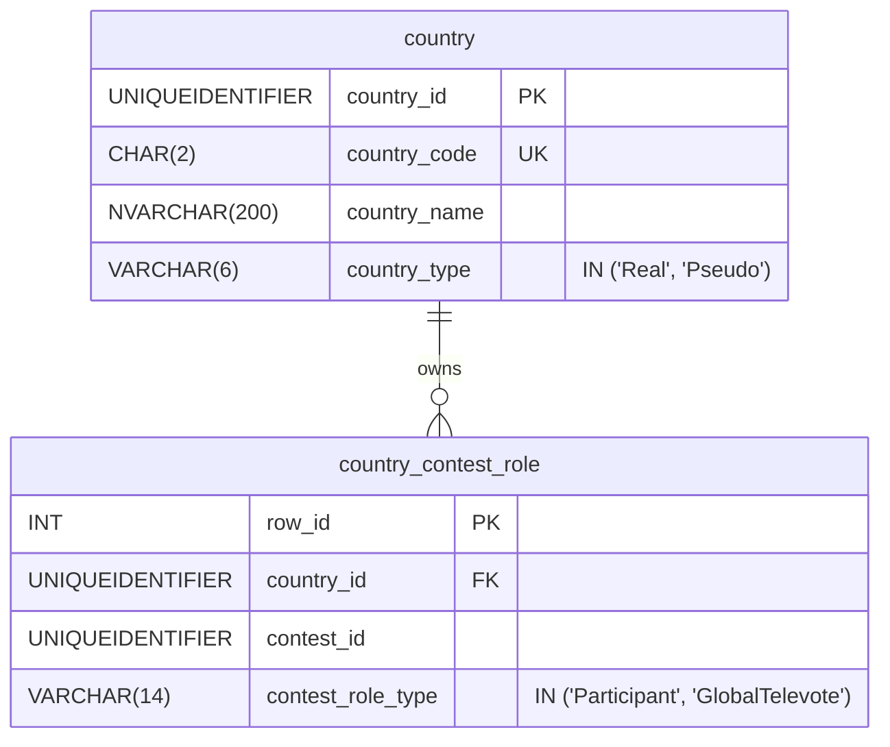
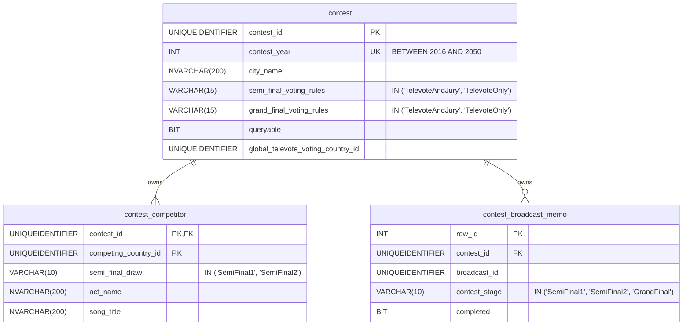
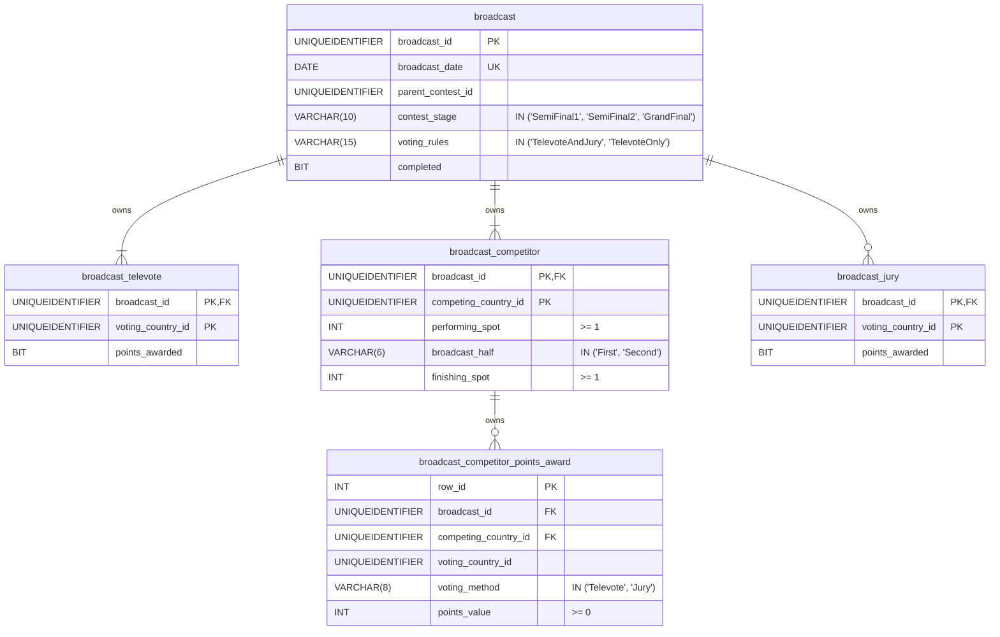
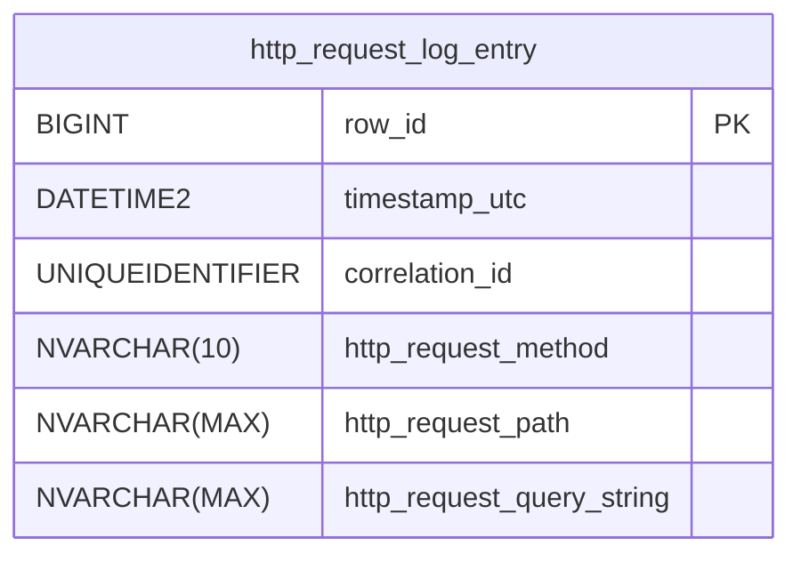
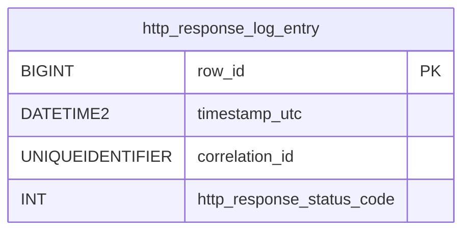
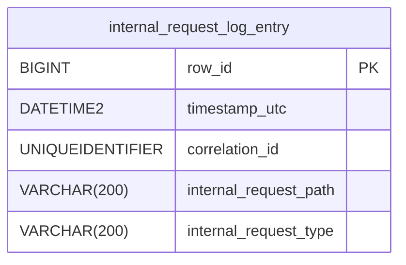
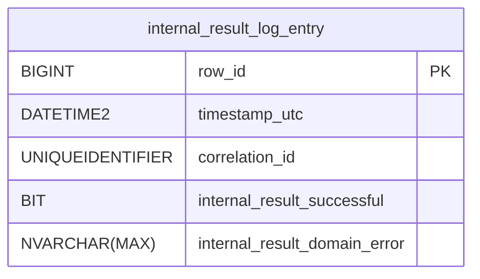
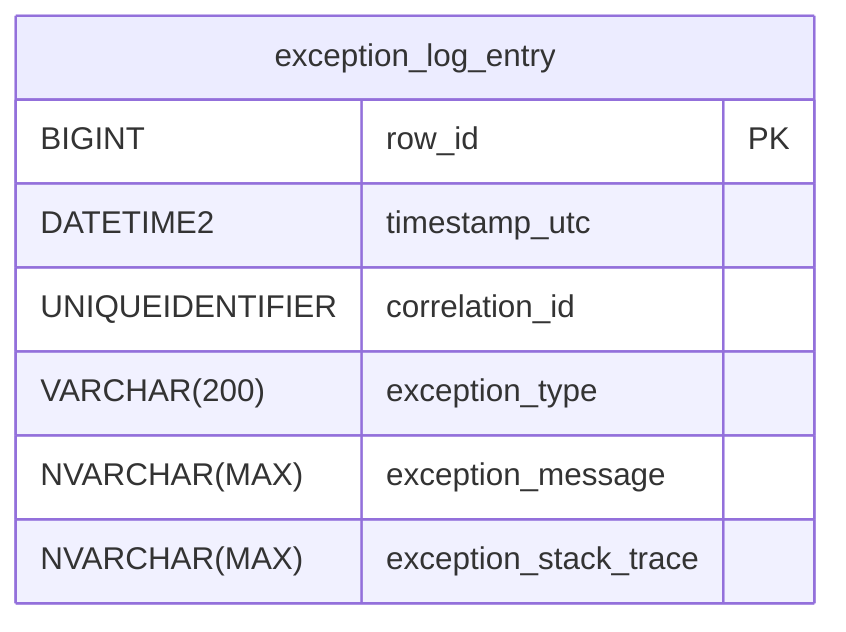

# 8 Database schema

This document is part of the [*Eurocentric* launch specification](README.md).

- [8 Database schema](#8-database-schema)
  - [`Country` aggregate tables](#country-aggregate-tables)
  - [`Contest` aggregate tables](#contest-aggregate-tables)
  - [`Broadcast` aggregate tables](#broadcast-aggregate-tables)
  - [`HttpRequestLogEntry` table](#httprequestlogentry-table)
  - [`HttpResponseLogEntry` table](#httpresponselogentry-table)
  - [`InternalRequestLogEntry` table](#internalrequestlogentry-table)
  - [`InternalResultLogEntry` table](#internalresultlogentry-table)
  - [`ExceptionLogEntry` table](#exceptionlogentry-table)

## `Country` aggregate tables

**Notes:**

- all columns are `NOT NULL` unless otherwise specified
- `country_contest_role.row_id` is generated on add

## `Contest` aggregate tables

**Notes:**

- all columns are `NOT NULL` unless otherwise specified
- `contest.global_televote_voting_country_id` allows `NULL`
- `contest_broadcast_memo.row_id` is generated on add

## `Broadcast` aggregate tables

**Notes:**

- all columns are `NOT NULL` unless otherwise specified
- (`broadcast.parent_contest_id`, `broadcast.contest_stage`) is unique
- (`broadcast_competitor.broadcast_id`, `broadcast_competitor.performing_spot`) is unique
- `broadcast_competitor_points_award.row_id` is generated on add
- `broadcast_competitor_points_award.competing_country_id` must not equal `broadcast_competitor_points_award.voting_country_id`
- (`broadcast_competitor_points_award.broadcast_id`, `broadcast_competitor_points_award.competing_country_id`, `broadcast_competitor_points_award.voting_country_id`, `broadcast_competitor_points_award.voting_method`) is unique

## `HttpRequestLogEntry` table

**Notes:**

- all columns are `NOT NULL` unless otherwise specified
- `http_request_log_entry.row_id` is generated on add
- `http_request_log_entry.http_request_query_string` allows `NULL`

## `HttpResponseLogEntry` table

**Notes:**

- all columns are `NOT NULL`
- `http_response_log_entry.row_id` is generated on add

## `InternalRequestLogEntry` table

**Notes:**

- all columns are `NOT NULL`
- `internal_request_log_entry.row_id` is generated on add

## `InternalResultLogEntry` table

**Notes:**

- all columns are `NOT NULL`
- `internal_result_log_entry.row_id` is generated on add
- `internal_result_log_entry.internal_result_domain_error` allows `NULL`
- `internal_result_log_entry.internal_result_domain_error` is a JSON-serialized `DomainError` object when it is not `NULL`

## `ExceptionLogEntry` table

**Notes:**

- all columns are `NOT NULL` unless otherwise specified
- `exception_log_entry.row_id` is generated on add
- `exception_stack_trace` allows `NULL`
