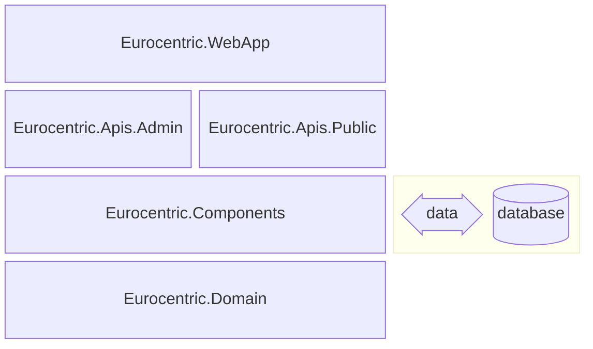
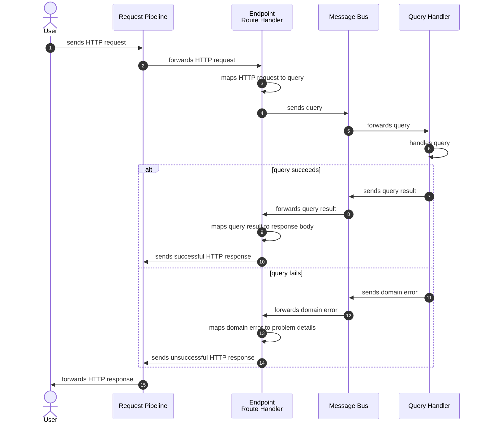
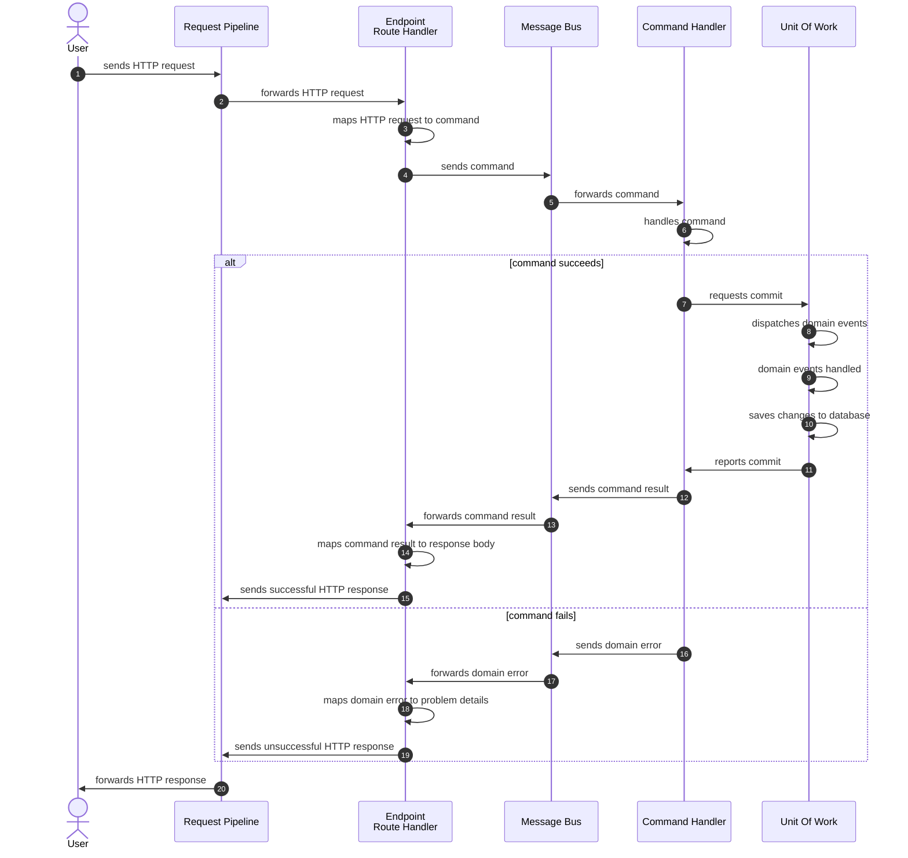
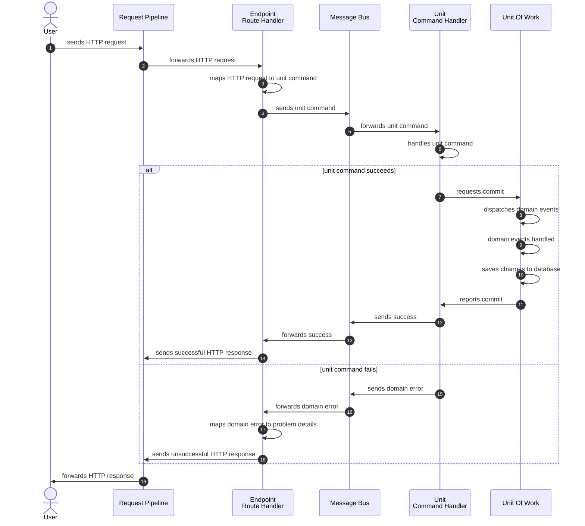

# 8. System architecture

This document is part of the [*Eurocentric* launch specification](README.md).

- [8. System architecture](#8-system-architecture)
  - [SDK](#sdk)
  - [Assembly architecture](#assembly-architecture)
  - [API feature organization](#api-feature-organization)
  - [Domain errors](#domain-errors)
  - [Internal requests and responses](#internal-requests-and-responses)
    - [Queries](#queries)
    - [Commands](#commands)
    - [Unit commands](#unit-commands)
  - [Request handling workflow](#request-handling-workflow)
    - [GET endpoint feature](#get-endpoint-feature)
    - [POST endpoint feature](#post-endpoint-feature)
    - [PATCH endpoint feature](#patch-endpoint-feature)
    - [DELETE endpoint feature](#delete-endpoint-feature)
  - [Exceptions](#exceptions)
  - [Logging points](#logging-points)
  - [Third-party libraries](#third-party-libraries)

## SDK

The system uses the .NET 10 SDK and runtime.

## Assembly architecture

The system is composed of five .NET assemblies:

| Name                         | .NET project type | Role                                                                       |
|:-----------------------------|:-----------------:|:---------------------------------------------------------------------------|
| `Eurocentric.WebApp`         |      Web API      | Composition root and executable                                            |
| `Eurocentric.Apis.Admin`     |   Class library   | *admin-api* features                                                       |
| `Eurocentric.Apis.Public`    |   Class library   | *public-api* features                                                      |
| `Eurocentric.Components`     |   Class library   | Domain service implementations, data access services, API middleware, etc. |
| `Eurocentric.Domain`         |   Class library   | Domain aggregate types, error types, domain service interfaces, etc.       |

The assemblies are illustrated in the diagram below, in which each assembly explicitly references the assembly/assemblies immediately below it.



## API feature organization

API feature source code is organized using the **Vertical Slice** architecture and the **Request-Endpoint-Response (REPR)** pattern.

All types specific to a single feature are located in the same namespace.

A feature has a single, static, internal `{FeatureName}` class, which contains all the internal methods and nested types necessary for the feature to work.

The only exceptions to the above are the endpoint request body, query parameters, and response body record types that make up the feature's API contract, each of which is a public, non-nested type named `{FeatureName}RequestBody`, `{FeatureName}QueryParameters`, or `{FeatureName}ResponseBody`.

## Domain errors

The `DomainError` record type represents a request that has been handled on the server, and which has failed due to a client error. The following types are defined:

```csharp
public enum DomainErrorType
{
  Unexpected, // maps to status code 500 Internal Server Error
  NotFound,   // maps to status code 404 Not Found
  Extrinsic,  // maps to status code 409 Conflict
  Intrinsic   // maps to status code 422 Unprocessable Entity
}

public sealed record DomainError
{
  public required string Title { get; init; }

  public required DomainErrorType Type { get; init; }

  public required string Description { get; init; }

  public IReadOnlyDictionary<string, object?>? AdditionalData { get; init; }
}
```

## Internal requests and responses

The system combines `CSharpFunctionalExtensions` with `SlimMessageBus` for its internal request/response contracts.

### Queries

An internal query, when successful, returns a value without changing the system state. The internal query response is the discriminated union of *either* a successful query return value *or* a `DomainError`.

```csharp
public interface IQuery<TValue> : IRequest<Result<TValue,DomainError>>
  where TValue : struct;

public interface IQueryHandler<in TQuery, TValue> : IRequestHandler<TQuery, Result<TValue,DomainError>>
  where TQuery : IQuery<TValue>
  where TValue : struct;
```

### Commands

An internal command, when successful, changes the system state and returns a value. The internal command response is the discriminated union of *either* a successful command return value *or* a `DomainError`.

```csharp
public interface ICommand<TValue> : IRequest<Result<TValue,DomainError>>
  where TValue : struct;

public interface ICommandHandler<in TCommand, TValue> : IRequestHandler<TQuery, Result<TValue,DomainError>>
  where TCommand : ICommand<TValue>
  where TValue : struct;
```

### Unit commands

An internal unit command, when successful, changes the system state and does not return a value. The internal unit command response is the discriminated union of *either* a success indicator *or* a `DomainError`.

```csharp
public interface IUnitCommand : IRequest<UnitResult<DomainError>>;

public interface IUnitCommandHandler<in TUnitCommand> : IRequestHandler<TUnitCommand, UnitResult<DomainError>>
  where TUnitCommand : IUnitCommand;
```

## Request handling workflow

Every *admin-api* or *public-api* endpoint feature uses the same request handling workflow, based on the **Railway-Oriented Programming (ROP)** template. An HTTP request *either* succeeds and returns the feature-specific successful HTTP response *or* fails and returns an unsuccessful HTTP response with a `ProblemDetails` response body. The four types of API endpoints are outlined below.

### GET endpoint feature

A GET endpoint feature executes a query on the system data without changing its state.

An HTTP request comprises:

- the path
- the `GET` method
- an optional query string, based on a `{FeatureName}QueryParameters` object

A successful HTTP response comprises:

- a `{FeatureName}ResponseBody` object
- status code `200 OK`

an unsuccessful HTTP response comprises:

- a `ProblemDetails` response body object
- an unsuccessful status code

The feature's internal types are:

- a `QueryResult` struct type
- a `Query` record type, which *either* succeeds and returns a `QueryResult` value *or* fails and returns a `DomainError` object
- a `QueryHandler` class

The sequence diagram below outlines the GET endpoint request handling workflow, assuming that the HTTP request is well-formed, authenticated, and authorized.



### POST endpoint feature

A POST endpoint feature executes a command that creates a new aggregate in the system and returns a summary of the created aggregate. A successful command may generate one or more domain events, which are handled as part of the same transaction.

An HTTP request comprises:

- the path
- a `{FeatureName}RequestBody` object
- the `POST` method

A successful HTTP response comprises:

- a `{FeatureName}ResponseBody` object
- a `Location` header
- status code `201 Created`

an unsuccessful HTTP response comprises:

- a `ProblemDetails` response body object
- an unsuccessful status code

The feature's internal types are:

- a `CommandResult` struct type
- a `Command` record type, which *either* succeeds and returns a `CommandResult` value *or* fails and returns a `DomainError` object
- a `CommandHandler` class

The sequence diagram below outlines the POST endpoint request handling workflow, assuming that the HTTP request is well-formed, authenticated, and authorized.



### PATCH endpoint feature

A PATCH endpoint feature executes a unit command that updates a requested aggregate in the system and does not return a value. A successful unit command may generate one or more domain events, which are handled as part of the same transaction.

An HTTP request comprises:

- the path
- a `{FeatureName}RequestBody` object
- the `PATCH` method

A successful HTTP response comprises:

- status code `204 No Content`

an unsuccessful HTTP response comprises:

- a `ProblemDetails` response body object
- an unsuccessful status code

The feature's internal types are:

- a `UnitCommand` record type, which *either* succeeds and returns no value *or* fails and returns a `DomainError` object
- a `UnitCommandHandler` class

The sequence diagram below outlines the PATCH endpoint request handling workflow, assuming that the HTTP request is well-formed, authenticated, and authorized.



### DELETE endpoint feature

A DELETE endpoint feature executes a unit command that deletes a requested aggregate from the system and does not return a value. A successful unit command may generate one or more domain events, which are handled as part of the same transaction.

An HTTP request comprises:

- the path
- the `DELETE` method

A successful HTTP response comprises:

- status code `204 No Content`

an unsuccessful HTTP response comprises:

- a `ProblemDetails` response body object
- an unsuccessful status code

The feature's internal types are:

- a `UnitCommand` record type, which *either* succeeds and returns no value *or* fails and returns a `DomainError` object
- a `UnitCommandHandler` class

The sequence diagram below outlines the DELETE endpoint request handling workflow, assuming that the HTTP request is well-formed, authenticated, and authorized.


## Exceptions

Any exception thrown on the server is caught by exception handling middleware and mapped to a `ProblemDetails` object that describes the exception without exposing any internal system logic. The `ProblemDetails` object is sent to the client as an unsuccessful HTTP response.

| Exception type                |  HTTP response status code  |
|:------------------------------|:---------------------------:|
| `BadHttpRequestException`     |      `400 Bad Request`      |
| `DbTimeoutException` (custom) |  `503 Service Unavailable`  |
| Any other exception           | `500 Internal Server Error` |

## Logging points

A request is logged at the following points in the workflow:

- HTTP request is received
- HTTP response is sent
- Internal request is sent
- Internal response is received
- Exception is caught

An HTTP request is assigned a unique correlation ID when it enters the HTTP request pipeline. The correlation ID is attached to the internal request when it is placed on the system bus. It is attached to the HTTP response as an `"X-Correlation-ID"` header. It is attached to all log entries generated for the request.

An exception's stack trace is only logged when the exception is not a `BadHttpRequestException` or a `DbTimeoutException`.

Log entries are added to an in-memory queue, which is written to the system database using a log entry writer background service. The same service is responsible for deleting any log entries that are more than 60 days old.

## Third-party libraries

The following key third-party libraries are used in the `Eurocentric.Domain` class library:

| Library                    | Role                                    |
|:---------------------------|:----------------------------------------|
| CSharpFunctionalExtensions | Errors and results                      |

The following key third-party libraries are used in the `Eurocentric.Components` class library:

| Library                                  | Role                                                |
|:-----------------------------------------|:----------------------------------------------------|
| Asp.Versioning.Mvc.ApiExplorer           | API versioning                                      |
| Dapper                                   | Database stored procedure execution                 |
| EFCore.CheckConstraints                  | Database configuration                              |
| EntityFrameworkCore.Exceptions.SqlServer | Database exceptions                                 |
| Microsoft.AspNetCore.OpenApi             | OpenAPI document generation                         |
| Microsoft.EntityFrameworkCore.SqlServer  | Database configuration and domain model data access |
| Riok.Mapperly                            | Mapping from domain types to API response types     |
| Scalar.AspNetCore                        | OpenAPI documentation UI pages                      |
| SlimMessageBus.Host.Memory               | In-memory command/query/event messaging             |

The following key third-party library is used in the `Eurocentric.WebApp` assembly:

| Library                                  | Role                                                |
|:-----------------------------------------|:----------------------------------------------------|
| Microsoft.EntityFrameworkCore.Design     | Database design-time configuration                  |
