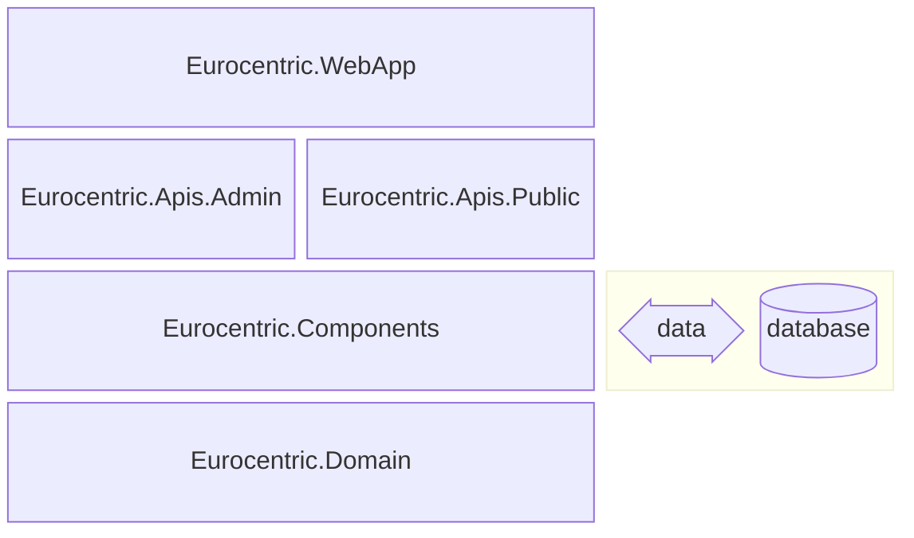

# 9. System architecture

This document is part of the [launch specification](README.md).

- [9. System architecture](#9-system-architecture)
  - [SDK](#sdk)
  - [Assembly architecture](#assembly-architecture)
  - [Third-party libraries](#third-party-libraries)
  - [Domain errors and exceptions](#domain-errors-and-exceptions)
  - [Exceptions](#exceptions)
  - [Internal messaging contracts](#internal-messaging-contracts)
    - [Queries](#queries)
    - [Commands](#commands)
    - [Unit commands](#unit-commands)
  - [API feature organization](#api-feature-organization)
    - [GET endpoint feature types](#get-endpoint-feature-types)
    - [POST endpoint feature types](#post-endpoint-feature-types)
    - [PATCH endpoint feature types](#patch-endpoint-feature-types)
    - [DELETE endpoint feature types](#delete-endpoint-feature-types)
  - [HTTP request handling workflow](#http-request-handling-workflow)
  - [Logging points](#logging-points)
  - [Security](#security)

## SDK

The system uses the .NET 10 SDK and runtime.

## Assembly architecture

The system is composed of five .NET assemblies:

| Name                         | .NET project type | Role                                                                       |
|:-----------------------------|:-----------------:|:---------------------------------------------------------------------------|
| `Eurocentric.WebApp`         |      Web app      | Composition root and executable                                            |
| `Eurocentric.Apis.Admin`     |   Class library   | *admin-api* features                                                       |
| `Eurocentric.Apis.Public`    |   Class library   | *public-api* features                                                      |
| `Eurocentric.Components`     |   Class library   | Domain service implementations, data access services, API middleware, etc. |
| `Eurocentric.Domain`         |   Class library   | Domain aggregate types, error types, domain service interfaces, etc.       |

The assemblies are illustrated in the diagram below, in which each assembly explicitly references the assembly/assemblies immediately below it.



## Third-party libraries

The following key third-party libraries are used in the `Eurocentric.Domain` class library:

| Library                    | Role               |
|:---------------------------|:-------------------|
| CSharpFunctionalExtensions | Errors and results |

The following key third-party libraries are used in the `Eurocentric.Components` class library:

| Library                                  | Role                                                |
|:-----------------------------------------|:----------------------------------------------------|
| Asp.Versioning.Mvc.ApiExplorer           | API versioning                                      |
| Dapper                                   | Database stored procedure execution                 |
| EFCore.CheckConstraints                  | Database configuration                              |
| EntityFrameworkCore.Exceptions.SqlServer | Database exceptions                                 |
| Microsoft.AspNetCore.OpenApi             | OpenAPI document generation                         |
| Microsoft.EntityFrameworkCore.SqlServer  | Database configuration and domain model data access |
| Riok.Mapperly                            | Mapping from domain types to API response types     |
| Scalar.AspNetCore                        | OpenAPI documentation UI pages                      |
| SlimMessageBus.Host.Memory               | In-memory request pipeline                          |

The following key third-party library is used in the `Eurocentric.WebApp` assembly:

| Library                                  | Role                               |
|:-----------------------------------------|:-----------------------------------|
| Microsoft.EntityFrameworkCore.Design     | Database design-time configuration |

## Domain errors and exceptions

An HTTP request that fails due to a user error results in a domain error.

An exception is thrown when something goes fundamentally wrong with the system when handling an HTTP request, either due to a bug in its source code or due to some fatal real-world condition such as a malformed HTTP request.

An HTTP request that fails with a domain error or causes an exception to be thrown *always* returns an unsuccessful HTTP response with a `ProblemDetails` response body object.

## Exceptions

Any exception thrown on the server is caught by exception handling middleware and mapped to a `ProblemDetails` object that describes the exception without exposing any internal system logic. The `ProblemDetails` object is sent to the client as an unsuccessful HTTP response.

| Exception type                 |  HTTP response status code  |
|:-------------------------------|:---------------------------:|
| `BadHttpRequestException`      |      `400 Bad Request`      |
| `InvalidEnumArgumentException` |      `400 Bad Request`      |
| `DbException` due to timeout   |  `503 Service Unavailable`  |
| Any other exception            | `500 Internal Server Error` |

## Internal messaging contracts

An API endpoint feature has an HTTP request, an HTTP response, an internal request and an internal response.

Internal messaging contracts combine `SlimMessageBus` with `CSharpFunctionalExtensions`.

### Queries

A query *either* succeeds and returns a value without changing the state of the system, *or* fails and returns a `DomainError`.

A query is the internal request type for a GET endpoint feature. Its internal response type is the discriminated union of the successful HTTP response body object or a `DomainError`.

```csharp
public interface IQuery<TValue> : IRequest<Result<TValue,DomainError>>
  where TValue : class;

public interface IQueryHandler<TQuery,TValue> : IRequestHandler<TQuery,TValue>
  where TQuery : IQuery<TValue>
  where TValue : class;
```

### Commands

A command *either* succeeds, changes the state of the system, and returns a value, *or* fails and returns a `DomainError`.

A command is the internal request type for a POST endpoint feature. Its internal response type is the discriminated union of the successful HTTP response body object or a `DomainError`.

```csharp
public interface ICommand<TValue> : IRequest<Result<TValue,DomainError>>
  where TValue : class;

public interface ICommandHandler<TCommand,TValue> : IRequestHandler<TCommand,TValue>
  where TCommand : ICommand<TValue>
  where TValue : class;
```

### Unit commands

A unit command *either* succeeds, changes the state of the system, and does not return a value, *or* fails and returns a `DomainError`.

A unit command is the internal request type for a PATCH or DELETE endpoint feature. Its internal response type is the discriminated union of an empty success value or a `DomainError`.

```csharp
public interface IUnitCommand : IRequest<UnitResult<DomainError>>;

public interface IUnitCommandHandler<TUnitCommand> : IRequestHandler<TUnitCommand,UnitResult<DomainError>>
  where TUnitCommand : IUnitCommand;
```

## API feature organization

API feature source code is organized using the **Vertical Slice** architecture and the **Request-Endpoint-Response (REPR)** pattern.

All types specific to a single feature are located in the same namespace.

A feature has a single, static, internal `{Feature}` class, which contains all the internal/private methods and nested types necessary for the feature to work.

The only exceptions to the above are the endpoint request body and response body record types that make up a feature's API contract and are therefore included in the API's OpenAPI document. Each of these is a public, non-nested type named `{Feature}RequestBody` or `{Feature}ResponseBody`.

### GET endpoint feature types

A GET endpoint feature has:

- a `{Feature}ResponseBody` record type, which:
  - is public
  - is not nested
  - is part of the API contract
- a `{Feature}` class, which:
  - is internal
  - is static
  - contains:
    - an internal `Query` record type, which:
      - has zero, one or more properties bound from route parameters or query parameters
      - implements `IQuery<{Feature}ResponseBody>`
      - returns a `Result<{Feature}ResponseBody,DomainError>`
    - an internal `QueryHandler` class, which:
      - implements `IQueryHandler<Query,{Feature}ResponseBody>`
    - a private static `Task<IResult> HandleAsync(Query, IRequestResponseBus, CancellationToken)` method, which:
      - is the endpoint route handler
      - returns *either* an `Ok<{Feature}ResponseBody>` *or* a `ProblemHttpResult`
    - an internal `Endpoint` class, which:
      - maps the endpoint

### POST endpoint feature types

A POST endpoint feature has:

- a `{Feature}RequestBody` record type, which:
  - is public
  - is not nested
  - is part of the API contract
- a `{Feature}ResponseBody` record type, which:
  - is public
  - is not nested
  - is part of the API contract
- a `{Feature}` class, which:
  - is internal
  - is static
  - contains:
    - an internal `Command` record type, which:
      - has a property bound from the request body and zero, one or more properties bound from route parameters
      - implements `ICommand<{Feature}ResponseBody>`
      - returns a `Result<{Feature}ResponseBody,DomainError>`
    - an internal `CommandHandler` class, which:
      - implements `ICommandHandler<Command,{Feature}ResponseBody>`
    - a private static `Task<IResult> HandleAsync(Command, IRequestResponseBus, CancellationToken)` method, which:
      - is the endpoint route handler
      - returns *either* a `CreatedAtRoute<{Feature}ResponseBody>` *or* a `ProblemHttpResult`
    - an internal `Endpoint` class, which:
      - maps the endpoint

### PATCH endpoint feature types

A PATCH endpoint feature has:

- a `{Feature}RequestBody` record type, which:
  - is public
  - is not nested
  - is part of the API contract
- a `{Feature}` class, which:
  - is internal
  - is static
  - contains:
    - an internal `UnitCommand` record type, which:
      - has a property bound from the request body and zero, one or more properties bound from route parameters
      - implements `IUnitCommand`
      - returns a `UnitResult<DomainError>`
    - an internal `UnitCommandHandler` class, which:
      - implements `IUnitCommandHandler<UnitCommand>`
    - a private static `Task<IResult> HandleAsync(UnitCommand, IRequestResponseBus, CancellationToken)` method, which:
      - is the endpoint route handler
      - returns *either* a `NoContent` *or* a `ProblemHttpResult`
    - an internal `Endpoint` class, which:
      - maps the endpoint

### DELETE endpoint feature types

A DELETE endpoint feature has:

- a `{Feature}` class, which:
  - is internal
  - is static
  - contains:
    - an internal `UnitCommand` record type, which:
      - has a single property bound from a route parameter
      - implements `IUnitCommand`
      - returns a `UnitResult<{DomainError>`
    - an internal `UnitCommandHandler` class, which:
      - implements `IUnitCommandHandler<UnitCommand>`
    - a private static `Task<IResult> HandleAsync(UnitCommand, IRequestResponseBus, CancellationToken)` method, which:
      - is the endpoint route handler
      - returns *either* a `NoContent` *or* a `ProblemHttpResult`
    - an internal `Endpoint` class, which:
      - maps the endpoint route handler

## HTTP request handling workflow

Every endpoint feature adopts the same workflow, based on the **Railway-Oriented Programming (ROP)** model.

1. The client sends an HTTP request to the web API
2. The middleware receives the HTTP request and maps it to an internal request
3. The endpoint route handler receives the internal request and places it on the system bus
4. The internal request handler receives the internal request and returns an internal response that is *either* a successful response value *or* a `DomainError`
5. The endpoint route handler receives the internal response and maps it to *either* a successful HTTP response with the successful response value in the body *or* an unsuccessful HTTP response with a `ProblemDetails` body mapped from the `DomainError`
6. The middleware sends the HTTP response to the client
7. The client receives the HTTP response

## Logging points

A request is logged at the following points in the workflow:

- HTTP request enters the HTTP request pipeline
- Internal request enters the internal messaging pipeline
- Internal response returns through the internal messaging pipeline
- HTTP response returns through the HTTP request pipeline
- Exception is caught in the HTTP request pipeline where the exception is not any of the following:
  - a `BadHttpRequestException`
  - an `InvalidEnumArgumentException`
  - a `DbUpdateException` caused due to database connection/command timeout

An HTTP request is assigned a unique correlation ID when it enters the HTTP request pipeline. The correlation ID is attached to the internal request when it is placed on the system bus. It is attached to the HTTP response as an `"X-Correlation-ID"` header. It is attached to all log entries generated for the request.

Log entries are written synchronously to the system database.

Log entries in the database are automatically deleted when they are more than 60 days old.

## Security

Two API keys are defined:

- The demo API key is made available to users
- The secret API key is never made available

Two user roles are defined:

- The "Administrator" user role is authorized to change the state of the system using the Admin API endpoints
- The "Reader" user role is authorized to execute read-only queries on the system data using the Public API endpoints

An HTTP request to an Admin API or Public API endpoint must include either the demo API key or the secret API key as an `"X-Api-Key"` header.

An HTTP request using the demo API key is authenticated and granted the "Reader" user role.

An HTTP request using the secret API key is authenticated and granted the "Administrator" and "Reader" user roles.
